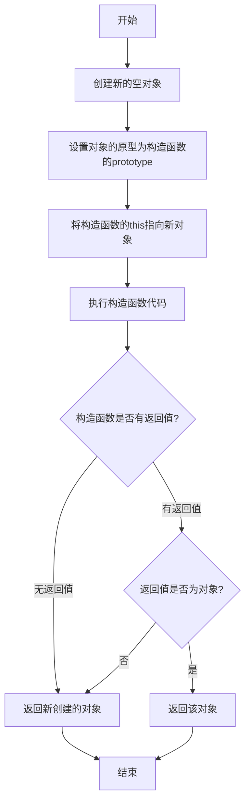

# HTML
## HTML离线缓存
离线存储指的是：在用户没有与因特网连接时，可以正常访问站点或应用，在用户与因特网连接时，更新用户机器上的缓存文件。  
  
原理：HTML5的离线存储是基于一个新建的 .appcache 文件的缓存机制(不是存储技术)，通过这个文件上的解析清单离线存储资源，这些资源就会像cookie一样被存储了下来。之后当网络在处于离线状态下时，浏览器会通过被离线存储的数据进行页面展示
使用方法：  
1. 创建一个和 html 同名的 manifest 文件，然后在页面头部加入 manifest 属性：
```html
<html lang="en" manifest="index.manifest">
```
2. 在 cache.manifest 文件中编写需要离线存储的资源：
```
CACHE MANIFEST
    #v0.11
    CACHE:
    js/app.js
    css/style.css
    NETWORK:
    resourse/logo.png
    FALLBACK:
    / /offline.html
```

CACHE: 表示需要离线存储的资源列表，由于包含 manifest 文件的页面将被自动离线存储，所以不需要把页面自身也列出来。  
●NETWORK: 表示在它下面列出来的资源只有在在线的情况下才能访问，他们不会被离线存储，所以在离线情况下无法使用这些资源。不过，如果在 CACHE 和 NETWORK 中有一个相同的资源，那么这个资源还是会被离线存储，也就是说 CACHE 的优先级更高。  
●FALLBACK: 表示如果访问第一个资源失败，那么就使用第二个资源来替换他，比如上面这个文件表示的就是如果访问根目录下任何一个资源失败了，那么就去访问 offline.html 。
3. 在离线状态时，操作 window.applicationCache 进行离线缓存的操作。

## iframe 有那些优点和缺点？
iframe 元素会创建包含另外一个文档的内联框架（即行内框架）。

优点：  
* 用来加载速度较慢的内容（如广告）  
* 可以使脚本可以并行下载  
* 可以实现跨子域通信  
  
缺点：  
* iframe 会阻塞主页面的 onload 事件  
* 无法被一些搜索引擎索识别  
* 会产生很多页面，不容易管理
## label 的作用是什么？如何使用？
label标签来定义表单控件的关系：当用户选择label标签时，浏览器会自动将焦点转到和label标签相关的表单控件上。  
```html
<label for="mobile">Number:</label>

<input type="text" id="mobile"/>


<label>Date:<input type="text"/></label>

```

## Canvas和SVG的区别
### SVG：
SVG可缩放矢量图形（Scalable Vector Graphics）是基于可扩展标记语言XML描述的2D图形的语言，SVG基于XML就意味着SVG DOM中的每个元素都是可用的，可以为某个元素附加Javascript事件处理器。在 SVG 中，每个被绘制的图形均被视为对象。如果 SVG 对象的属性发生变化，那么浏览器能够自动重现图形。
其特点如下：  
* 不依赖分辨率  
* 支持事件处理器  
* 最适合带有大型渲染区域的应用程序（比如谷歌地图）  
* 复杂度高会减慢渲染速度（任何过度使用 DOM 的应用都不快）  
* 不适合游戏应用

### Canvas:
依赖分辨率  
* 不支持事件处理器  
* 弱的文本渲染能力  
* 能够以 .png 或 .jpg 格式保存结果图像  
* 最适合图像密集型的游戏，其中的许多对象会被频繁重绘

# 渐进增强和优雅降级之间的区别
1. 渐进增强（progressive enhancement）：主要是针对低版本的浏览器进行页面重构，保证基本的功能情况下，再针对高级浏览器进行效果、交互等方面的改进和追加功能，以达到更好的用户体验。  
2. 优雅降级 graceful degradation： 一开始就构建完整的功能，然后再针对低版本的浏览器进行兼容。

# CSS


## 优先级
样式表的来源不同时，优先级顺序为：内联样式 > 内部样式 > 外部样式 > 浏览器用户自定义样式 > 浏览器默认样式。

## CSS中可继承与不可继承属性有哪些
无继承性的属性  
1display：规定元素应该生成的框的类型  
2文本属性：  
●vertical-align：垂直文本对齐  
●text-decoration：规定添加到文本的装饰  
●text-shadow：文本阴影效果  
●white-space：空白符的处理  
●unicode-bidi：设置文本的方向  
3盒子模型的属性：width、height、margin、border、padding  
4背景属性：background、background-color、background-image、background-repeat、background-position、background-attachment  
5定位属性：float、clear、position、top、right、bottom、left、min-width、min-height、max-width、max-height、overflow、clip、z-index  
6生成内容属性：content、counter-reset、counter-increment  
7轮廓样式属性：outline-style、outline-width、outline-color、outline  
8页面样式属性：size、page-break-before、page-break-after  
9声音样式属性：pause-before、pause-after、pause、cue-before、cue-after、cue、play-during

有继承性的属性
1字体系列属性  
●font-family：字体系列  
●font-weight：字体的粗细  
●font-size：字体的大小  
●font-style：字体的风格  
2文本系列属性  
●text-indent：文本缩进  
●text-align：文本水平对齐  
●line-height：行高  
●word-spacing：单词之间的间距  
●letter-spacing：中文或者字母之间的间距  
●text-transform：控制文本大小写（就是uppercase、lowercase、capitalize这三个）  
●color：文本颜色  
3元素可见性  
●visibility：控制元素显示隐藏  
4列表布局属性  
●list-style：列表风格，包括list-style-type、list-style-image等  
5光标属性  
●cursor：光标显示为何种形态

## display

| 属性值          | 作用                            |
| ------------ | ----------------------------- |
| none         | 元素不显示，并且会从文档流中移除。             |
| block        | 块类型。默认宽度为父元素宽度，可设置宽高，换行显示。    |
| inline       | 行内元素类型。默认宽度为内容宽度，不可设置宽高，同行显示。 |
| inline-block | 默认宽度为内容宽度，可以设置宽高，同行显示。        |
| list-item    | 像块类型元素一样显示，并添加样式列表标记。         |
| table        | 此元素会作为块级表格来显示。                |
| inherit      | 规定应该从父元素继承display属性的值。        |

## 隐藏元素的方法
### display:none
不会在DOM树上出现
### visibility:hidden
隐藏元素，但元素所占的空间仍然保留，其他元素不会受到影响。
### opacity:0
使元素透明，但元素仍然存在于页面上，并且可以与其他元素交互。
### position:absolute 
设置位置到页面之外

### z-index设为负数
使其他元素遮盖住该元素，以此来实现隐藏

###  clip/clip-path
裁剪元素实现隐藏

###  transform: scale(0,0)
将元素缩放为 0，来实现元素的隐藏。这种方法下，元素仍在页面中占据位置，但是不会响应绑定的监听事件。

## link和@import的区别
  
* link是XHTML标签，除了加载CSS外，还可以定义RSS等其他事务；@import属于CSS范畴，只能加载CSS。
* link引用CSS时，在页面载入时同时加载；@import需要页面网页完全载入以后加载，可能会阻塞页面的渲染。
* link支持使用Javascript控制DOM去改变样式；而@import不支持。
- 如果同时使用 `link` 和 `@import` 引入了相同的样式表，`link` 引入的样式表通常具有更高的优先级。

## display:none与visibility:hidden的区别
这两个属性都是让元素隐藏，不可见。两者区别如下：
在渲染树中  
●display:none会让元素完全从渲染树中消失，渲染时不会占据任何空间；  
●visibility:hidden不会让元素从渲染树中消失，渲染的元素还会占据相应的空间，只是内容不可见
是否是继承属性  
●display:none是非继承属性，子孙节点会随着父节点从渲染树消失，通过修改子孙节点的属性也无法显示；  
●visibility:hidden是继承属性，子孙节点消失是由于继承了hidden，通过设置visibility:visible可以让子孙节点显示；
修改常规文档流中元素的 display 通常会造成文档的重排，但是修改visibility属性只会造成本元素的重绘；


## 伪元素和伪类的区别和作用？
  
伪元素：在内容元素的前后插入额外的元素或样式，但是这些元素实际上并不在文档中生成。它们只在外部显示可见，但不会在文档的源代码中找到它们，因此，称为“伪”元素。例如：
```css
p::before {content:"第一章：";}
p::after {content:"Hot!";}
p::first-line {background:red;}
p::first-letter {font-size:30px;}
```

伪类：将特殊的效果添加到特定选择器上。它是已有元素上添加类别的，不会产生新的元素。例如：
```css
  
a:hover {color: #FF00FF}

p:first-child {color: red}
```

## CSS 优化和提高性能的方法有哪些？
css压缩：将写好的css进行打包压缩，可以减小文件体积。
减少使用@import，建议使用link，因为后者在页面加载时一起加载，前者是等待页面加载完成之后再进行加载。

避免使用通配规则，如*{}计算次数惊人，只对需要用到的元素进行选择
尽量少的去对标签进行选择，而是用class。
尽量少的去使用后代选择器，降低选择器的权重值。后代选择器的开销是最高的，尽量将选择器的深度降到最低，最高不要超过三层，更多的使用类来关联每一个标签元素
了解哪些属性是可以通过继承而来的，然后避免对这些属性重复指定规则

## display:inline-block 什么时候会显示间隙
有空格时会有间隙，可以删除空格解决；
margin正值时，可以让margin使用负值解决；
使用font-size时，可通过设置font-size:0、letter-spacing、word-spacing解决

## 单行、多行文本溢出隐藏
单行文本溢出
```css
  
overflow: hidden; // 溢出隐藏

text-overflow: ellipsis; // 溢出用省略号显示

white-space: nowrap; // 规定段落中的文本不进行换行
```

多行文本溢出
```css
overflow: hidden;            // 溢出隐藏
text-overflow: ellipsis;     // 溢出用省略号显示
display:-webkit-box;         // 作为弹性伸缩盒子模型显示。
-webkit-box-orient:vertical; // 设置伸缩盒子的子元素排列方式：从上到下垂直排列
-webkit-line-clamp:3;        // 显示的行数
```

## 如何判断元素是否到达可视区域
### 计算距离
### 通过intersectionObserver API？？

## z-index属性在什么情况下会失效
通常 z-index 的使用是在有两个重叠的标签，在一定的情况下控制其中一个在另一个的上方或者下方出现。z-index值越大就越是在上层。z-index元素的position属性需要是relative，absolute或是fixed。

index属性在下列情况下会失效：  
* 父元素position为relative时，子元素的z-index失效。解决：父元素position改为absolute或static；  
* 元素没有设置position属性为非static属性。解决：设置该元素的position属性为relative，absolute或是fixed中的一种；  
* 元素在设置z-index的同时还设置了float浮动。解决：float去除，改为display：inline-block；


## 浮动元素引起的问题？
  
父元素的高度无法被撑开，影响与父元素同级的元素  
●与浮动元素同级的非浮动元素会跟随其后  
●若浮动的元素不是第一个元素，则该元素之前的元素也要浮动，否则会影响页面的显示结构
## 清除浮动的方式如下：
  
* 给父级div定义height属性  
* 最后一个浮动元素之后添加一个空的div标签，并添加clear:both样式  
* 包含浮动元素的父级标签添加overflow:hidden或者overflow:auto  
* 使用 :after 伪元素。由于IE6-7不支持 :after，使用 zoom:1 触发 hasLayout**

## BFC
* Box: Box 是 CSS 布局的对象和基本单位，⼀个⻚⾯是由很多个 Box 组成的，这个Box就是我们所说的盒模型。  
* Formatting context：块级上下⽂格式化，它是⻚⾯中的⼀块渲染区域，并且有⼀套渲染规则，它决定了其⼦元素将如何定位，以及和其他元素的关系和相互作⽤。
块格式化上下文（Block Formatting Context，BFC）是Web页面的可视化CSS渲染的一部分，是布局过程中生成块级盒子的区域，也是浮动元素与其他元素的交互限定区域。

通俗来讲：BFC是一个独立的布局环境，可以理解为一个容器，在这个容器中按照一定规则进行物品摆放，并且不会影响其它环境中的物品。如果一个元素符合触发BFC的条件，则BFC中的元素布局不受外部影响。

创建BFC的条件：  
* 根元素：body；  
* 元素设置浮动：float 除 none 以外的值；  
* 元素设置绝对定位：position (absolute、fixed)；  
* display 值为：inline-block、table-cell、table-caption、flex等；  
* overflow 值为：hidden、auto、scroll；  
  
BFC的特点：  
* 垂直方向上，自上而下排列，和文档流的排列方式一致。  
* 在BFC中上下相邻的两个容器的margin会重叠  
* 计算BFC的高度时，需要计算浮动元素的高度  
* BFC区域不会与浮动的容器发生重叠  
* BFC是独立的容器，容器内部元素不会影响外部元素  
* 每个元素的左margin值和容器的左border相接触  
  
BFC的作用：  
* 解决margin的重叠问题：由于BFC是一个独立的区域，内部的元素和外部的元素互不影响，将两个元素变为两个BFC，就解决了margin重叠的问题。  
* 解决高度塌陷的问题：在对子元素设置浮动后，父元素会发生高度塌陷，也就是父元素的高度变为0。解决这个问题，只需要把父元素变成一个BFC。常用的办法是给父元素设置overflow:hidden。  
* 创建自适应两栏布局：可以用来创建自适应两栏布局：左边的宽度固定，右边的宽度自适应。


## 元素的层叠顺序


对于上图，从上到下的层级分别是：

1. **背景和边框**：建立当前层叠上下文元素的背景和边框。
2. **负的 z-index**：当前层叠上下文中，z-index 属性值为负的元素。
3. **块级盒**：文档流内非行内级非定位后代元素。
4. **浮动盒**：非定位浮动元素。
5. **行内盒**：文档流内行内级非定位后代元素。
6. **z-index:0**：层叠级数为 0 的定位元素。
7. **正 z-index**：z-index 属性值为正的定位元素。

注意：当定位元素的 z-index 为 auto 时，生成的盒在当前层叠上下文中的层级为 0，不会建立新的层叠上下文，除非它是根元素。

## position的属性有哪些，区别是什么
position有以下属性值：  


| 属性值      | 概述                                                                                                                                                                                      |
| -------- | --------------------------------------------------------------------------------------------------------------------------------------------------------------------------------------- |
| absolute | 生成绝对定位的元素，相对于static定位以外的一个父元素进行定位。元素的位置通过left、top、right、bottom属性进行规定。                                                                                                                   |
| relative | 生成相对定位的元素，相对于其原来的位置进行定位。元素的位置通过left、top、right、bottom属性进行规定。                                                                                                                             |
| fixed    | 生成绝对定位的元素，指定元素相对于屏幕视⼝（viewport）的位置来指定元素位置。元素的位置在屏幕滚动时不会改变，⽐如回到顶部的按钮⼀般都是⽤此定位⽅式。                                                                                                          |
| static   | 默认值，没有定位，元素出现在正常的文档流中，会忽略 top, bottom, left, right 或者 z-index 声明，块级元素从上往下纵向排布，⾏级元素从左向右排列。                                                                                               |
| inherit  | 规定从父元素继承position属性的值                                                                                                                                                                    |
| sticky   | 在元素到达特定位置之前，它会按照正常的文档流进行布局，表现得像相对定位。<br><br>当元素到达特定位置（通常通过设置 `top`、`bottom`、`left`、`right` 属性来定义这个特定位置）时，它就会 “粘” 在那个位置上，表现得像固定定位，不随页面滚动而移动。<br><br>如果父元素没有足够的空间让粘性元素到达其特定位置，粘性定位可能不会生效。 |

## absolute与fixed共同点与不同点
共同点：  
* 改变行内元素的呈现方式，将display置为inline-block    
* 使元素脱离普通文档流，不再占据文档物理空间  
* 覆盖非定位文档元素  
  
不同点：  
* absolute与fixed的根元素不同，absolute的根元素可以设置，fixed根元素是浏览器。  
* 在有滚动条的页面中，absolute会跟着父元素进行移动，fixed固定在页面的具体位置。

## 设置小于12px的字体
在谷歌下css设置字体大小为12px及以下时，显示都是一样大小，都是默认12px。
  
解决办法：  
●使用Webkit的内核的-webkit-text-size-adjust的私有CSS属性来解决，只要加了-webkit-text-size-adjust:none;字体大小就不受限制了。但是chrome更新到27版本之后就不可以用了。所以高版本chrome谷歌浏览器已经不再支持-webkit-text-size-adjust样式，所以要使用时候慎用。  
●使用css3的transform缩放属性-webkit-transform:scale(0.5); 注意-webkit-transform:scale(0.75);收缩的是整个元素的大小，这时候，如果是内联元素，必须要将内联元素转换成块元素，可以使用display：block/inline-block/...；  
●使用图片：如果是内容固定不变情况下，使用将小于12px文字内容切出做图片，这样不影响兼容也不影响美观。


## 如何解决 1px 问题？
1px 问题指的是：在一些 Retina屏幕 的机型上，移动端页面的 1px 会变得很粗，呈现出不止 1px 的效果。原因很简单——CSS 中的 1px 并不能和移动设备上的 1px 划等号。它们之间的比例关系有一个专门的属性来描述：
思路一：直接写 0.5px

**使用 CSS 媒体查询和缩放**
```css
.border-1px {
  border: 1px solid #000;
}

@media screen and (-webkit-min-device-pixel-ratio: 2) {
 .border-1px {
    border-width: 0.5px;
  }
}

@media screen and (-webkit-min-device-pixel-ratio: 3) {
 .border-1px {
    border-width: 0.333333px;
  }
}
```
思路二：伪元素先放大后缩小
```css
.border-1px {
  position: relative;
}

.border-1px::after {
  content: '';
  position: absolute;
  top: 0;
  left: 0;
  width: 100%;
  height: 100%;
  border: 1px solid #000;
  -webkit-transform: scaleY(0.5);
  transform: scaleY(0.5);
  -webkit-transform-origin: top left;
  transform-origin: top left;
}

@media screen and (-webkit-min-device-pixel-ratio: 2) {
 .border-1px::after {
    -webkit-transform: scaleY(0.5);
    transform: scaleY(0.5);
  }
}

@media screen and (-webkit-min-device-pixel-ratio: 3) {
 .border-1px::after {
    -webkit-transform: scaleY(0.333333);
    transform: scaleY(0.333333);
  }
}
```

使用 box-shadow
```css
.border-1px {
  box-shadow: 0 1px 1px -1px rgba(0, 0, 0, 0.5);
}
```

## 响应式布局 
原理：一套代码，
去适应多端的页面布局，而不是单独的两套
实现：
* 媒体查询
给不同屏幕的大小编写不同的样式来实现响应式的布局
缺点：
对于复杂的响应式设计，可能需要编写大量的媒体查询代码，增加了代码的复杂性和维护难度。
只能基于一些预定义的条件进行判断，对于一些特殊的需求可能无法满足
```css
@media screen and (max-device-width:960px){     body{background:red;} }
```
* rem
1rem=html根元素标签的fontsize
* vw、vh
因为 100vw = 100视图窗宽度 ，100vh = 100 视图窗高度，那么按照750的设计稿100vw就是750.那么1vw就是7.5px
* flex 弹性布局
* 容器查询 
更有灵活性，但是兼容性差


## 布局居中
1. **使用 Flex 布局**：
    
    - 将父元素设置为 Flex 容器，并使用`justify-content: center;`和`align-items: center;`来使子元素在水平和垂直方向上居中。
2. **使用 Grid 布局**：
    
    - 将父元素设置为 Grid 容器，并使用`place-items: center;`来使子元素在网格中居中。
3. **使用绝对定位和负边距**：
    
    - 将子元素设置为绝对定位，并使用`top: 50%; left: 50%; transform: translate(-50%, -50%);`来使其在父元素中居中。
4. **使用文本居中**：
    
    - 对于文本元素，可以使用`text-align: center;`来使其在父元素中水平居中。
5. **使用 margin 自动**：
    
    - 如果子元素的宽度已知，可以将其左右 margin 设置为`auto`，以使其在父元素中水平居中。


# JS
JavaScript有哪些数据类型，它们的区别？
JavaScript共有八种数据类型，分别是 Undefined、Null、Boolean、Number、String、Object、Symbol、BigInt。  
  
其中 Symbol 和 BigInt 是ES6 中新增的数据类型：  
●Symbol 代表创建后独一无二且不可变的数据类型，它主要是为了解决可能出现的全局变量冲突的问题。  
●BigInt 是一种数字类型的数据，它可以表示任意精度格式的整数，使用 BigInt 可以安全地存储和操作大整数，即使这个数已经超出了 Number 能够表示的安全整数范围。  
  
这些数据可以分为原始数据类型和引用数据类型：  
●栈：原始数据类型（Undefined、Null、Boolean、Number、String）  
●堆：引用数据类型（对象、数组和函数）  
  
两种类型的区别在于存储位置的不同：  
●原始数据类型直接存储在栈（stack）中的简单数据段，占据空间小、大小固定，属于被频繁使用数据，所以放入栈中存储；  
●引用数据类型存储在堆（heap）中的对象，占据空间大、大小不固定。如果存储在栈中，将会影响程序运行的性能；引用数据类型在栈中存储了指针，该指针指向堆中该实体的起始地址。当解释器寻找引用值时，会首先检索其在栈中的地址，取得地址后从堆中获得实体。  
  
堆和栈的概念存在于数据结构和操作系统内存中，在数据结构中：  
●在数据结构中，栈中数据的存取方式为先进后出。  
●堆是一个优先队列，是按优先级来进行排序的，优先级可以按照大小来规定。  
  
在操作系统中，内存被分为栈区和堆区：  
●栈区内存由编译器自动分配释放，存放函数的参数值，局部变量的值等。其操作方式类似于数据结构中的栈。  
●堆区内存一般由开发着分配释放，若开发者不释放，程序结束时可能由垃圾回收机制回收。

## 判断数组的方式有哪些

```js
//通过Object.prototype.toString.call()做判断
Object.prototype.toString.call(obj).slice(8,-1) === 'Array';


//通过原型链做判断
obj.__proto__ === Array.prototype;

//通过ES6的Array.isArray()做判断
Array.isArrray(obj);

//通过instanceof做判断
obj instanceof Array

//通过Array.prototype.isPrototypeOf
Array.prototype.isPrototypeOf(obj)

```

## null和undefined区别
首先 Undefined 和 Null 都是基本数据类型，这两个基本数据类型分别都只有一个值，就是 undefined 和 null。  
  
undefined 代表的含义是未定义，null 代表的含义是空对象。一般变量声明了但还没有定义的时候会返回 undefined，null主要用于赋值给一些可能会返回对象的变量，作为初始化。  
  
undefined 在 JavaScript 中不是一个保留字，这意味着可以使用 undefined 来作为一个变量名，但是这样的做法是非常危险的，它会影响对 undefined 值的判断。我们可以通过一些方法获得安全的 undefined 值，比如说 void 0。  
  
当对这两种类型使用 typeof 进行判断时，Null 类型化会返回 “object”，这是一个历史遗留的问题。当使用双等号对两种类型的值进行比较时会返回 true，使用三个等号时会返回 false。

## typeof null 的结果是什么，为什么？
typeof null 的结果是Object。  
  
在 JavaScript 第一个版本中，所有值都存储在 32 位的单元中，每个单元包含一个小的 类型标签(1-3 bits) 以及当前要存储值的真实数据。类型标签存储在每个单元的低位中，共有五种数据类型：

```js
000: object - 当前存储的数据指向一个对象。 
  1: int - 当前存储的数据是一个 31 位的有符号整数。 
010: double - 当前存储的数据指向一个双精度的浮点数。 
100: string - 当前存储的数据指向一个字符串。 
110: boolean - 当前存储的数据是布尔值。
```

如果最低位是 1，则类型标签标志位的长度只有一位；如果最低位是 0，则类型标签标志位的长度占三位，为存储其他四种数据类型提供了额外两个 bit 的长度。  
  
有两种特殊数据类型：  
* undefined的值是 (-2)30(一个超出整数范围的数字)；  
* null 的值是机器码 NULL 指针(null 指针的值全是 0)  
  
那也就是说null的类型标签也是000，和Object的类型标签一样，所以会被判定为Object。

## intanceof 操作符的实现原理及实现
instanceof 运算符用于判断构造函数的 prototype 属性是否出现在对象的原型链中的任何位置。
```js
function myInstanceof(left, right) {
  // 获取对象的原型
  let proto = Object.getPrototypeOf(left)
  // 获取构造函数的 prototype 对象
  let prototype = right.prototype; 
 
  // 判断构造函数的 prototype 对象是否在对象的原型链上
  while (true) {
    if (!proto) return false;
    if (proto === prototype) return true;
    // 如果没有找到，就继续从其原型上找，Object.getPrototypeOf方法用来获取指定对象的原型
    proto = Object.getPrototypeOf(proto);
  }
}
```

## 为什么0.1+0.2 ! == 0.3，如何让其相等

https://www.yuque.com/cuggz/interview/vgbphi#07bd225009b56575a79bacf9c659d4e7
计算机是通过二进制的方式存储数据的，所以计算机计算0.1+0.2的时候，实际上是计算的两个数的二进制的和。0.1的二进制是0.0001100110011001100...（1100循环），0.2的二进制是：0.00110011001100...（1100循环），这两个数的二进制都是无限循环的数。那JavaScript是如何处理无限循环的二进制小数呢？  
  
一般我们认为数字包括整数和小数，但是在 JavaScript 中只有一种数字类型：Number，它的实现遵循IEEE 754标准，使用64位固定长度来表示，也就是标准的double双精度浮点数。在二进制科学表示法中，双精度浮点数的小数部分最多只能保留52位，再加上前面的1，其实就是保留53位有效数字，剩余的需要舍去，遵从“0舍1入”的原则。  
  
根据这个原则，0.1和0.2的二进制数相加，再转化为十进制数就是：0.30000000000000004。

对于这个问题，一个直接的解决方法就是设置一个误差范围，通常称为“机器精度”。对JavaScript来说，这个值通常为2-52，在ES6中，提供了Number.EPSILON属性，而它的值就是2-52，只要判断0.1+0.2-0.3是否小于Number.EPSILON，如果小于，就可以判断为0.1+0.2 ===0.3
```js
function numberepsilon(arg1,arg2){

return Math.abs(arg1 - arg2) < Number.EPSILON;

}

  

console.log(numberepsilon(0.1 + 0.2, 0.3)); // true
```

## typeof NaN 的结果是什么？
NaN 指“不是一个数字”（not a number），NaN 是一个“警戒值”（sentinel value，有特殊用途的常规值），用于指出数字类型中的错误情况，即“执行数学运算没有成功，这是失败后返回的结果”。
```js
typeof NaN; // "number"
```
NaN 是一个特殊值，它和自身不相等，是唯一一个非自反（自反，reflexive，即 x === x 不成立）的值。而 NaN !== NaN 为 true。


## isNaN 和 Number.isNaN 函数的区别？

isNaN会有类型转换
* 函数 isNaN 接收参数后，会尝试将这个参数转换为数值，任何不能被转换为数值的的值都会返回 true，因此非数字值传入也会返回 true ，会影响 NaN 的判断。  
* 函数 Number.isNaN 会首先判断传入参数是否为数字，如果是数字再继续判断是否为 NaN ，不会进行数据类型的转换，这种方法对于 NaN 的判断更为准确。

## 其他值到字符串的转换规则？
* Null 和 Undefined 类型 ，null 转换为 "null"，undefined 转换为 "undefined"，  
* Boolean 类型，true 转换为 "true"，false 转换为 "false"。  
* Number 类型的值直接转换，不过那些极小和极大的数字会使用指数形式。  
* Symbol 类型的值直接转换，但是只允许显式强制类型转换，使用隐式强制类型转换会产生错误。  
* 对普通对象来说，除非自行定义 toString() 方法，否则会调用 toString()（Object.prototype.toString()）来返回内部属性 [[Class]] 的值，如"[object Object]"。如果对象有自己的 toString() 方法，字符串化时就会调用该方法并使用其返回值。

## 其他值到数字值的转换规则？
* Undefined 类型的值转换为 NaN。  
* Null 类型的值转换为 0。  
* Boolean 类型的值，true 转换为 1，false 转换为 0。  
* String 类型的值转换如同使用 Number() 函数进行转换，如果包含非数字值则转换为 NaN，空字符串为 0。  
* Symbol 类型的值不能转换为数字，会报错。  
* 对象（包括数组）会首先被转换为相应的基本类型值，如果返回的是非数字的基本类型值，则再遵循以上规则将其强制转换为数字。

## 其他值到布尔类型的值的转换规则？
以下这些是假值：  
* undefined  
* null  
* false  
* +0、-0 和 NaN  
* ""

## Object.is() 与比较操作符`===`与 `==`的区别？
* 使用双等号（==）进行相等判断时，如果两边的类型不一致，则会进行强制类型转化后再进行比较。  
* 使用三等号（===）进行相等判断时，如果两边的类型不一致时，不会做强制类型准换，直接返回 false。  
* 使用 Object.is 来进行相等判断时，一般情况下和三等号的判断相同，它处理了一些特殊的情况，比如 -0 和 +0 不再相等，两个 NaN 是相等的。

## 什么是 JavaScript 中的包装类型？
在 JavaScript 中，基本类型是没有属性和方法的，但是为了便于操作基本类型的值，在调用基本类型的属性或方法时 JavaScript 会在后台隐式地将基本类型的值转换为对象，如：
```js
const a = "abc"; 
a.length; // 3 
a.toUpperCase(); // "ABC"
```

## object.assign和扩展运算法是深拷贝还是浅拷贝，两者区别
### 扩展运算符：
```js
let outObj = {
  inObj: {a: 1, b: 2}
}
let newObj = {...outObj}
newObj.inObj.a = 2
console.log(outObj) // {inObj: {a: 2, b: 2}}
```

### Object.assign():
```js
let outObj = {
  inObj: {a: 1, b: 2}
}
let newObj = Object.assign({}, outObj)
newObj.inObj.a = 2
console.log(outObj) // {inObj: {a: 2, b: 2}}
```
可以看到，两者都是浅拷贝。  
* Object.assign()方法接收的第一个参数作为目标对象，后面的所有参数作为源对象。然后把所有的源对象合并到目标对象中。它会修改了一个对象，因此会触发 ES6 setter。  
* 扩展操作符（…）使用它时，数组或对象中的每一个值都会被拷贝到一个新的数组或对象中。它不复制继承的属性或类的属性，但是它会复制ES6的 symbols 属性。


## 如何判断一个对象是空对象
```js
//使用JSON自带的.stringify方法来判断
if(Json.stringify(Obj) == '{}' ){
    console.log('空对象');
}

//使用ES6新增的方法Object.keys()来判断：
if(Object.keys(Obj).length < 0){
    console.log('空对象');
}
```

## ES6
### let、const、var的区别
（1）块级作用域：块作用域由 { }包括，let和const具有块级作用域，var不存在块级作用域。块级作用域解决了ES5中的两个问题：  
●内层变量可能覆盖外层变量  
●用来计数的循环变量泄露为全局变量  
（2）变量提升：var存在变量提升，let和const不存在变量提升，即在变量只能在声明之后使用，否在会报错。  
（3）给全局添加属性：浏览器的全局对象是window，Node的全局对象是global。var声明的变量为全局变量，并且会将该变量添加为全局对象的属性，但是let和const不会。  
（4）重复声明：var声明变量时，可以重复声明变量，后声明的同名变量会覆盖之前声明的遍历。const和let不允许重复声明变量。  
（5）暂时性死区：在使用let、const命令声明变量之前，该变量都是不可用的。这在语法上，称为暂时性死区。使用var声明的变量不存在暂时性死区。  
（6）初始值设置：在变量声明时，var 和 let 可以不用设置初始值。而const声明变量必须设置初始值。  
（7）指针指向：let和const都是ES6新增的用于创建变量的语法。 let创建的变量是可以更改指针指向（可以重新赋值）。但const声明的变量是不允许改变指针的指向。


| 区别        | var | let | const |
| --------- | --- | --- | ----- |
| 是否有块级作用域  | ✗   | ✓   | ✓     |
| 是否存在变量提升  | ✓   | ✗   | ✗     |
| 是否添加全局属性  | ✓   | ✗   | ✗     |
| 能否重复声明变量  | ✓   | ✗   | ✗     |
| 是否存在暂时性死区 | ✗   | ✓   | ✓     |
| 是否必须设置初始值 | ✗   | ✗   | ✓     |
| 能否改变指针指向  | ✓   | ✓   | ✗     |

### const对象的属性可以修改吗
const保证的并不是变量的值不能改动，而是变量指向的那个内存地址不能改动。对于基本类型的数据（数值、字符串、布尔值），其值就保存在变量指向的那个内存地址，因此等同于常量。  
  
但对于引用类型的数据（主要是对象和数组）来说，变量指向数据的内存地址，保存的只是一个指针，const只能保证这个指针是固定不变的，至于它指向的数据结构是不是可变的，就完全不能控制了。


### 剪头函数
箭头函数是 JavaScript 中一种简洁的函数声明方式，它有以下几个主要特点：

1. 简洁的语法：
    - 对于单个参数，可以省略括号
    - 如果函数体只有一个表达式，可以省略大括号和 return 关键字
2. 词法 this 绑定：
    - 箭头函数不会创建自己的 this 上下文，而是继承外围作用域的 this 值
    - 这解决了传统函数中 this 指向不确定的问题
    - 箭头函数继承来的this指向永远不会改变
    - call()、apply()、bind()等方法不能改变箭头函数中this的指向
3. 不能用作构造函数：
    - 箭头函数不能使用 new 关键字调用，因为它没有自己的 this
4. 没有 arguments 对象：
    - 箭头函数没有自己的 arguments 对象，但可以访问外围函数的 arguments 对象
5. 没有 prototype 属性
6. 不能用作生成器函数：
    - 箭头函数不能使用 yield 关键字

### new操作符的实现原理
new操作符的执行过程：  
（1）首先创建了一个新的空对象  
（2）设置原型，将对象的原型设置为函数的 prototype 对象。  
（3）让函数的 this 指向这个对象，执行构造函数的代码（为这个新对象添加属性）  
（4）判断函数的返回值类型，如果是值类型，返回创建的对象。如果是引用类型，就返回这个引用类型的对象。

```js
function objectFactory() {
  let newObject = null;
  let constructor = Array.prototype.shift.call(arguments);
  let result = null;
  // 判断参数是否是一个函数
  if (typeof constructor !== "function") {
    console.error("type error");
    return;
  }
  // 新建一个空对象，对象的原型为构造函数的 prototype 对象
  newObject = Object.create(constructor.prototype);
  // 将 this 指向新建对象，并执行函数
  result = constructor.apply(newObject, arguments);
  // 判断返回对象
  let flag = result && (typeof result === "object" || typeof result === "function");
  // 判断返回结果
  return flag ? result : newObject;
}
// 使用方法
objectFactory(构造函数, 初始化参数);
```




### map和weakMap的区别
（1）Map  
map本质上就是键值对的集合，但是普通的Object中的键值对中的键只能是字符串。而ES6提供的Map数据结构类似于对象，但是它的键不限制范围，可以是任意类型，是一种更加完善的Hash结构。如果Map的键是一个原始数据类型，只要两个键严格相同，就视为是同一个键。
Map数据结构有以下操作方法：  
* size： map.size 返回Map结构的成员总数。  
* set(key,value)：设置键名key对应的键值value，然后返回整个Map结构，如果key已经有值，则键值会被更新，否则就新生成该键。（因为返回的是当前Map对象，所以可以链式调用）  
* get(key)：该方法读取key对应的键值，如果找不到key，返回undefined。  
* has(key)：该方法返回一个布尔值，表示某个键是否在当前Map对象中。  
* delete(key)：该方法删除某个键，返回true，如果删除失败，返回false。  
* clear()：map.clear()清除所有成员，没有返回值。  
  
Map结构原生提供是三个遍历器生成函数和一个遍历方法  
* keys()：返回键名的遍历器。  
* values()：返回键值的遍历器。  
* entries()：返回所有成员的遍历器。  
* forEach()：遍历Map的所有成员。


WeakMap  
WeakMap 对象也是一组键值对的集合，其中的键是弱引用的。其键必须是对象，原始数据类型不能作为key值，而值可以是任意的。该对象也有以下几种方法：  
* set(key,value)：设置键名key对应的键值value，然后返回整个Map结构，如果key已经有值，则键值会被更新，否则就新生成该键。（因为返回的是当前Map对象，所以可以链式调用）  
* get(key)：该方法读取key对应的键值，如果找不到key，返回undefined。  
* has(key)：该方法返回一个布尔值，表示某个键是否在当前Map对象中。  
* delete(key)：该方法删除某个键，返回true，如果删除失败，返回false。  
其clear()方法已经被弃用，所以可以通过创建一个空的WeakMap并替换原对象来实现清除。  
  
WeakMap的设计目的在于，有时想在某个对象上面存放一些数据，但是这会形成对于这个对象的引用。一旦不再需要这两个对象，就必须手动删除这个引用，否则垃圾回收机制就不会释放对象占用的内存。  
  
而WeakMap的键名所引用的对象都是弱引用，即垃圾回收机制不将该引用考虑在内。因此，只要所引用的对象的其他引用都被清除，垃圾回收机制就会释放该对象所占用的内存。也就是说，一旦不再需要，WeakMap 里面的键名对象和所对应的键值对会自动消失，不用手动删除引用。


总结：  
* Map 数据结构。它类似于对象，也是键值对的集合，但是“键”的范围不限于字符串，各种类型的值（包括对象）都可以当作键。  
* WeakMap 结构与 Map 结构类似，也是用于生成键值对的集合。但是 WeakMap 只接受对象作为键名（ null 除外），不接受其他类型的值作为键名。而且 WeakMap 的键名所指向的对象，不计入垃圾回收机制

### JavaScript脚本延迟加载的方式有哪些
延迟加载就是等页面加载完成之后再加载 JavaScript 文件。 js 延迟加载有助于提高页面加载速度。
一般有以下几种方式：  
* defer 属性：给 js 脚本添加 defer 属性，这个属性会让脚本的加载与文档的解析同步解析，然后在文档解析完成后再执行这个脚本文件，这样的话就能使页面的渲染不被阻塞。多个设置了 defer 属性的脚本按规范来说最后是顺序执行的，但是在一些浏览器中可能不是这样。  
* async 属性：给 js 脚本添加 async 属性，这个属性会使脚本异步加载，不会阻塞页面的解析过程，但是当脚本加载完成后立即执行 js 脚本，这个时候如果文档没有解析完成的话同样会阻塞。多个 async 属性的脚本的执行顺序是不可预测的，一般不会按照代码的顺序依次执行。  
* 动态创建 DOM 方式：动态创建 DOM 标签的方式，可以对文档的加载事件进行监听，当文档加载完成后再动态的创建 script 标签来引入 js 脚本。  
* 使用 setTimeout 延迟方法：设置一个定时器来延迟加载js脚本文件  
* 让 JS 最后加载：将 js 脚本放在文档的底部，来使 js 脚本尽可能的在最后来加载执行。

### JavaScript 类数组对象的定义？
将类数组转换成真正的数组
```js
Array.prototype.slice.call(arrayLike);
Array.prototype.splice.call(arrayLike, 0);
Array.prototype.concat.apply([], arrayLike);
Array.from(arrayLike);
```

### Slice和Splice的区别

1. slice 方法：

- 用途：从数组中提取一部分元素，返回一个新数组
- 语法：array.slice(start, end)
- 特点：
    - 不修改原数组
    - start 和 end 参数可选
    - 返回一个新数组，包含从 start 到 end（不包括 end）的元素
2. splice 方法：

- 用途：在数组中添加或删除元素
- 语法：array.splice(start, deleteCount, item1, item2, ...)
- 特点：
    - 修改原数组
    - start 参数必需，其他可选
    - 可以删除元素、添加元素，或同时进行这两种操作
    - 返回被删除的元素组成的数组

总结：
1. 功能不同：
    - slice 是用来"切片"，只是复制数组的一部分
    - splice 功能更强大，可以删除、插入、替换数组元素
2. 对原数组的影响：
    - slice 不修改原数组
    - splice 会修改原数组
3. 返回值：
    - slice 返回提取的元素组成的新数组
    - splice 返回被删除的元素组成的数组
4. 参数：
    - slice 接受开始和结束索引
    - splice 接受开始索引、删除数量，以及要插入的新元素
5. 使用场景：
    - 当你只想复制数组的一部分而不修改原数组时，使用 slice
    - 当你需要在数组中间插入或删除元素时，使用 splice

记忆技巧：可以将 "splice" 理解为 "surgery"（外科手术），因为它会直接修改原数组。而 "slice" 就像切蛋糕一样，只是取走一部分，不影响原来的蛋糕。


### Unicode、UTF-8、UTF-16、UTF-32的区别？
ASCII码可以表示的编码有限，要想表示其他语言的编码，还是要使用Unicode来表示，可以说Unicode是ASCII 的超集。
Unicode全称 Unicode Translation Format，又叫做统一码、万国码、单一码。Unicode 是为了解决传统的字符编码方案的局限而产生的，它为每种语言中的每个字符设定了统一并且唯一的二进制编码，以满足跨语言、跨平台进行文本转换、处理的要求。  
  
Unicode的实现方式（也就是编码方式）有很多种，常见的是UTF-8、UTF-16、UTF-32和USC-2。

可以说Unicode是一个标准，UTF-8是一个实现。

（2）UTF-8  
UTF-8是使用最广泛的Unicode编码方式，它是一种可变长的编码方式，可以是1—4个字节不等，它可以完全兼容ASCII码的128个字符。  
  
注意： UTF-8 是一种编码方式，Unicode是一个字符集合。
总结
Unicode 是编码字符集（字符集），而UTF-8、UTF-16、UTF-32是字符集编码（编码规则）；  
* UTF-16 使用变长码元序列的编码方式，相较于定长码元序列的UTF-32算法更复杂，甚至比同样是变长码元序列的UTF-8也更为复杂，因为其引入了独特的代理对这样的代理机制；  
* UTF-8需要判断每个字节中的开头标志信息，所以如果某个字节在传送过程中出错了，就会导致后面的字节也会解析出错；而UTF-16不会判断开头标志，即使错也只会错一个字符，所以容错能力教强；  
* 如果字符内容全部英文或英文与其他文字混合，但英文占绝大部分，那么用UTF-8就比UTF-16节省了很多空间；而如果字符内容全部是中文这样类似的字符或者混合字符中中文占绝大多数，那么UTF-16就占优势了，可以节省很多空间；

### 原码、补码、反码
上面提到了补码、反码等知识，这里就补充一下。  
计算机中的有符号数有三种表示方法，即原码、反码和补码。三种表示方法均有符号位和数值位两部分，符号位都是用0表示“正”，用1表示“负”，而数值位，三种表示方法各不相同。  
（1）原码  
原码就是一个数的二进制数。  
例如：10的原码为0000 1010  
（2）反码  
* 正数的反码与原码相同，如：10 反码为 0000 1010  
* 负数的反码为除符号位，按位取反，即0变1，1变0。  
例如：-10
```js
原码：1000 1010 
反码：1111 0101
```
（3）补码  
* 正数的补码与原码相同，如：10 补码为 0000 1010  
* 负数的补码是原码除符号位外的所有位取反即0变1，1变0，然后加1，也就是反码加1。  
例如：-10
```js
原码：1000 1010 
反码：1111 0101 
补码：1111 0110
```


## 什么是 DOM 和 BOM
* DOM 指的是文档对象模型，它指的是把文档当做一个对象，这个对象主要定义了处理网页内容的方法和接口。  
* BOM 指的是浏览器对象模型，它指的是把浏览器当做一个对象来对待，这个对象主要定义了与浏览器进行交互的法和接口。BOM的核心是 window，而 window 对象具有双重角色，它既是通过 js 访问浏览器窗口的一个接口，又是一个 Global（全局）对象。这意味着在网页中定义的任何对象，变量和函数，都作为全局对象的一个属性或者方法存在。window 对象含有 location 对象、navigator 对象、screen 对象等子对象，并且 DOM 的最根本的对象 document 对象也是 BOM 的 window 对象的子对象。

## escape、encodeURI、encodeURIComponent 的区别
* encodeURI 是对整个 URI 进行转义，将 URI 中的非法字符转换为合法字符，所以对于一些在 URI 中有特殊意义的字符不会进行转义。  
* encodeURIComponent 是对 URI 的组成部分进行转义，所以一些特殊字符也会得到转义。  
* escape 和 encodeURI 的作用相同，不过它们对于 unicode 编码为 0xff 之外字符的时候会有区别，escape 是直接在字符的 unicode 编码前加上 %u，而 encodeURI 首先会将字符转换为 UTF-8 的格式，再在每个字节前加上 %。

## ES6模块与CommonJS模块有什么异同？
ES6 Module和CommonJS模块的区别：  
* CommonJS是对模块的浅拷⻉，ES6 Module是对模块的引⽤，即ES6 Module只存只读，不能改变其值，也就是指针指向不能变，类似const；  
* import的接⼝是read-only（只读状态），不能修改其变量值。 即不能修改其变量的指针指向，但可以改变变量内部指针指向，可以对commonJS对重新赋值（改变指针指向），但是对ES6 Module赋值会编译报错。  
  
ES6 Module和CommonJS模块的共同点：  
* CommonJS和ES6 Module都可以对引⼊的对象进⾏赋值，即对对象内部属性的值进⾏改变。


## 原型链
[Blog/articles/深入系列文章/JavaScript深入之从原型到原型链.md at master · mqyqingfeng/Blog (github.com)](https://github.com/mqyqingfeng/Blog/blob/master/articles/%E6%B7%B1%E5%85%A5%E7%B3%BB%E5%88%97%E6%96%87%E7%AB%A0/JavaScript%E6%B7%B1%E5%85%A5%E4%B9%8B%E4%BB%8E%E5%8E%9F%E5%9E%8B%E5%88%B0%E5%8E%9F%E5%9E%8B%E9%93%BE.md)
在JavaScript中是使用构造函数来新建一个对象的，每一个构造函数的内部都有一个 prototype 属性，它的属性值是一个对象，这个对象包含了可以由该构造函数的所有实例共享的属性和方法。当使用构造函数新建一个对象后，在这个对象的内部将包含一个指针，这个指针指向构造函数的 prototype 属性对应的值，在 ES5 中这个指针被称为对象的原型。一般来说不应该能够获取到这个值的，但是现在浏览器中都实现了 __proto__ 属性来访问这个属性，但是最好不要使用这个属性，因为它不是规范中规定的。ES5 中新增了一个 Object.getPrototypeOf() 方法，可以通过这个方法来获取对象的原型。  
  
当访问一个对象的属性时，如果这个对象内部不存在这个属性，那么它就会去它的原型对象里找这个属性，这个原型对象又会有自己的原型，于是就这样一直找下去，也就是原型链的概念。原型链的尽头一般来说都是 Object.prototype 所以这就是新建的对象为什么能够使用 toString() 等方法的原因。  
  
特点：JavaScript 对象是通过引用来传递的，创建的每个新对象实体中并没有一份属于自己的原型副本。当修改原型时，与之相关的对象也会继承这一改变。


## for...in和for...of的区别
for…of 是ES6新增的遍历方式，允许遍历一个含有iterator接口的数据结构（数组、对象等）并且返回各项的值，和ES3中的for…in的区别如下  
* for…of 遍历获取的是对象的键值，for…in 获取的是对象的键名；  
* for… in 会遍历对象的整个原型链，性能非常差不推荐使用，而 for … of 只遍历当前对象不会遍历原型链；  
* 对于数组的遍历，for…in 会返回数组中所有可枚举的属性(包括原型链上可枚举的属性)，for…of 只返回数组的下标对应的属性值；  
  
总结：for...in 循环主要是为了遍历对象而生，不适用于遍历数组；for...of 循环可以用来遍历数组、类数组对象，字符串、Set、Map 以及 Generator 对象。

## 如何获得对象非原型链上的属性
```js
function iterate(obj){
   var res=[];
   for(var key in obj){
        if(obj.hasOwnProperty(key))
           res.push(key+': '+obj[key]);
   }
   return res;
} 
```


## this
对this对象的理解
this 是执行上下文中的一个属性，它指向最后一次调用这个方法的对象。在实际开发中，this 的指向可以通过四种调用模式来判断。  
* 第一种是函数调用模式，当一个函数不是一个对象的属性时，直接作为函数来调用时，this 指向全局对象。  
* 第二种是方法调用模式，如果一个函数作为一个对象的方法来调用时，this 指向这个对象。  
* 第三种是构造器调用模式，如果一个函数用 new 调用时，函数执行前会新创建一个对象，this 指向这个新创建的对象。  
* 第四种是 apply 、 call 和 bind 调用模式，这三个方法都可以显示的指定调用函数的 this 指向。其中 apply 方法接收两个参数：一个是 this 绑定的对象，一个是参数数组。call 方法接收的参数，第一个是 this 绑定的对象，后面的其余参数是传入函数执行的参数。也就是说，在使用 call() 方法时，传递给函数的参数必须逐个列举出来。bind 方法通过传入一个对象，返回一个 this 绑定了传入对象的新函数。这个函数的 this 指向除了使用 new 时会被改变，其他情况下都不会改变。  
  
这四种方式，使用构造器调用模式的优先级最高，然后是 apply、call 和 bind 调用模式，然后是方法调用模式，然后是函数调用模式。


## call() 和 apply() 的区别
它们的作用一模一样，区别仅在于传入参数的形式的不同。  
* apply 接受两个参数，第一个参数指定了函数体内 this 对象的指向，第二个参数为一个带下标的集合，这个集合可以为数组，也可以为类数组，apply 方法把这个集合中的元素作为参数传递给被调用的函数。  
* call 传入的参数数量不固定，跟 apply 相同的是，第一个参数也是代表函数体内的 this 指向，从第二个参数开始往后，每个参数被依次传入函数。


## 继承
### JavaScript对象继承方法概览

JavaScript中有多种实现对象继承的方法,每种方法都有其优缺点。本文将概述主要的继承方式及其特点。

### 1. 原型链继承

#### 实现方式

```javascript
function Parent() {
  this.name = 'parent';
}

function Child() {}

Child.prototype = new Parent();
```

#### 优点
- 实现简单
- 可以继承父类的属性和方法

#### 缺点
- 所有实例共享父类实例的属性,可能会互相影响
- 无法向父类构造函数传参

### 2. 构造函数继承

#### 实现方式

```javascript
function Parent(name) {
  this.name = name;
}

function Child(name) {
  Parent.call(this, name);
}
```

#### 优点
- 可以向父类构造函数传参
- 不会共享父类的引用属性

#### 缺点
- 无法继承父类原型上的方法
- 每次创建实例都会创建一遍方法

### 3. 组合继承

#### 实现方式

```javascript
function Parent(name) {
  this.name = name;
}

Parent.prototype.sayName = function() {
  console.log(this.name);
};

function Child(name, age) {
  Parent.call(this, name);
  this.age = age;
}

Child.prototype = new Parent();
Child.prototype.constructor = Child;
```

#### 优点
- 结合了原型链和构造函数的优点
- 是最常用的继承方式

#### 缺点
- 调用了两次父类构造函数,性能略有影响

### 4. 原型式继承

#### 实现方式

```javascript
function createObj(o) {
  function F() {}
  F.prototype = o;
  return new F();
}
```

#### 优点
- 不需要定义构造函数就可以实现继承

#### 缺点
- 所有实例会共享原型对象的属性
- 无法传参

### 5. 寄生式继承

#### 实现方式

```javascript
function createObj(o) {
  var clone = Object.create(o);
  clone.sayName = function() {
    console.log('hi');
  };
  return clone;
}
```

#### 优点
- 可以在原型式继承的基础上添加新属性和方法

#### 缺点
- 同原型式继承

### 6. ES6 class继承

#### 实现方式

```javascript
class Parent {
  constructor(name) {
    this.name = name;
  }
  
  sayName() {
    console.log(this.name);
  }
}

class Child extends Parent {
  constructor(name, age) {
    super(name);
    this.age = age;
  }
}
```

#### 优点
- 语法简洁,更接近传统的面向对象编程
- 实现了构造函数和原型的继承

#### 缺点
- 仅语法糖,本质上还是基于原型的继承

### 总结

每种继承方式都有其适用场景,选择时需要根据具体需求权衡利弊。在实际开发中,组合继承和ES6的class继承是较为常用的方式。

## 垃圾回收与内存泄漏

### 浏览器的垃圾回收机制
垃圾回收：JavaScript代码运行时，需要分配内存空间来储存变量和值。当变量不在参与运行时，就需要系统收回被占用的内存空间，这就是垃圾回收。
回收机制：  
* Javascript 具有自动垃圾回收机制，会定期对那些不再使用的变量、对象所占用的内存进行释放，原理就是找到不再使用的变量，然后释放掉其占用的内存。  
* JavaScript中存在两种变量：局部变量和全局变量。全局变量的生命周期会持续要页面卸载；而局部变量声明在函数中，它的生命周期从函数执行开始，直到函数执行结束，在这个过程中，局部变量会在堆或栈中存储它们的值，当函数执行结束后，这些局部变量不再被使用，它们所占有的空间就会被释放。  
* 不过，当局部变量被外部函数使用时，其中一种情况就是闭包，在函数执行结束后，函数外部的变量依然指向函数内部的局部变量，此时局部变量依然在被使用，所以不会回收。

浏览器通常使用的垃圾回收方法有两种：标记清除，引用计数。
1. 标记清除  
* 标记清除是浏览器常见的垃圾回收方式，当变量进入执行环境时，就标记这个变量“进入环境”，被标记为“进入环境”的变量是不能被回收的，因为他们正在被使用。当变量离开环境时，就会被标记为“离开环境”，被标记为“离开环境”的变量会被内存释放。  
* 垃圾收集器在运行的时候会给存储在内存中的所有变量都加上标记。然后，它会去掉环境中的变量以及被环境中的变量引用的标记。而在此之后再被加上标记的变量将被视为准备删除的变量，原因是环境中的变量已经无法访问到这些变量了。最后。垃圾收集器完成内存清除工作，销毁那些带标记的值，并回收他们所占用的内存空间。  
2. 引用计数  
* 另外一种垃圾回收机制就是引用计数，这个用的相对较少。引用计数就是跟踪记录每个值被引用的次数。当声明了一个变量并将一个引用类型赋值给该变量时，则这个值的引用次数就是1。相反，如果包含对这个值引用的变量又取得了另外一个值，则这个值的引用次数就减1。当这个引用次数变为0时，说明这个变量已经没有价值，因此，在在机回收期下次再运行时，这个变量所占有的内存空间就会被释放出来。  
* 这种方法会引起循环引用的问题：例如： obj1和obj2通过属性进行相互引用，两个对象的引用次数都是2。当使用循环计数时，由于函数执行完后，两个对象都离开作用域，函数执行结束，obj1和obj2还将会继续存在，因此它们的引用次数永远不会是0，就会引起循环引用。

减少垃圾回收
虽然浏览器可以进行垃圾自动回收，但是当代码比较复杂时，垃圾回收所带来的代价比较大，所以应该尽量减少垃圾回收。  
* 对数组进行优化：在清空一个数组时，最简单的方法就是给其赋值为[ ]，但是与此同时会创建一个新的空对象，可以将数组的长度设置为0，以此来达到清空数组的目的。  
* 对object进行优化：对象尽量复用，对于不再使用的对象，就将其设置为null，尽快被回收。  
* 对函数进行优化：在循环中的函数表达式，如果可以复用，尽量放在函数的外面。

## 哪些情况会导致内存泄漏
* 意外的全局变量：由于使用未声明的变量，而意外的创建了一个全局变量，而使这个变量一直留在内存中无法被回收。  
* 被遗忘的计时器或回调函数：设置了 setInterval 定时器，而忘记取消它，如果循环函数有对外部变量的引用的话，那么这个变量会被一直留在内存中，而无法被回收。  
* 脱离 DOM 的引用：获取一个 DOM 元素的引用，而后面这个元素被删除，由于一直保留了对这个元素的引用，所以它也无法被回收。  
* 闭包：不合理的使用闭包，从而导致某些变量一直被留在内存当中。

## 
## js判断数据类型
### typeof
只能判断基础类型和引用类型
判断 null结果是object
```js
console.log(typeof 123); // "number"
console.log(typeof "hello"); // "string"
console.log(typeof true); // "boolean"
console.log(typeof undefined); // "undefined"
console.log(typeof null); // "object"
console.log(typeof {}); // "object"
console.log(typeof []); // "object"
console.log(typeof function(){}); // "function"
console.log(typeof null); // "object"
console.log(typeof NaN); // "number"
console.log(typeof document.all); // "undefined"

```
### construct
- `constructor` 指向创建该实例对象的构造函数
```js
const arr = [1, 2, 3];
console.log(arr.constructor === Array) // true

const obj = {name: "云牧", age: 18};
console.log(obj.constructor === Object) // true


String.prototype.constructor = function fn() {
  return {};
}

// constructor 可以被改写
console.log("云牧".constructor) // [Function: fn]

```
### instanceof

- 语法：`obj instanceof Type`
- 功能：判断 `obj` 是不是 `Type` 类的实例，只可用来判断引用数据
- 实现思路： `Type` 的原型对象是否是 `obj` 的原型链上的某个对象
- 注意：右操作数必须是函数或者 class
```js
const arr = [1, 2, 3]
console.log(arr instanceof Array) // true
console.log(arr instanceof Object) // true

const obj = { name: "云牧", age: 18 }
console.log(obj instanceof Object) // true
console.log(obj instanceof Array) // false

```


### Object.prototype.toString
- 利用函数动态 this 的特性
```js
Object.prototype.toString.call(123); // "[object Number]"
Object.prototype.toString.call("hello"); // "[object String]"
Object.prototype.toString.call(true); // "[object Boolean]"
Object.prototype.toString.call(undefined); // "[object Undefined]"
Object.prototype.toString.call(null); // "[object Null]"
Object.prototype.toString.call({}); // "[object Object]"
Object.prototype.toString.call([]); // "[object Array]"
Object.prototype.toString.call(function(){}); // "[object Function]"
// 注意的是，Object.prototype.toString.call 方法返回的字符串格式为 "[object 类型]"

// 封装
function typeOf(data) {
  return Object.prototype.toString.call(data).slice(8, -1);
}

// 测试
console.log(typeOf(1)); // Number
console.log(typeOf("1")); // String
console.log(typeOf(true)); // Boolean
console.log(typeOf(null)); // Null
console.log(typeOf(undefined)); // Undefined
console.log(typeOf(Symbol(1))); // Symbol
console.log(typeOf({})); // Object
console.log(typeOf([])); // Array
console.log(typeOf(function () {})); // Function
console.log(typeOf(new Date())); // Date
console.log(typeOf(new RegExp())); // RegExp

```


# Vue
## 原理


当一个Vue实例创建时，Vue会遍历data中的属性，用 Object.defineProperty（vue3.0使用proxy ）将它们转为 getter/setter，并且在内部追踪相关依赖，在属性被访问和修改时通知变化。 每个组件实例都有相应的 watcher 程序实例，它会在组件渲染的过程中把属性记录为依赖，之后当依赖项的setter被调用时，会通知watcher重新计算，从而致使它关联的组件得以更新。


Vue.js 是采用数据劫持结合发布者-订阅者模式的方式，通过Object.defineProperty()来劫持各个属性的setter，getter，在数据变动时发布消息给订阅者，触发相应的监听回调。主要分为以下几个步骤：  
1需要observe的数据对象进行递归遍历，包括子属性对象的属性，都加上setter和getter这样的话，给这个对象的某个值赋值，就会触发setter，那么就能监听到了数据变化  
2compile解析模板指令，将模板中的变量替换成数据，然后初始化渲染页面视图，并将每个指令对应的节点绑定更新函数，添加监听数据的订阅者，一旦数据有变动，收到通知，更新视图  
3Watcher订阅者是Observer和Compile之间通信的桥梁，主要做的事情是: ①在自身实例化时往属性订阅器(dep)里面添加自己 ②自身必须有一个update()方法 ③待属性变动dep.notice()通知时，能调用自身的update()方法，并触发Compile中绑定的回调，则功成身退。  
4MVVM作为数据绑定的入口，整合Observer、Compile和Watcher三者，通过Observer来监听自己的model数据变化，通过Compile来解析编译模板指令，最终利用Watcher搭起Observer和Compile之间的通信桥梁，达到数据变化 -> 视图更新；视图交互变化(input) -> 数据model变更的双向绑定效果。


## Computed 和 Watch 的区别


- computed (计算属性):
    - 用于派生状态,基于现有数据计算新值
    - 有缓存机制,只在依赖项变化时重新计算
    - 返回一个不可变的响应式引用
    - 适用于需要缓存的复杂计算
- watch (侦听器):
    - 用于观察数据变化并执行副作用
    - 可以访问新值和旧值
    - 可以观察特定的数据源
    - 适用于需要在数据变化时执行异步或开销较大的操作
- watchEffect:
    - 立即运行一个函数,同时响应式地追踪其依赖
    - 自动追踪所有响应式依赖
    - 不需要指定要观察的数据源
    - 适用于执行一些副作用,但不需要分离依赖源的情况
    - 无法直接获取被监听数据的新旧值
`watch` 提供了更细粒度的控制，而 `watchEffect` 则更加简洁和自动化。选择使用哪一个主要取决于具体需求和代码复杂度。

  
* 当需要进行数值计算,并且依赖于其它数据时，应该使用 computed，因为可以利用 computed 的缓存特性，避免每次获取值时都要重新计算。  
* 当需要在数据变化时执行异步或开销较大的操作时，应该使用 watch，使用 watch 选项允许执行异步操作 ( 访问一个 API )，限制执行该操作的频率，并在得到最终结果前，设置中间状态。这些都是计算属性无法做到的。
* watchEffect会自动收集依赖，所以不好控制收集项，适用于简单需求
## 常见的事件修饰符及其作用

* .stop：等同于 JavaScript 中的 event.stopPropagation() ，防止事件冒泡；  
* .prevent ：等同于 JavaScript 中的 event.preventDefault() ，防止执行预设的行为（如果事件可取消，则取消该事件，而不停止事件的进一步传播）；  
* .capture ：与事件冒泡的方向相反，事件捕获由外到内；  
* .self ：只会触发自己范围内的事件，不包含子元素；  
* .once ：只会触发一次。

## v-if和v-show的区别
* 手段：v-if是动态的向DOM树内添加或者删除DOM元素；v-show是通过设置DOM元素的display样式属性控制显隐；  
* 编译过程：v-if切换有一个局部编译/卸载的过程，切换过程中合适地销毁和重建内部的事件监听和子组件；v-show只是简单的基于css切换；  
* 编译条件：v-if是惰性的，如果初始条件为假，则什么也不做；只有在条件第一次变为真时才开始局部编译; v-show是在任何条件下，无论首次条件是否为真，都被编译，然后被缓存，而且DOM元素保留；  
* 性能消耗：v-if有更高的切换消耗；v-show有更高的初始渲染消耗；  
* 使用场景：v-if适合运营条件不大可能改变；v-show适合频繁切换。


## 模板HTML和JSX

对于 runtime 来说，只需要保证组件存在 render 函数即可，所有template和jsx最后都会生成render函数，只不过中间过程不一样
如果使用Template编写的话，下面是步骤
- **Template（模板）**： 这是开始的地方，就是您在Vue组件中编写的HTML模板。
- **Parse（解析）**： 模板被解析成抽象语法树（AST）。AST是一个嵌套的对象，代表了模板的结构。
- **AST（抽象语法树）**： 这是模板的中间表示，包含了模板的结构和各个元素的信息。
- **Transform（转换）**： 这一步对AST进行一系列的转换和优化。例如，它可能会进行静态树提升（hoisting）、预编译等优化操作。
- **Generate（生成）**： 最后，优化后的AST被用来生成实际的渲染函数。
- **Render函数**： 这是最终的输出，一个JavaScript函数，当被调用时会创建虚拟DOM节点树。
会做一些优化，如静态节点优化之类的

如果使用JSX，下面是步骤
- **JSX**： 这是起点。你直接在JavaScript/TypeScript文件中编写JSX代码。
- **Transform（转换）**： JSX代码会被转换成标准的JavaScript函数调用。这个过程通常由Babel或TypeScript编译器完成。在Vue的上下文中，JSX通常被转换成`h`函数（createElement）的调用。
- **Render函数**： 转换后的代码本质上就是一个render函数，它会在运行时创建虚拟DOM节点树。
所以使用JSX会失去Vue模板编译器提供的一些特定优化，但是会带来灵活性


## Vue自定义指令
用于对dom的操作或者样式的修改。比方说按钮权限显隐、防抖节流、点击放大缩小这种操作，可以使用Vue的自定义指令
一般需要对DOM元素进行底层操作时使用，尽量只用来操作 DOM展示，不修改内部的值。当使用自定义指令直接修改 value 值时绑定v-model的值也不会同步更新；如必须修改可以在自定义指令中使用keydown事件，在vue组件中使用 change事件，回调中修改vue数据;

例如  鼠标聚焦，自定义指令实现图片懒加载


## nextTick
[全局 API：常规 | Vue.js (vuejs.org)](https://cn.vuejs.org/api/general.html#nexttick)
当你在 Vue 中更改响应式状态时，最终的 DOM 更新并不是同步生效的，而是由 Vue 将它们缓存在一个队列中，直到下一个“tick”才一起执行。这样是为了确保每个组件无论发生多少状态改变，都仅执行一次更新。
`nextTick()` 可以在状态改变后立即使用，以等待 DOM 更新完成。你可以传递一个回调函数作为参数，或者 await 返回的 Promise。

```vue
<script setup>
import { ref, nextTick } from 'vue'

const count = ref(0)

async function increment() {
  count.value++

  // DOM 还未更新
  console.log(document.getElementById('counter').textContent) // 0

  await nextTick()
  // DOM 此时已经更新
  console.log(document.getElementById('counter').textContent) // 1
}
</script>

<template>
  <button id="counter" @click="increment">{{ count }}</button>
</template>
```


## vue性能优化
（1）编码阶段  
* 尽量减少data中的数据，data中的数据都会增加getter和setter，会收集对应的watcher  
* v-if和v-for不能连用  
>  因为在Vue2中for的优先级会比if更高（Vue3中两者优先级相反），所以如果将for和if放在同一个节点下面的时候，会将所有节点都渲染一遍，然后再通过if干掉。  
最优的方式是：  
使用computed计算出满足if条件的数据，然后再使用v-for做渲染。
* 如果需要使用v-for给每项元素绑定事件时使用事件代理  
* SPA 页面采用keep-alive缓存组件  
* 按需使用v-if和v-show
* key保证唯一  
* 使用路由懒加载、异步组件  
* 防抖、节流  
* 第三方模块按需导入  
* 长列表滚动到可视区域动态加载  
* 图片懒加载  
  
（2）SEO优化  
* 预渲染  
* 服务端渲染SSR  
  
（3）打包优化  
* 压缩代码  
* Tree Shaking/Scope Hoisting  
* 使用cdn加载第三方模块  
* 多线程打包happypack  
* splitChunks抽离公共文件  
* sourceMap优化  
  
（4）用户体验  
* 骨架屏  
* PWA  
* 还可以使用缓存(客户端缓存、服务端缓存)优化、服务端开启gzip压缩等。


### 组件懒加载
### 使用computed缓存结果

### 按需使用v-if和v-show


## 对 SPA 单页面的理解，它的优缺点分别是什么？
* 页面跳转不用重新加载页面
* 资源只需要加载一次
* 服务器压力小
* 前后端解耦
缺点：
* 初次加载耗时多：为实现单页 Web 应用功能及显示效果，需要在加载页面的时候将 JavaScript、CSS 统一加载，部分页面按需加载；
* 前进后退路由管理：由于单页应用在一个页面中显示所有的内容，所以不能使用浏览器的前进后退功能，所有的页面切换需要自己建立堆栈管理；  
* SEO 难度较大：由于所有的内容都在一个页面中动态替换显示，所以在 SEO 上其有着天然的弱势。

## Vue和React区别
### 相同点

1. **虚拟DOM**：
    
    - Vue和React都采用了虚拟DOM技术。它们都会创建一个虚拟的DOM树，并与真实DOM树进行对比，只更新有变化的部分，从而大大提高了页面的渲染性能。
2. **组件化**：
    
    - 两者都支持组件化开发，将UI拆分为可复用的组件，有助于构建大型和可维护的应用程序。
    - 两者都支持父子组件之间的数据传递（props），并且都强调单向数据流（尽管Vue通过v-model等机制实现了双向数据绑定，但本质上也是单向数据流的一种实现）。
3. **数据驱动视图**：
    
    - Vue和React都是数据驱动视图的框架，当数据发生变化时，视图会自动更新。
4. **服务端渲染**：
    
    - 两者都支持服务端渲染（SSR），有助于改善SEO和首屏加载速度。
5. **构建工具**：
    
    - Vue和React都有自己的构建工具，可以快速搭建开发环境。Vue对应的是vue-cli，而React则可以使用Create React App (CRA)。
### 区别

1. **实现原理**：
    
    - Vue采用组件响应式思想，通过getter/setter以及一些函数的劫持，能精确知道数据的变化，并触发相应的视图更新。
    - React则采用函数式组件思想，通过diff算法比较新旧虚拟DOM的差异，然后更新真实DOM。React 16还引入了Fiber架构，将DOM树微观化为链表，提高了diff算法的效率。
2. **设计结构**：
    
    - Vue使用的是可变数据，数据由data属性在Vue对象中进行管理。
    - React更强调数据的不可变性，通过setState()方法更新状态。
3. **数据流**：
    
    - Vue通过v-model等机制实现了双向数据绑定，使得数据模型和视图之间的同步更加直接。
    - React则采用单向数据流，通过props将数据从父组件传递到子组件，并通过回调函数或Context等方式实现子组件到父组件的数据传递。
4. **模板语法**：
    
    - Vue鼓励使用HTML模板语法，写起来更接近于常规的HTML结构，同时支持在模板中直接编写CSS和JavaScript。
    - React则推荐使用JSX语法，将HTML和CSS都写进JavaScript中，实现了“all in js”的理念。
5. **状态管理**：
    
    - Vue的状态管理可以通过Vuex等库实现，但Vue的核心也提供了一定程度的状态管理能力。
    - React的状态管理则更多依赖于Redux等第三方库。
6. **框架本质**：
    
    - Vue是一个渐进式框架，旨在降低前端开发的门槛，让更多的人能够更快地上手开发。它使用了MVVM框架，由MVC框架发展而来。
    - React则是一个前端组件化框架，由后端组件化发展而来。它更关注于UI的开发，提供了丰富的UI组件和API。
7. **学习曲线**：
    
    - Vue被认为对新手友好，其文档清晰且框架设计较为直观。
    - React由于其更“裸露”的性质和丰富的生态系统，可能需要更多的学习时间。
Vue默认支持数据双向绑定，而React一直提倡单向数据流
React与Vue最大的不同是模板的编写。  
* Vue鼓励写近似常规HTML的模板。写起来很接近标准 HTML元素，只是多了一些属性。  
* React推荐你所有的模板通用JavaScript的语法扩展——JSX书写。

## assets和static的区别
相同点： assets 和 static 两个都是存放静态资源文件。项目中所需要的资源文件图片，字体图标，样式文件等都可以放在这两个文件下，这是相同点  
  
不相同点：assets 中存放的静态资源文件在项目打包时，也就是运行 npm run build 时会将 assets 中放置的静态资源文件进行打包上传，所谓打包简单点可以理解为压缩体积，代码格式化。而压缩后的静态资源文件最终也都会放置在 static 文件中跟着 index.html 一同上传至服务器。static 中放置的静态资源文件就不会要走打包压缩格式化等流程，而是直接进入打包好的目录，直接上传至服务器。因为避免了压缩直接进行上传，在打包时会提高一定的效率，但是 static 中的资源文件由于没有进行压缩等操作，所以文件的体积也就相对于 assets 中打包后的文件提交较大点。在服务器中就会占据更大的空间。

assets会中会对资源进行压缩优化


## SSR
SSR也就是服务端渲染，也就是将Vue在客户端把标签渲染成HTML的工作放在服务端完成，然后再把html直接返回给客户端  
  
SSR的优势：  
* 更好的SEO  
* 首屏加载速度更快  
  
SSR的缺点：  
* 开发条件会受到限制，服务器端渲染只支持beforeCreate和created两个钩子；  
* 当需要一些外部扩展库时需要特殊处理，服务端渲染应用程序也需要处于Node.js的运行环境；  
* 更多的服务端负载。


## MVVM的优缺点
优点:  
* 分离视图（View）和模型（Model），降低代码耦合，提⾼视图或者逻辑的重⽤性: ⽐如视图（View）可以独⽴于Model变化和修改，⼀个ViewModel可以绑定不同的"View"上，当View变化的时候Model不可以不变，当Model变化的时候View也可以不变。你可以把⼀些视图逻辑放在⼀个ViewModel⾥⾯，让很多view重⽤这段视图逻辑  
* 提⾼可测试性: ViewModel的存在可以帮助开发者更好地编写测试代码  
* ⾃动更新dom: 利⽤双向绑定,数据更新后视图⾃动更新,让开发者从繁琐的⼿动dom中解放  
  
缺点:  
* Bug很难被调试: 因为使⽤双向绑定的模式，当你看到界⾯异常了，有可能是你View的代码有Bug，也可能是Model的代码有问题。数据绑定使得⼀个位置的Bug被快速传递到别的位置，要定位原始出问题的地⽅就变得不那么容易了。另外，数据绑定的声明是指令式地写在View的模版当中的，这些内容是没办法去打断点debug的  
* ⼀个⼤的模块中model也会很⼤，虽然使⽤⽅便了也很容易保证了数据的⼀致性，当时⻓期持有，不释放内存就造成了花费更多的内存  
* 对于⼤型的图形应⽤程序，视图状态较多，ViewModel的构建和维护的成本都会⽐较⾼。
## Hooks
Vue中的hooks是通过响应式实现的，所以在任何地方都能使用

React中hooks是通过单链表实现的，挂载在Fiber书。根据声明hooks顺序去构建单链表。如果在条件语句中声明，会破坏hooks链表顺序
* useState
* useReducer
* useContext
* useRef
* useEffect
* useLayoutEffect
* useMemo
* useTransition
* useDeferredValue


## 常见的Vue性能优化方法
  
路由懒加载
```js
const router = new VueRouter({ routes: [
  	{ path: '/foo', component: () => import('./Foo.vue') }
  ]
})
```

  
keep-alive缓存页面
```vue
<template>
  <div id="app">
    <keep-alive>
      <router-view/>
    </keep-alive>
  </div>
</template>
```

使用v-show复用DOM
```vue
<template>
  <div class="cell">
     <!--这种情况用v-show复用DOM，比v-if效果好-->
     <div v-show="value" class="on">
        <Heavy :n="10000"/>
     </div>
     <section v-show="!value" class="off">
        <Heavy :n="10000"/>
     </section>
  </div>
</template>
```

  
v-for 遍历避免同时使用 v-if
```vue

//或者在外层使用v-if
<template>
  <ul>
		<li v-for="user in activeUsers" :key="user.id">
			{{ user.name }}
		</li>
	</ul>
</template>

<script>
export default { 
  computed: {
		activeUsers: function () {
			return this.users.filter(function (user) { 
        return user.isActive
      })
		}
	}
}
</script>
```


  
长列表性能优化
```vue
// 如果列表是纯粹的数据展示，不会有任何改变，就不需要做响应化
export default { 
	data: () => ({
		users: []
	}),
	async created() {
		const users = await axios.get("/api/users"); 
		this.users = Object.freeze(users);
	}	
};

// 如果是大数据长列表，可采用虚拟滚动，只渲染少部分区域的内容
<recycle-scroller class="items" :items="items" :item-size="24">
	<template v-slot="{ item }">
 		<FetchItemView :item="item" @vote="voteItem(item)"/>
  </template>
</recycle-scroller>
```


事件的销毁
```vue
created() {
	this.timer = setInterval(this.refresh, 2000)
},
beforeDestroy() { 
	clearInterval(this.timer)
}
```
图片懒加载  
对于图片过多的页面，为了加速页面加载速度，所以很多时候我们需要将页面内未出现在可视区域内的图片先不做加载， 等到滚动到可视区域后再去加载。
```vue

```

第三方模块按需引入

## created和mounted的区别
* created:在模板渲染成html前调用，即通常初始化某些属性值，然后再渲染成视图。  
* mounted:在模板渲染成html后调用，通常是初始化页面完成后，再对html的dom节点进行一些需要的操作。

## 一般在哪个生命周期请求异步数据
我们可以在钩子函数 created、beforeMount、mounted 中进行调用，因为在这三个钩子函数中，data 已经创建，可以将服务端端返回的数据进行赋值。  
  
推荐在 created 钩子函数中调用异步请求，因为在 created 钩子函数中调用异步请求有以下优点：  
* 能更快获取到服务端数据，减少页面加载时间，用户体验更好；  
* SSR不支持 beforeMount 、mounted 钩子函数，放在 created 中有助于一致性。

## keep-alive 中的生命周期哪些
keep-alive是 Vue 提供的一个内置组件，用来对组件进行缓存——在组件切换过程中将状态保留在内存中，防止重复渲染DOM。  
  
如果为一个组件包裹了 keep-alive，那么它会多出两个生命周期：deactivated、activated。同时，beforeDestroy 和 destroyed 就不会再被触发了，因为组件不会被真正销毁。  
  
当组件被换掉时，会被缓存到内存中、触发 deactivated 生命周期；当组件被切回来时，再去缓存里找这个组件、触发 activated钩子函数。


## 组件通信
### props
### emits
### expose/ref

### attrs

### provide/inject

### 状态管理


## 生命周期


![[Vue3生命周期.excalidraw|675]]


## vue-router

SPA中的路由一般有两种方式去实现hash模式和hisotry模式，反正两种模式的特点都是url变化但是不会去刷新页面。
### hash router

`hash` 模式是一种把前端路由的路径用井号 `#` 拼接在真实 `url` 后面的模式。当井号 `#` 后面的路径发生变化时，浏览器并不会重新发起请求，而是会触发 `onhashchange` 事件。
#### 特点
- `hash` 可以改变 `url` ，但是不会触发页面重新加载（hash的改变是记录在 `window.history` 中），即不会刷新页面。也就是说，所有页面的跳转都是在客户端进行操作。因此，这并不算是一次 `http` 请求，所以这种模式不利于 `SEO` 优化。`hash` 只能修改 `#` 后面的部分，所以只能跳转到与当前 `url` 同文档的 `url` 。
- `hash` 通过 `window.onhashchange` 的方式，来监听 `hash` 的改变，借此实现无刷新跳转的功能。
- - `hash` 永远不会提交到 `server` 端（可以理解为只在前端自生自灭）。
#### 缺点
1. 地址栏中携带#，不美观
2. 只可修改 # 后面的部分，因此只能设置与当前 URL 同文档的 URL
3. 设置的新值必须与原来不一样才会触发hashchange事件，并将记录添加到栈中
```js
window.addEventListener("load", this.updateView.bind(this)); // hash模式 路由修改时 浏览器会触发hashchange事件 调用更新视图函数 
window.addEventListener("hashchange", this.updateView.bind(this));
```


### history router
`history API` 是 `H5` 提供的新特性，允许开发者**直接更改前端路由**，即更新浏览器 `URL` 地址而**不重新发起请求**基于HTML5新增的pushState()和replaceState()两个api，以及浏览器的popstate事件，地址变化时，浏览器不会刷新页面，通过window.location.pathname找到对应的组件。并通过构造Router类，配置routes对象设置pathname值与对应的组件内容。

#### 特点
1. 没有#，更加美观
2. pushState() 设置的新 URL 可以是与当前 URL 同源的任意 URL
3. pushState() 设置的新 URL 可以与当前 URL 一模一样，这样也会把记录添加到栈中
4. pushState() 通过 stateObject 参数可以添加任意类型的数据到记录中
5. pushState() 可额外设置 title 属性供后续使用
6. 浏览器的进后退能触发浏览器的popstate事件，获取window.location.pathname来控制页面的变化

#### 缺点
- 使用 `history` 模式时，在对当前的页面进行刷新时，此时浏览器会重新发起请求。如果 `nginx` 没有匹配得到当前的 `url` ，就会出现 `404` 的页面。
- 而对于 `hash` 模式来说， 它虽然看着是改变了 `url` ，但不会被包括在 `http` 请求中。所以，它算是被用来指导浏览器的动作，并不影响服务器端。因此，改变 `hash` 并没有真正地改变 `url` ，所以页面路径还是之前的路径， `nginx` 也就不会拦截。
- 因此，在使用 `history` 模式时，需要**通过服务端来允许地址可访问**，如果没有设置，就很容易导致出现 `404` 的局面。


调用 history.pushState() 相比于直接修改 hash，存在以下优势:  
* pushState() 设置的新 URL 可以是与当前 URL 同源的任意 URL；而 hash 只可修改 # 后面的部分，因此只能设置与当前 URL 同文档的 URL；  
* pushState() 设置的新 URL 可以与当前 URL 一模一样，这样也会把记录添加到栈中；而 hash 设置的新值必须与原来不一样才会触发动作将记录添加到栈中；  
* pushState() 通过 stateObject 参数可以添加任意类型的数据到记录中；而 hash 只可添加短字符串；  
* pushState() 可额外设置 title 属性供后续使用。  
* hash模式下，仅hash符号之前的url会被包含在请求中，后端如果没有做到对路由的全覆盖，也不会返回404错误；history模式下，前端的url必须和实际向后端发起请求的url一致，如果没有对用的路由处理，将返回404错误。

## Vue-router 路由钩子在生命周期的体现
有的时候，需要通过路由来进行一些操作，比如最常见的登录权限验证，当用户满足条件时，才让其进入导航，否则就取消跳转，并跳到登录页面让其登录。  
为此有很多种方法可以植入路由的导航过程：全局的，单个路由独享的，或者组件级的  
1全局路由钩子  
全局有三个路由钩子;  
* router.beforeEach 全局前置守卫 进入路由之前  
* router.beforeResolve 全局解析守卫（2.5.0+）在 beforeRouteEnter 调用之后调用  
* router.afterEach 全局后置钩子 进入路由之后  
具体使用∶
beforeEach（判断是否登录了，没登录就跳转到登录页）
```js
router.beforeEach((to, from, next) => {  
    let ifInfo = Vue.prototype.$common.getSession('userData');  // 判断是否登录的存储信息
    if (!ifInfo) { 
        // sessionStorage里没有储存user信息    
        if (to.path == '/') { 
            //如果是登录页面路径，就直接next()      
            next();    
        } else { 
            //不然就跳转到登录      
            Message.warning("请重新登录！");     
            window.location.href = Vue.prototype.$loginUrl;    
        }  
    } else {    
        return next();  
    }
})
```

* 全局前置/钩子：beforeEach、beforeResolve、afterEach  
* 路由独享的守卫：beforeEnter  
* 组件内的守卫：beforeRouteEnter、beforeRouteUpdate、beforeRouteLeave


## 1. 完整的路由导航解析流程（不包括其他生命周期）

1. 触发进入其他路由。
2. 调用要离开路由的组件守卫 `beforeRouteLeave`
3. 调用全局前置守卫：`beforeEach`
4. 在重用的组件里调用 `beforeRouteUpdate`
5. 调用路由独享守卫 `beforeEnter`
6. 解析异步路由组件
7. 在将要进入的路由组件中调用 `beforeRouteEnter`
8. 调用全局解析守卫 `beforeResolve`
9. 导航被确认
10. 调用全局后置钩子的 `afterEach` 钩子
11. 触发DOM更新（`mounted`）
12. 执行 `beforeRouteEnter` 守卫中传给 `next` 的回调函数

## 2. 触发钩子的完整顺序

假设从 a 组件离开，第一次进入 b 组件：

1. `beforeRouteLeave`：路由组件的组件离开路由前钩子，可取消路由离开。
2. `beforeEach`：路由全局前置守卫，可用于登录验证、全局路由loading等。
3. `beforeEnter`：路由独享守卫
4. `beforeRouteEnter`：路由组件的组件进入路由前钩子。
5. `beforeResolve`：路由全局解析守卫
6. `afterEach`：路由全局后置钩子
7. `beforeCreate`：组件生命周期，不能访问 `this`。
8. `created`：组件生命周期，可以访问 `this`，不能访问dom。
9. `beforeMount`：组件生命周期
10. `deactivated`：离开缓存组件 a，或者触发 a 的 `beforeDestroy` 和 `destroyed` 组件销毁钩子。
11. `mounted`：访问/操作dom。
12. `activated`：进入缓存组件，进入 a 的嵌套子组件（如果有的话）。
13. 执行 `beforeRouteEnter` 回调函数 `next`。

## 3. 导航行为被触发到导航完成的整个过程

1. 导航行为被触发，此时导航未被确认。
2. 在失活的组件里调用离开守卫 `beforeRouteLeave`。
3. 调用全局的 `beforeEach` 守卫。
4. 在重用的组件里调用 `beforeRouteUpdate` 守卫(2.2+)。
5. 在路由配置里调用 `beforeEnter`。
6. 解析异步路由组件（如果有）。
7. 在被激活的组件里调用 `beforeRouteEnter`。
8. 调用全局的 `beforeResolve` 守卫（2.5+），标示解析阶段完成。
9. 导航被确认。
10. 调用全局的 `afterEach` 钩子。
11. 非重用组件，开始组件实例的生命周期：`beforeCreate` & `created`、`beforeMount` & `mounted`
12. 触发 DOM 更新。
13. 用创建好的实例调用 `beforeRouteEnter` 守卫中传给 `next` 的回调函数。
14. 导航完成

## Vue-router跳转和location.href有什么区别
  
使用 location.href= /url 来跳转，简单方便，但是刷新了页面；  
* 使用 history.pushState( /url ) ，无刷新页面，静态跳转；  
* 引进 router ，然后使用 router.push( /url ) 来跳转，使用了 diff 算法，实现了按需加载，减少了 dom 的消耗。其实使用 router 跳转和使用 history.pushState() 没什么差别的，因为vue-router就是用了 history.pushState() ，尤其是在history模式下。

## params和query的区别
用法：query要用path来引入，params要用name来引入，接收参数都是类似的，分别是 this.$route.query.name 和 this.$route.params.name 。  
  
url地址显示：query更加类似于ajax中get传参，params则类似于post，说的再简单一点，前者在浏览器地址栏中显示参数，后者则不显示  
  
注意：query刷新不会丢失query里面的数据 params刷新会丢失 params里面的数据。


## Vuex
Vuex 实现了一个单向数据流，在全局拥有一个 State 存放数据，当组件要更改 State 中的数据时，必须通过 Mutation 提交修改信息， Mutation 同时提供了订阅者模式供外部插件调用获取 State 数据的更新。而当所有异步操作(常见于调用后端接口异步获取更新数据)或批量的同步操作需要走 Action ，但 Action 也是无法直接修改 State 的，还是需要通过Mutation 来修改State的数据。最后，根据 State 的变化，渲染到视图上。


## Vuex中action和mutation的区别
mutation中的操作是一系列的同步函数，用于修改state中的变量的的状态。当使用vuex时需要通过commit来提交需要操作的内容。mutation 非常类似于事件：每个 mutation 都有一个字符串的 事件类型 (type) 和 一个 回调函数 (handler)。这个回调函数就是实际进行状态更改的地方，并且它会接受 state 作为第一个参数：

Action 函数接受一个与 store 实例具有相同方法和属性的 context 对象，因此你可以调用 context.commit 提交一个 mutation，或者通过 context.state 和 context.getters 来获取 state 和 getters。  
所以，两者的不同点如下：  
* Mutation专注于修改State，理论上是修改State的唯一途径；Action业务代码、异步请求。  
* Mutation：必须同步执行；Action：可以异步，但不能直接操作State。  
* 在视图更新时，先触发actions，actions再触发mutation  
* mutation的参数是state，它包含store中的数据；store的参数是context，它是 state 的父级，包含 state、getters

## Vuex 和 localStorage 的区别
1. 最重要的区别  
●vuex存储在内存中  
●localstorage 则以文件的方式存储在本地，只能存储字符串类型的数据，存储对象需要 JSON的stringify和parse方法进行处理。 读取内存比读取硬盘速度要快  
2. 应用场景  
●Vuex 是一个专为 Vue.js 应用程序开发的状态管理模式。它采用集中式存储管理应用的所有组件的状态，并以相应的规则保证状态以一种可预测的方式发生变化。vuex用于组件之间的传值。  
●localstorage是本地存储，是将数据存储到浏览器的方法，一般是在跨页面传递数据时使用 。  
●Vuex能做到数据的响应式，localstorage不能  
3. 永久性  
刷新页面时vuex存储的值会丢失，localstorage不会。  
注意：对于不变的数据确实可以用localstorage可以代替vuex，但是当两个组件共用一个数据源（对象或数组）时，如果其中一个组件改变了该数据源，希望另一个组件响应该变化时，localstorage无法做到，原因就是区别1。

## Redux 和 Vuex 有什么区别，它们的共同思想
（1）Redux 和 Vuex区别  
* Vuex改进了Redux中的Action和Reducer函数，以mutations变化函数取代Reducer，无需switch，只需在对应的mutation函数里改变state值即可  
* Vuex由于Vue自动重新渲染的特性，无需订阅重新渲染函数，只要生成新的State即可  
* Vuex数据流的顺序是∶View调用store.commit提交对应的请求到Store中对应的mutation函数->store改变（vue检测到数据变化自动渲染）  
  
通俗点理解就是，vuex 弱化 dispatch，通过commit进行 store状态的一次更变;取消了action概念，不必传入特定的 action形式进行指定变更;弱化reducer，基于commit参数直接对数据进行转变，使得框架更加简易;  
  
（2）共同思想  
* 单—的数据源  
* 变化可以预测  
  
本质上：redux与vuex都是对mvvm思想的服务，将数据从视图中抽离的一种方案;  
形式上：vuex借鉴了redux，将store作为全局的数据中心，进行model管理;


# 路由
[阿里P7：你了解路由吗？年后被迫跳槽，其中种种一言难尽，于是投递简历，虽然有了年前尝试积累，但年前毕竟不是真正的跳槽。由 - 掘金 (juejin.cn)](https://juejin.cn/post/6844904113990270989?searchId=20230719194727C905D849125CD77F0962#heading-0)


# 性能优化
## CDN
CDN（Content Delivery Network，内容分发网络）是指一种通过互联网互相连接的电脑网络系统，利用最靠近每位用户的服务器，更快、更可靠地将音乐、图片、视频、应用程序及其他文件发送给用户，来提供高性能、可扩展性及低成本的网络内容传递给用户。

## 图片懒加载

# 项目性能优化
## 启动缓存
所谓的前端缓存，其实就是http缓存，通过（强缓存/协商缓存）等方式让计算机直接从缓存中读取静态资源，从而实现_节约宽带_，_提高响应速度_，_减少服务器压力_等优化。

## 开启gzip压缩
常规情况下前端部署所需要的dist包中会有一些静态文件（如js，css，图片文件）。这些静态文件会在项目初始化后续某个动作下被加载。出于体积大小的不同，加载速度也不一样。有些文件比较大，加载所需时间相对较长，针对文件加载慢的情况。

我们可以采用一些压缩方案，让这些静态文件的体积尽量变小。这样，就可以相对的_节约宽带_，而因为这些文件的变小，对这些的静态文件的_加载的速度也会得到提升_，客户端也可以尽快响应给用户一个良好的体验。

gzip有着比zip更优秀的压缩算法，可以有效的减少文件的大小。

## 使用函数节流和防抖

节流和防抖都是将我们大量重复多余的操作进行合并，以达到_减少客户端或服务端压力_，_提高运算速度_，_减少http请求_等效果。
### 节流
频繁触发一个事件时候，每隔一段时间，函数只会执行一次。
场景：
滚动条滚动事件，dom的拖拽事件等
### 防抖
当触发一个时间后的n秒内，如果该事件没有被第二次触发，则执行。否，则重新开始计时。
场景：
搜索框的搜索事件，按钮提交

## 异步加载文件

浏览器在下载和解析script文件的时候会停止html的解析和 CSSOM 的构建。

所以，在以前我们通常喜欢把< script >标签放在html的最后面。

当然，不想将< script >标签放在后面又不想让script的下载和解析影响html的渲染，也有方案。在script标签中加上_defer_属性即可。

script标签的defer属性可以让script异步加载并在DOM构建完成和CSS渲染完毕之后再执行
注意：有多种执行外部脚本的方法：
如果async="async'":脚本相对于页面的其余部分异步地执行（当页面继续进行解析时，脚本将被执行）
如果不使用async且defe="defer”:脚本将在页面完成解析时执行
如果既不使用async也不使用defer::在浏览器继续解析页面之前，立即读取并执行脚本
  
## 减少重排和重绘
重排和重绘是浏览器中相对比较耗时的动作。尤其是重排。

_重绘不一定会引起重排。重排一定会导致重绘。_

浏览器上我们所能看见的元素。当它们的位置发生改变的时候，并不是流动的。而是先被擦除，再重新生成。这就像画画，当画上的某一个单位需要改变位置，我们无法直接把这个单位直接进行移动，只能先将其擦除，然后在指定的位置重新画一个。

元素改变位置，浏览器会先在指定位置上构建该元素的dom（重排）(注意这里没有渲染)，然后在对该元素进行渲染（比如background,color）（重绘）。

元素在位置上的改变属于重排，非位置上的改变基本属于重绘（不绝对）。

比如一个原本红色背景的div，如果仅仅改变背景为蓝色的话，那么只会触发重绘，并不会触发重排。（因为位置没有变，只有CSS改变）

  **重绘触发场景**

- background的改变
- color的改变
- visibility:hidden
- css3的translate
- color, border-style, border-radius, visibility, text-decoration, background, background-image, background-position,  background-repeat, background-size，outline-color, outline-style, outline-width, box-shadow
- ...

**重排的触发场景**

- 删除或者新增一个节点元素
- 元素位置的改变，比如float,position,overflow,display等等
- 元素尺寸的改变，比如margin,padding,height,width等等
- 初始化构建DOM树的时候
- 窗口尺寸的变化 也就是resize事件发生的时候
- 填充内容的改变（内容撑大了某一个节点，内容改变，包含它的节点大小自然跟随调整。）
- 读取某一个元素的时候，比如offsetLeft，offsetTop，offsetHeight，offsetWidth,　clientTop，clientLeft，clientWidth，clientHeight,　scrollTop，scrollLeft，scrollWidth，scrollHeight,　width，height等等
- ...

使用部分CSS属性来优化性能
在 GPU 渲染的过程中，一些元素会因为符合了某些规则，而被提升为独立的层（黄色边框部分），一旦独立出来，就不会影响其它 DOM 的布局，所以我们可以利用这些规则，将经常变换的 DOM 主动提升到独立的层，那么在浏览器的一帧运行中，就可以减少 Layout 和 Paint 的时间了。
哪些规则能让浏览器主动帮我们创建独立的层呢？

1. 3D 或者透视变换（perspective，transform） 的 CSS 属性。
2. 使用加速视频解码的 video 元素。
3. 拥有 3D（WebGL） 上下文或者加速 2D 上下文的 canvas 元素。
4. 混合插件（Flash)。
5. 对自己的 opacity 做 CSS 动画或使用一个动画 webkit 变换的元素。
6. 拥有加速 CSS 过滤器的元素。
7. 元素有一个包含复合层的后代节点(换句话说，就是一个元素拥有一个子元素，该子元素在自己的层里)。
8. 元素有一个兄弟元素在复合图层渲染，并且该兄弟元素的 z-index 较小，那这个元素也会被应用到复合图层。
#### 开启 GPU 加速

CSS 中的以下几个属性能触发硬件加速：

1. transform
2. opacity
3. filter
4. will-change


## 使用服务端渲染
如果使用服务端渲染（SSR）的话，首先_首屏加载速度会有显著的提升_（因为SSE只需要加载首页一个页面）。并且_对SEO也很友好_。

当然它也有弊端：页面数据更容易被爬。服务器压力会变大。


## 图片优化
图片压缩tiny-png，或者更换webp格式图片或者avif格式图片

## 使用CDN资源

 ## 使用HTTP2
 


## 合并请求
_为了减少请求时间，为了减小服务器压力_。ajax请求并不是没有成本的。每次请求都需要进行TCP的_三次握手_和_四次挥手，解析报文_等一系列的过程，这些过程都需要时间去执行。并且，浏览器在同一域名下的请求并发数有限制，_同一域名下同一个请求只能并发一个，不同类型请求（比如GET/POST）并发个数基本在4-6个之间_。假设当前浏览器的并发请求有6个。那么第7个请求就需要等前6个请求中任意一个完成以后才可以从任务队列中被拉出去执行。_所以，合并请求可以在一定程度上减少资源响应时间，给用户带来更好的使用体验。_

  合并请求的基本方案

1. 使用精灵图（合并静态图片资源请求）
2. 合理合并get请求,在适当的情况下，我们可以将一些可以合并的get请求合并为一个

## 事件委托
将事件挂载到父元素上面去
_事件委托适用场景：列表数据和瀑布流数据等需要大量绑定相同功能的函数的场景。_

## 使用CSS动画完成动画
一些简单的，需要手动绘制的动画，在CSS可以完成的情况下，_尽量避免使用JS完成动画_。

使用CSS完成动画的好处是：

1. 不占用主线程（js是需要占用的）
2. 可以利用硬件加速
3. 在不可见时动画不会持续执行

## 使用懒加载
对于一些不必要立即显示的节点，我们可以采用懒加载技术。在需要使用到的时候，再去加载该文件（组件），以减少不必要的内存占用和页面负载。

## 使用骨架屏

## absolute脱离文档流优化css性能，这样元素改变就不会大面积的重排了


## webworker（大量数据运算）
webworker是独立的线程，不会与主线程冲突
实现主线程与复杂计运算线程的分离，从而减轻了因大量计算而造成UI阻塞的情况
在 HTML 页面中，如果在执行脚本时，页面的状态是不可相应的，直到脚本执行完成后，页面才变成可相应。web worker 是运行在后台的 js，独立于其他脚本，不会影响页面的性能。 并且通过 postMessage 将结果回传到主线程。这样在进行复杂操作的时候，就不会阻塞主线程了。
[Web Worker 使用教程 - 阮一峰的网络日志 (ruanyifeng.com)](https://www.ruanyifeng.com/blog/2018/07/web-worker.html)


## 使用getBoundingClientRect()获取元素位置
`getBoundingClientRect()` 不触发重排（reflow）或重绘（repaint）。它提供的信息是布局阶段的副产品，浏览器在渲染过程中已经计算好并存储了这些数据。  
因此，调用此方法不会直接影响渲染流水线，避免了可能阻塞主线程的操作。


## 回流与重绘
### 回流  
当渲染树中部分或者全部元素的尺寸、结构或者属性发生变化时，浏览器会重新渲染部分或者全部文档的过程就称为回流。  
  
下面这些操作会导致回流：  
* 页面的首次渲染  
* 浏览器的窗口大小发生变化  
* 元素的内容发生变化  
* 元素的尺寸或者位置发生变化  
* 元素的字体大小发生变化  
* 激活CSS伪类  
* 查询某些属性或者调用某些方法  
* 添加或者删除可见的DOM元素  
  
在触发回流（重排）的时候，由于浏览器渲染页面是基于流式布局的，所以当触发回流时，会导致周围的DOM元素重新排列，它的影响范围有两种：  
* 全局范围：从根节点开始，对整个渲染树进行重新布局  
* 局部范围：对渲染树的某部分或者一个渲染对象进行重新布局  

### 重绘  
当页面中某些元素的样式发生变化，但是不会影响其在文档流中的位置时，浏览器就会对元素进行重新绘制，这个过程就是重绘。  
  
下面这些操作会导致重绘：  
* color、background 相关属性：background-color、background-image 等  
* outline 相关属性：outline-color、outline-width 、text-decoration  
* border-radius、visibility、box-shadow  
注意： 当触发回流时，一定会触发重绘，但是重绘不一定会引发回流。

## 如何避免回流与重绘？
减少回流与重绘的措施：  
* 操作DOM时，尽量在低层级的DOM节点进行操作  
* 不要使用table布局， 一个小的改动可能会使整个table进行重新布局  
* 使用CSS的表达式  
* 不要频繁操作元素的样式，对于静态页面，可以修改类名，而不是样式。  
* 使用absolute或者fixed，使元素脱离文档流，这样他们发生变化就不会影响其他元素  
* 避免频繁操作DOM，可以创建一个文档片段documentFragment，在它上面应用所有DOM操作，最后再把它添加到文档中  
* 将元素先设置display: none，操作结束后再把它显示出来。因为在display属性为none的元素上进行的DOM操作不会引发回流和重绘。  
* 将DOM的多个读操作（或者写操作）放在一起，而不是读写操作穿插着写。这得益于浏览器的渲染队列机制。
浏览器针对页面的回流与重绘，进行了自身的优化——渲染队列  
  
浏览器会将所有的回流、重绘的操作放在一个队列中，当队列中的操作到了一定的数量或者到了一定的时间间隔，浏览器就会对队列进行批处理。这样就会让多次的回流、重绘变成一次回流重绘。  
  
上面，将多个读操作（或者写操作）放在一起，就会等所有的读操作进入队列之后执行，这样，原本应该是触发多次回流，变成了只触发一次回流。

## 如何优化动画
对于如何优化动画，我们知道，一般情况下，动画需要频繁的操作DOM，就就会导致页面的性能问题，我们可以将动画的position属性设置为absolute或者fixed，将动画脱离文档流，这样他的回流就不会影响到页面了。

## documentFragment 是什么？用它跟直接操作 DOM 的区别是什么？
MDN中对documentFragment的解释：  
DocumentFragment，文档片段接口，一个没有父对象的最小文档对象。它被作为一个轻量版的 Document使用，就像标准的document一样，存储由节点（nodes）组成的文档结构。与document相比，最大的区别是DocumentFragment不是真实 DOM 树的一部分，它的变化不会触发 DOM 树的重新渲染，且不会导致性能等问题。  
  
当我们把一个 DocumentFragment 节点插入文档树时，插入的不是 DocumentFragment 自身，而是它的所有子孙节点。在频繁的DOM操作时，我们就可以将DOM元素插入DocumentFragment，之后一次性的将所有的子孙节点插入文档中。和直接操作DOM相比，将DocumentFragment 节点插入DOM树时，不会触发页面的重绘，这样就大大提高了页面的性能。


# 计算机网络
## HTTP
### GET和POST的请求的区别


POST 和 GET 是 HTTP 请求的两种常用方法，它们在以下几个方面有显著区别：

1. 应用场景

- **GET**: 是一个幂等的请求，通常用于不会对服务器资源产生影响的场景，例如请求网页资源。
- **POST**: 不是一个幂等的请求，通常用于会对服务器资源产生影响的场景，例如注册用户。

2. 缓存

- **GET**: 浏览器通常会对GET请求进行缓存。
- **POST**: 浏览器很少对POST请求进行缓存。

3. 发送的报文格式

- **GET**: 请求的报文中实体部分为空。
- **POST**: 请求的报文中实体部分通常包含向服务器发送的数据。

4. 安全性

- **GET**: 可以将请求参数放入URL中发送给服务器，相对不太安全，因为URL会被保留在历史记录中。
- **POST**: 相对更安全，因为参数不会出现在URL中。

5. 请求长度

- **GET**: 受到浏览器对URL长度限制的影响，可能会限制发送数据的长度。注意，这是浏览器的限制，而非RFC标准的规定。
- **POST**: 理论上没有长度限制。

6. 参数类型

- **GET**: 参数类型相对有限。
- **POST**: 支持更多的数据类型，更加灵活。

## POST和PUT请求的区别
* PUT请求是向服务器端发送数据，从而修改数据的内容，但是不会增加数据的种类等，也就是说无论进行多少次PUT操作，其结果并没有不同。（可以理解为时更新数据）  
* POST请求是向服务器端发送数据，该请求会改变数据的种类等资源，它会创建新的内容。（可以理解为是创建数据）
* 
## PUT和PATCH请求在HTTP协议中都用于更新资源,但它们有一些关键的区别:

1. 完整性:
    - PUT: 替换整个资源。即使只更新一个字段,也需要发送完整的资源数据。
    - PATCH: 部分更新资源。只发送需要修改的字段。
2. 幂等性:
    - PUT: 是幂等的。多次相同的请求会产生相同的结果。
    - PATCH: 不一定是幂等的。根据具体的实现可能会有不同结果。
3. 使用场景:
    - PUT: 适用于知道资源完整结构,要全量更新的情况。
    - PATCH: 适用于只需更新部分字段,不清楚完整结构的情况。
4. 请求体格式:
    - PUT: 通常发送完整的资源表示。
    - PATCH: 可以使用多种格式(如JSON Patch),只包含要修改的部分。
5. 错误处理:
    - PUT: 如果缺少某些字段,可能会将这些字段设置为null或默认值。
    - PATCH: 只更新指定的字段,不会影响其他字段。
6. 资源存在性:
    - PUT: 如果资源不存在,可能会创建新资源。
    - PATCH: 通常要求资源已存在。

总的来说,PUT适合整体更新,PATCH适合局部更新。选择哪种方法取决于API的设计和具体需求。

## 常见的HTTP请求头和响应头
### HTTP Request Header 常见的请求头：  
* Accept:浏览器能够处理的内容类型  
* Accept-Charset:浏览器能够显示的字符集  
* Accept-Encoding：浏览器能够处理的压缩编码  
* Accept-Language：浏览器当前设置的语言  
* Connection：浏览器与服务器之间连接的类型  
* Cookie：当前页面设置的任何Cookie  
* Host：发出请求的页面所在的域  
* Referer：发出请求的页面的URL  
* User-Agent：浏览器的用户代理字符串  
  
HTTP Responses Header 常见的响应头：  
* Date：表示消息发送的时间，时间的描述格式由rfc822定义  
* server:服务器名称  
* Connection：浏览器与服务器之间连接的类型  
* Cache-Control：控制HTTP缓存  
* content-type:表示后面的文档属于什么MIME类型

常见的 Content-Type 属性值有以下四种：  
（1）application/x-www-form-urlencoded：浏览器的原生 form 表单，如果不设置 enctype 属性，那么最终就会以 application/x-www-form-urlencoded 方式提交数据。该种方式提交的数据放在 body 里面，数据按照 key1=val1&key2=val2 的方式进行编码，key 和 val 都进行了 URL转码。  
（2）multipart/form-data：该种方式也是一个常见的 POST 提交方式，通常表单上传文件时使用该种方式。  
（3）application/json：服务器消息主体是序列化后的 JSON 字符串。  
（4）text/xml：该种方式主要用来提交 XML 格式的数据。

## 常见的HTTP请求方法  
* GET: 向服务器获取数据；  
* POST：将实体提交到指定的资源，通常会造成服务器资源的修改；  
* PUT：上传文件，更新数据；  
* DELETE：删除服务器上的对象；  
* HEAD：获取报文首部，与GET相比，不返回报文主体部分；  
* OPTIONS：询问支持的请求方法，用来跨域请求；  
* CONNECT：要求在与代理服务器通信时建立隧道，使用隧道进行TCP通信；  
* TRACE: 回显服务器收到的请求，主要⽤于测试或诊断。

## OPTIONS请求方法及使用场景
OPTIONS是除了GET和POST之外的其中一种 HTTP请求方法。  
  
OPTIONS方法是用于请求获得由Request-URI标识的资源在请求/响应的通信过程中可以使用的功能选项。通过这个方法，客户端可以在采取具体资源请求之前，决定对该资源采取何种必要措施，或者了解服务器的性能。该请求方法的响应不能缓存。  
  
OPTIONS请求方法的主要用途有两个：  
* 获取服务器支持的所有HTTP请求方法；  
* 用来检查访问权限。例如：在进行 CORS 跨域资源共享时，对于复杂请求，就是使用 OPTIONS 方法发送嗅探请求，以判断是否有对指定资源的访问权限。

## HTTP版本差异对比

### HTTP 1.0 和 HTTP 1.1 之间的区别

HTTP 1.0和HTTP 1.1有以下几个主要区别：

#### 连接方面
- HTTP 1.0 默认使用非持久连接
- HTTP 1.1 默认使用持久连接
  - 通过使用持久连接来使多个HTTP请求复用同一个TCP连接
  - 避免使用非持久连接时每次需要建立连接的时延

#### 资源请求方面
- HTTP 1.0
  - 存在浪费带宽的现象（如客户端只需要对象的一部分，服务器却发送整个对象）
  - 不支持断点续传功能
- HTTP 1.1
  - 引入了range头域
  - 允许只请求资源的某个部分（返回码206 Partial Content）
  - 方便开发者更好地利用带宽和连接

#### 缓存方面
- HTTP 1.0
  - 主要使用header里的Last-Modifed/If-Modified-Since、Expires作为缓存判断标准
- HTTP 1.1
  - 引入更多缓存控制策略
  - 新增缓存头： Etag/If-None-Match：、Cache-Control等

#### 新增host字段
- HTTP 1.1新增host字段，用来指定服务器的域名
- 解决了虚拟主机技术发展带来的问题
  - 允许多个网站共享同一IP地址

#### 新增请求方法
- HTTP 1.1相对于HTTP 1.0新增了很多请求方法
  - 如PUT、HEAD、OPTIONS等

### HTTP 1.1 和 HTTP 2.0 的区别

#### 二进制协议
- HTTP/2是一个彻底的二进制协议
  - 头信息和数据体都是二进制
  - 统称为"帧"，分为头信息帧和数据帧
- HTTP/1.1
  - 报文的头信息必须是文本（ASCII编码）
  - 数据体可以是文本，也可以是二进制

#### 多路复用
- HTTP/2实现了多路复用
  - 在一个连接里，客户端和服务器可以同时发送多个请求或回应
  - 不需要按顺序一一发送，避免了"队头堵塞"问题

#### 数据流
- HTTP/2引入了数据流的概念
  - 每个请求或回应的所有数据包称为一个数据流
  - 每个数据流都有独一无二的编号
  - 数据包发送时必须标记数据流ID

#### 头信息压缩
- HTTP/2实现了头信息压缩
  - 使用gzip或compress压缩头信息
  - 客户端和服务器同时维护一张头信息表，使用索引号代替重复字段

#### 服务器推送
- HTTP/2允许服务器主动向客户端发送资源
  - 可以提前推送必要的静态资源，减少延迟时间
  - 注意：这与WebSocket和SSE的即时数据推送不同

### HTTP和HTTPS协议的区别
HTTP和HTTPS协议的主要区别如下：  
* HTTPS协议需要CA证书，费用较高；而HTTP协议不需要；  
* HTTP协议是超文本传输协议，信息是明文传输的，HTTPS则是具有安全性的SSL加密传输协议；  
* 使用不同的连接方式，端口也不同，HTTP协议端口是80，HTTPS协议端口是443；  
* HTTP协议连接很简单，是无状态的；HTTPS协议是有SSL和HTTP协议构建的可进行加密传输、身份认证的网络协议，比HTTP更加安全。
### 对keep-alive的理解
HTTP1.0 中默认是在每次请求/应答，客户端和服务器都要新建一个连接，完成之后立即断开连接，这就是短连接。当使用Keep-Alive模式时，Keep-Alive功能使客户端到服务器端的连接持续有效，当出现对服务器的后继请求时，Keep-Alive功能避免了建立或者重新建立连接，这就是长连接。其使用方法如下：  
* HTTP1.0版本是默认没有Keep-alive的（也就是默认会发送keep-alive），所以要想连接得到保持，必须手动配置发送Connection: keep-alive字段。若想断开keep-alive连接，需发送Connection:close字段；  
* HTTP1.1规定了默认保持长连接，数据传输完成了保持TCP连接不断开，等待在同域名下继续用这个通道传输数据。如果需要关闭，需要客户端发送Connection：close首部字段。

开启Keep-Alive的优点：  
* 较少的CPU和内存的使⽤（由于同时打开的连接的减少了）；  
* 允许请求和应答的HTTP管线化；  
* 降低拥塞控制 （TCP连接减少了）；  
* 减少了后续请求的延迟（⽆需再进⾏握⼿）；  
* 报告错误⽆需关闭TCP连；  
  
开启Keep-Alive的缺点：  
* 长时间的Tcp连接容易导致系统资源无效占用，浪费系统资源。

### 页面有多张图片，HTTP是怎样的加载表现？
* 在HTTP 1下，浏览器对一个域名下最大TCP连接数为6，所以会请求多次。可以用多域名部署解决。这样可以提高同时请求的数目，加快页面图片的获取速度。  
* 在HTTP 2下，可以一瞬间加载出来很多资源，因为，HTTP2支持多路复用，可以在一个TCP连接中发送多个HTTP请求。

### HTTP请求报文的是什么样的？
请求报⽂有4部分组成:  
* 请求⾏  
* 请求头部  
* 空⾏  
* 请求体

其中：  
（1）请求⾏包括：请求⽅法字段、URL字段、HTTP协议版本字段。它们⽤空格分隔。例如，GET /index.html HTTP/1.1。  
（2）请求头部:请求头部由关键字/值对组成，每⾏⼀对，关键字和值⽤英⽂冒号“:”分隔  
* User-Agent：产⽣请求的浏览器类型。  
* Accept：客户端可识别的内容类型列表。  
* Host：请求的主机名，允许多个域名同处⼀个IP地址，即虚拟主机。  
（3）请求体: post put等请求携带的数据


### HTTP响应报文的是什么样的？
请求报⽂有4部分组成:  
* 响应⾏  
* 响应头  
* 空⾏  
* 响应体


  
* 响应⾏：由网络协议版本，状态码和状态码的原因短语组成，例如 HTTP/1.1 200 OK 。  
* 响应头：响应部⾸组成  
* 响应体：服务器响应的数据

### HTTP协议的优点和缺点
HTTP 是超文本传输协议，它定义了客户端和服务器之间交换报文的格式和方式，默认使用 80 端口。它使用 TCP 作为传输层协议，保证了数据传输的可靠性。  
  
HTTP协议具有以下优点：  
* 支持客户端/服务器模式  
* 简单快速：客户向服务器请求服务时，只需传送请求方法和路径。由于 HTTP 协议简单，使得 HTTP 服务器的程序规模小，因而通信速度很快。  
* 无连接：无连接就是限制每次连接只处理一个请求。服务器处理完客户的请求，并收到客户的应答后，即断开连接，采用这种方式可以节省传输时间。  
* 无状态：HTTP 协议是无状态协议，这里的状态是指通信过程的上下文信息。缺少状态意味着如果后续处理需要前面的信息，则它必须重传，这样可能会导致每次连接传送的数据量增大。另一方面，在服务器不需要先前信息时它的应答就比较快。  
* 灵活：HTTP 允许传输任意类型的数据对象。正在传输的类型由 Content-Type 加以标记。  
  
HTTP协议具有以下缺点：  
* 无状态：HTTP 是一个无状态的协议，HTTP 服务器不会保存关于客户的任何信息。  
* 明文传输：协议中的报文使用的是文本形式，这就直接暴露给外界，不安全。  
* 不安全  
（1）通信使用明文（不加密），内容可能会被窃听；  
（2）不验证通信方的身份，因此有可能遭遇伪装；  
（3）无法证明报文的完整性，所以有可能已遭篡改；

### 说一下HTTP 3.0
HTTP/3基于UDP协议实现了类似于TCP的多路复用数据流、传输可靠性等功能，这套功能被称为QUIC协议。


1流量控制、传输可靠性功能：QUIC在UDP的基础上增加了一层来保证数据传输可靠性，它提供了数据包重传、拥塞控制、以及其他一些TCP中的特性。  
2集成TLS加密功能：目前QUIC使用TLS1.3，减少了握手所花费的RTT数。  
3多路复用：同一物理连接上可以有多个独立的逻辑数据流，实现了数据流的单独传输，解决了TCP的队头阻塞问题。
4快速握手：由于基于UDP，可以实现使用0 ~ 1个RTT来建立连接。


## HTTPS协议
### 什么是HTTPS协议？
超文本传输安全协议（Hypertext Transfer Protocol Secure，简称：HTTPS）是一种通过计算机网络进行安全通信的传输协议。HTTPS经由HTTP进行通信，利用SSL/TLS来加密数据包。HTTPS的主要目的是提供对网站服务器的身份认证，保护交换数据的隐私与完整性。


HTTP协议采用明文传输信息，存在信息窃听、信息篡改和信息劫持的风险，而协议TLS/SSL具有身份验证、信息加密和完整性校验的功能，可以避免此类问题发生。  
  
安全层的主要职责就是对发起的HTTP请求的数据进行加密操作 和 对接收到的HTTP的内容进行解密操作。

### TLS/SSL的工作原理
TLS/SSL全称安全传输层协议（Transport Layer Security）, 是介于TCP和HTTP之间的一层安全协议，不影响原有的TCP协议和HTTP协议，所以使用HTTPS基本上不需要对HTTP页面进行太多的改造。  
  
TLS/SSL的功能实现主要依赖三类基本算法：散列函数hash、对称加密、非对称加密。这三类算法的作用如下：  
* 基于散列函数验证信息的完整性  
* 对称加密算法采用协商的秘钥对数据加密  
* 非对称加密实现身份认证和秘钥协商


### HTTPS通信（握手）过程
HTTPS的通信过程如下：  
1客户端向服务器发起请求，请求中包含使用的协议版本号、生成的一个随机数、以及客户端支持的加密方法。  
2服务器端接收到请求后，确认双方使用的加密方法、并给出服务器的证书、以及一个服务器生成的随机数。  
3客户端确认服务器证书有效后，生成一个新的随机数，并使用数字证书中的公钥，加密这个随机数，然后发给服 务器。并且还会提供一个前面所有内容的 hash 的值，用来供服务器检验。  
4服务器使用自己的私钥，来解密客户端发送过来的随机数。并提供前面所有内容的 hash 值来供客户端检验。  
5客户端和服务器端根据约定的加密方法使用前面的三个随机数，生成对话秘钥，以后的对话过程都使用这个秘钥来加密信息。

### HTTPS的特点
HTTPS的优点如下：  
* 使用HTTPS协议可以认证用户和服务器，确保数据发送到正确的客户端和服务器；  
* 使用HTTPS协议可以进行加密传输、身份认证，通信更加安全，防止数据在传输过程中被窃取、修改，确保数据安全性；  
* HTTPS是现行架构下最安全的解决方案，虽然不是绝对的安全，但是大幅增加了中间人攻击的成本；  
  
HTTPS的缺点如下：  
* HTTPS需要做服务器和客户端双方的加密个解密处理，耗费更多服务器资源，过程复杂；  
* HTTPS协议握手阶段比较费时，增加页面的加载时间；  
* SSL证书是收费的，功能越强大的证书费用越高；  
* HTTPS连接服务器端资源占用高很多，支持访客稍多的网站需要投入更大的成本；  
* SSL证书需要绑定IP，不能再同一个IP上绑定多个域名。

### HTTPS是如何保证安全的？
先理解两个概念：  
●对称加密：即通信的双⽅都使⽤同⼀个秘钥进⾏加解密，对称加密虽然很简单性能也好，但是⽆法解决⾸次把秘钥发给对⽅的问题，很容易被⿊客拦截秘钥。  
●⾮对称加密：  
1. 私钥 + 公钥= 密钥对  
2. 即⽤私钥加密的数据,只有对应的公钥才能解密,⽤公钥加密的数据,只有对应的私钥才能解密  
3. 因为通信双⽅的⼿⾥都有⼀套⾃⼰的密钥对,通信之前双⽅会先把⾃⼰的公钥都先发给对⽅  
4. 然后对⽅再拿着这个公钥来加密数据响应给对⽅,等到到了对⽅那⾥,对⽅再⽤⾃⼰的私钥进⾏解密  
  
⾮对称加密虽然安全性更⾼，但是带来的问题就是速度很慢，影响性能。
解决⽅案：  
结合两种加密⽅式，将对称加密的密钥使⽤⾮对称加密的公钥进⾏加密，然后发送出去，接收⽅使⽤私钥进⾏解密得到对称加密的密钥，然后双⽅可以使⽤对称加密来进⾏沟通。  
  
此时⼜带来⼀个问题，中间⼈问题：  
如果此时在客户端和服务器之间存在⼀个中间⼈,这个中间⼈只需要把原本双⽅通信互发的公钥,换成⾃⼰的公钥,这样中间⼈就可以轻松解密通信双⽅所发送的所有数据。  
  
所以这个时候需要⼀个安全的第三⽅颁发证书（CA），证明身份的身份，防⽌被中间⼈攻击。 证书中包括：签发者、证书⽤途、使⽤者公钥、使⽤者私钥、使⽤者的HASH算法、证书到期时间等。  
  
但是问题来了，如果中间⼈篡改了证书，那么身份证明是不是就⽆效了？这个证明就⽩买了，这个时候需要⼀个新的技术，数字签名。  
  
数字签名就是⽤CA⾃带的HASH算法对证书的内容进⾏HASH得到⼀个摘要，再⽤CA的私钥加密，最终组成数字签名。当别⼈把他的证书发过来的时候,我再⽤同样的Hash算法,再次⽣成消息摘要，然后⽤CA的公钥对数字签名解密,得到CA创建的消息摘要,两者⼀⽐,就知道中间有没有被⼈篡改了。这个时候就能最⼤程度保证通信的安全了。

## 常用状态码
（1）2XX 成功  
●200 OK，表示从客户端发来的请求在服务器端被正确处理  
●204 No content，表示请求成功，但响应报文不含实体的主体部分  
●205 Reset Content，表示请求成功，但响应报文不含实体的主体部分，但是与 204 响应不同在于要求请求方重置内容  
●206 Partial Content，进行范围请求  
（2）3XX 重定向  
●301 moved permanently，永久性重定向，表示资源已被分配了新的 URL  
●302 found，临时性重定向，表示资源临时被分配了新的 URL  
●303 see other，表示资源存在着另一个 URL，应使用 GET 方法获取资源  
●304 not modified，表示服务器允许访问资源，但因发生请求未满足条件的情况  
●307 temporary redirect，临时重定向，和302含义类似，但是期望客户端保持请求方法不变向新的地址发出请求  
（3）4XX 客户端错误  
●400 bad request，请求报文存在语法错误  
●401 unauthorized，表示发送的请求需要有通过 HTTP 认证的认证信息  
●403 forbidden，表示对请求资源的访问被服务器拒绝  
●404 not found，表示在服务器上没有找到请求的资源  
（4）5XX 服务器错误  
●500 internal sever error，表示服务器端在执行请求时发生了错误  
●501 Not Implemented，表示服务器不支持当前请求所需要的某个功能  
●503 service unavailable，表明服务器暂时处于超负载或正在停机维护，无法处理请求

## DNS
概念： DNS 是域名系统 (Domain Name System) 的缩写，提供的是一种主机名到 IP 地址的转换服务，就是我们常说的域名系统。它是一个由分层的 DNS 服务器组成的分布式数据库，是定义了主机如何查询这个分布式数据库的方式的应用层协议。能够使人更方便的访问互联网，而不用去记住能够被机器直接读取的IP数串。  
  
作用： 将域名解析为IP地址，客户端向DNS服务器（DNS服务器有自己的IP地址）发送域名查询请求，DNS服务器告知客户机Web服务器的 IP 地址。


### DNS同时使用TCP和UDP协议？  
DNS占用53号端口，同时使用TCP和UDP协议。  
（1）在区域传输的时候使用TCP协议  
●辅域名服务器会定时（一般3小时）向主域名服务器进行查询以便了解数据是否有变动。如有变动，会执行一次区域传送，进行数据同步。区域传送使用TCP而不是UDP，因为数据同步传送的数据量比一个请求应答的数据量要多得多。  
●TCP是一种可靠连接，保证了数据的准确性。  
（2）在域名解析的时候使用UDP协议  
●客户端向DNS服务器查询域名，一般返回的内容都不超过512字节，用UDP传输即可。不用经过三次握手，这样DNS服务器负载更低，响应更快。理论上说，客户端也可以指定向DNS服务器查询时用TCP，但事实上，很多DNS服务器进行配置的时候，仅支持UDP查询包。

### DNS完整的查询过程
DNS服务器解析域名的过程：  
●首先会在浏览器的缓存中查找对应的IP地址，如果查找到直接返回，若找不到继续下一步  
●将请求发送给本地DNS服务器，在本地域名服务器缓存中查询，如果查找到，就直接将查找结果返回，若找不到继续下一步  
●本地DNS服务器向根域名服务器发送请求，根域名服务器会返回一个所查询域的顶级域名服务器地址  
●本地DNS服务器向顶级域名服务器发送请求，接受请求的服务器查询自己的缓存，如果有记录，就返回查询结果，如果没有就返回相关的下一级的权威域名服务器的地址  
●本地DNS服务器向权威域名服务器发送请求，域名服务器返回对应的结果  
●本地DNS服务器将返回结果保存在缓存中，便于下次使用  
●本地DNS服务器将返回结果返回给浏览器

### 迭代查询与递归查询
实际上，DNS解析是一个包含迭代查询和递归查询的过程。  
* 递归查询指的是查询请求发出后，域名服务器代为向下一级域名服务器发出请求，最后向用户返回查询的最终结果。使用递归 查询，用户只需要发出一次查询请求。  
* 迭代查询指的是查询请求后，域名服务器返回单次查询的结果。下一级的查询由用户自己请求。使用迭代查询，用户需要发出 多次的查询请求。

### TCP和UDP的区别

| UDP    | TCP                   |                            |
| ------ | --------------------- | -------------------------- |
| 是否连接   | 无连接                   | 面向连接                       |
| 是否可靠   | 不可靠传输，不使用流量控制和拥塞控制    | 可靠传输（数据顺序和正确性），使用流量控制和拥塞控制 |
| 连接对象个数 | 支持一对一，一对多，多对一和多对多交互通信 | 只能是一对一通信                   |
| 传输方式   | 面向报文                  | 面向字节流                      |
| 首部开销   | 首部开销小，仅8字节            | 首部最小20字节，最大60字节            |
| 适用场景   | 适用于实时应用，例如视频会议、直播     | 适用于要求可靠传输的应用，例如文件传输        |

### TCP和UDP的使用场景
  
* TCP应用场景： 效率要求相对低，但对准确性要求相对高的场景。因为传输中需要对数据确认、重发、排序等操作，相比之下效率没有UDP高。例如：文件传输（准确高要求高、但是速度可以相对慢）、接受邮件、远程登录。  
* UDP应用场景： 效率要求相对高，对准确性要求相对低的场景。例如：QQ聊天、在线视频、网络语音电话（即时通讯，速度要求高，但是出现偶尔断续不是太大问题，并且此处完全不可以使用重发机制）、广播通信（广播、多播）。

### UDP协议为什么不可靠？
UDP在传输数据之前不需要先建立连接，远地主机的运输层在接收到UDP报文后，不需要确认，提供不可靠交付。总结就以下四点：  
●不保证消息交付：不确认，不重传，无超时  
●不保证交付顺序：不设置包序号，不重排，不会发生队首阻塞  
●不跟踪连接状态：不必建立连接或重启状态机  
●不进行拥塞控制：不内置客户端或网络反馈机制


## WebSocket
### 对 WebSocket 的理解
WebSocket是HTML5提供的一种浏览器与服务器进行全双工通讯的网络技术，属于应用层协议。它基于TCP传输协议，并复用HTTP的握手通道。浏览器和服务器只需要完成一次握手，两者之间就直接可以创建持久性的连接， 并进行双向数据传输。  
  
WebSocket 的出现就解决了半双工通信的弊端。它最大的特点是：服务器可以向客户端主动推动消息，客户端也可以主动向服务器推送消息。  
  
WebSocket原理：客户端向 WebSocket 服务器通知（notify）一个带有所有接收者ID（recipients IDs）的事件（event），服务器接收后立即通知所有活跃的（active）客户端，只有ID在接收者ID序列中的客户端才会处理这个事件。

WebSocket 特点的如下：  
●支持双向通信，实时性更强  
●可以发送文本，也可以发送二进制数据‘’  
●建立在TCP协议之上，服务端的实现比较容易  
●数据格式比较轻量，性能开销小，通信高效  
●没有同源限制，客户端可以与任意服务器通信  
●协议标识符是ws（如果加密，则为wss），服务器网址就是 URL  
●与 HTTP 协议有着良好的兼容性。默认端口也是80和443，并且握手阶段采用 HTTP 协议，因此握手时不容易屏蔽，能通过各种 HTTP 代理服务器。


## 即时通讯的实现：短轮询、长轮询、SSE 和 WebSocket 间的区别？
短轮询和长轮询的目的都是用于实现客户端和服务器端的一个即时通讯。  
  
短轮询的基本思路：浏览器每隔一段时间向服务器发送 http 请求，服务器端在收到请求后，不论是否有数据更新，都直接进行响应。这种方式实现的即时通信，本质上还是浏览器发送请求，服务器接受请求的一个过程，通过让客户端不断的进行请求，使得客户端能够模拟实时地收到服务器端的数据的变化。这种方式的优点是比较简单，易于理解。缺点是这种方式由于需要不断的建立 http 连接，严重浪费了服务器端和客户端的资源。当用户增加时，服务器端的压力就会变大，这是很不合理的。  
  
长轮询的基本思路：首先由客户端向服务器发起请求，当服务器收到客户端发来的请求后，服务器端不会直接进行响应，而是先将这个请求挂起，然后判断服务器端数据是否有更新。如果有更新，则进行响应，如果一直没有数据，则到达一定的时间限制才返回。客户端 JavaScript 响应处理函数会在处理完服务器返回的信息后，再次发出请求，重新建立连接。长轮询和短轮询比起来，它的优点是明显减少了很多不必要的 http 请求次数，相比之下节约了资源。长轮询的缺点在于，连接挂起也会导致资源的浪费。  
  
SSE 的基本思想：服务器使用流信息向服务器推送信息。严格地说，http 协议无法做到服务器主动推送信息。但是，有一种变通方法，就是服务器向客户端声明，接下来要发送的是流信息。也就是说，发送的不是一次性的数据包，而是一个数据流，会连续不断地发送过来。这时，客户端不会关闭连接，会一直等着服务器发过来的新的数据流，视频播放就是这样的例子。SSE 就是利用这种机制，使用流信息向浏览器推送信息。它基于 http 协议，目前除了 IE/Edge，其他浏览器都支持。它相对于前面两种方式来说，不需要建立过多的 http 请求，相比之下节约了资源。  
  
WebSocket 是 HTML5 定义的一个新协议议，与传统的 http 协议不同，该协议允许由服务器主动的向客户端推送信息。使用 WebSocket 协议的缺点是在服务器端的配置比较复杂。WebSocket 是一个全双工的协议，也就是通信双方是平等的，可以相互发送消息，而 SSE 的方式是单向通信的，只能由服务器端向客户端推送信息，如果客户端需要发送信息就是属于下一个 http 请求了。  
  
上面的四个通信协议，前三个都是基于HTTP协议的。  
  
对于这四种即使通信协议，从性能的角度来看：  
WebSocket > 长连接（SEE） > 长轮询 > 短轮询  
但是，我们如果考虑浏览器的兼容性问题，顺序就恰恰相反了：  
短轮询 > 长轮询 > 长连接（SEE） > WebSocket  
所以，还是要根据具体的使用场景来判断使用哪种方式。


# 浏览器
## 什么是 XSS 攻击？
（1）概念  
XSS 攻击指的是跨站脚本攻击，是一种代码注入攻击。攻击者通过在网站注入恶意脚本，使之在用户的浏览器上运行，从而盗取用户的信息如 cookie 等。  
  
XSS 的本质是因为网站没有对恶意代码进行过滤，与正常的代码混合在一起了，浏览器没有办法分辨哪些脚本是可信的，从而导致了恶意代码的执行。  
  
攻击者可以通过这种攻击方式可以进行以下操作：  
●获取页面的数据，如DOM、cookie、localStorage；  
●DOS攻击，发送合理请求，占用服务器资源，从而使用户无法访问服务器；  
●破坏页面结构；  
●流量劫持（将链接指向某网站）；  

（2）攻击类型  
XSS 可以分为存储型、反射型和 DOM 型：  
●存储型指的是恶意脚本会存储在目标服务器上，当浏览器请求数据时，脚本从服务器传回并执行。  
●反射型指的是攻击者诱导用户访问一个带有恶意代码的 URL 后，服务器端接收数据后处理，然后把带有恶意代码的数据发送到浏览器端，浏览器端解析这段带有 XSS 代码的数据后当做脚本执行，最终完成 XSS 攻击。   
●DOM 型指的通过修改页面的 DOM 节点形成的 XSS。  
  
1）存储型 XSS 的攻击步骤：  
1攻击者将恶意代码提交到⽬标⽹站的数据库中。  
2⽤户打开⽬标⽹站时，⽹站服务端将恶意代码从数据库取出，拼接在 HTML 中返回给浏览器。  
3⽤户浏览器接收到响应后解析执⾏，混在其中的恶意代码也被执⾏。  
4恶意代码窃取⽤户数据并发送到攻击者的⽹站，或者冒充⽤户的⾏为，调⽤⽬标⽹站接⼝执⾏攻击者指定的操作。  
  
这种攻击常⻅于带有⽤户保存数据的⽹站功能，如论坛发帖、商品评论、⽤户私信等。  
  
2）反射型 XSS 的攻击步骤：  
1攻击者构造出特殊的 URL，其中包含恶意代码。  
2⽤户打开带有恶意代码的 URL 时，⽹站服务端将恶意代码从 URL 中取出，拼接在 HTML 中返回给浏览器。  
3⽤户浏览器接收到响应后解析执⾏，混在其中的恶意代码也被执⾏。  
4恶意代码窃取⽤户数据并发送到攻击者的⽹站，或者冒充⽤户的⾏为，调⽤⽬标⽹站接⼝执⾏攻击者指定的操作。  
  
反射型 XSS 跟存储型 XSS 的区别是：存储型 XSS 的恶意代码存在数据库⾥，反射型 XSS 的恶意代码存在 URL ⾥。  
  
反射型 XSS 漏洞常⻅于通过 URL 传递参数的功能，如⽹站搜索、跳转等。 由于需要⽤户主动打开恶意的 URL 才能⽣效，攻击者往往会结合多种⼿段诱导⽤户点击。  
  
3）DOM 型 XSS 的攻击步骤：  
1攻击者构造出特殊的 URL，其中包含恶意代码。  
2⽤户打开带有恶意代码的 URL。  
3⽤户浏览器接收到响应后解析执⾏，前端 JavaScript 取出 URL 中的恶意代码并执⾏。  
4恶意代码窃取⽤户数据并发送到攻击者的⽹站，或者冒充⽤户的⾏为，调⽤⽬标⽹站接⼝执⾏攻击者指定的操作。  
  
DOM 型 XSS 跟前两种 XSS 的区别：DOM 型 XSS 攻击中，取出和执⾏恶意代码由浏览器端完成，属于前端JavaScript ⾃身的安全漏洞，⽽其他两种 XSS 都属于服务端的安全漏洞。

## 如何防御 XSS 攻击？
可以看到XSS危害如此之大， 那么在开发网站时就要做好防御措施，具体措施如下：  
●可以从浏览器的执行来进行预防，一种是使用纯前端的方式，不用服务器端拼接后返回（不使用服务端渲染）。另一种是对需要插入到 HTML 中的代码做好充分的转义。对于 DOM 型的攻击，主要是前端脚本的不可靠而造成的，对于数据获取渲染和字符串拼接的时候应该对可能出现的恶意代码情况进行判断。  
●使用 CSP ，CSP 的本质是建立一个白名单，告诉浏览器哪些外部资源可以加载和执行，从而防止恶意代码的注入攻击。  
1CSP 指的是内容安全策略，它的本质是建立一个白名单，告诉浏览器哪些外部资源可以加载和执行。我们只需要配置规则，如何拦截由浏览器自己来实现。  
2通常有两种方式来开启 CSP，一种是设置 HTTP 首部中的 Content-Security-Policy，一种是设置 meta 标签的方式 <meta http-equiv="Content-Security-Policy">  
●对一些敏感信息进行保护，比如 cookie 使用 http-only，使得脚本无法获取。也可以使用验证码，避免脚本伪装成用户执行一些操作。

## 什么是 CSRF 攻击？
1）概念  
CSRF 攻击指的是跨站请求伪造攻击，攻击者诱导用户进入一个第三方网站，然后该网站向被攻击网站发送跨站请求。如果用户在被攻击网站中保存了登录状态，那么攻击者就可以利用这个登录状态，绕过后台的用户验证，冒充用户向服务器执行一些操作。  
  
CSRF 攻击的本质是利用 cookie 会在同源请求中携带发送给服务器的特点，以此来实现用户的冒充。  

（2）攻击类型  
常见的 CSRF 攻击有三种：  
● GET 类型的 CSRF 攻击，比如在网站中的一个 img 标签里构建一个请求，当用户打开这个网站的时候就会自动发起提交。  
● POST 类型的 CSRF 攻击，比如构建一个表单，然后隐藏它，当用户进入页面时，自动提交这个表单。  
●链接类型的 CSRF 攻击，比如在 a 标签的 href 属性里构建一个请求，然后诱导用户去点击。  

4. 如何防御 CSRF 攻击？  
CSRF 攻击可以使用以下方法来防护：  
●进行同源检测，服务器根据 http 请求头中 origin 或者 referer 信息来判断请求是否为允许访问的站点，从而对请求进行过滤。当 origin 或者 referer 信息都不存在的时候，直接阻止请求。这种方式的缺点是有些情况下 referer 可以被伪造，同时还会把搜索引擎的链接也给屏蔽了。所以一般网站会允许搜索引擎的页面请求，但是相应的页面请求这种请求方式也可能被攻击者给利用。（Referer 字段会告诉服务器该网页是从哪个页面链接过来的）  
●使用 CSRF Token 进行验证，服务器向用户返回一个随机数 Token ，当网站再次发起请求时，在请求参数中加入服务器端返回的 token ，然后服务器对这个 token 进行验证。这种方法解决了使用 cookie 单一验证方式时，可能会被冒用的问题，但是这种方法存在一个缺点就是，我们需要给网站中的所有请求都添加上这个 token，操作比较繁琐。还有一个问题是一般不会只有一台网站服务器，如果请求经过负载平衡转移到了其他的服务器，但是这个服务器的 session 中没有保留这个 token 的话，就没有办法验证了。这种情况可以通过改变 token 的构建方式来解决。  
●对 Cookie 进行双重验证，服务器在用户访问网站页面时，向请求域名注入一个Cookie，内容为随机字符串，然后当用户再次向服务器发送请求的时候，从 cookie 中取出这个字符串，添加到 URL 参数中，然后服务器通过对 cookie 中的数据和参数中的数据进行比较，来进行验证。使用这种方式是利用了攻击者只能利用 cookie，但是不能访问获取 cookie 的特点。并且这种方法比 CSRF Token 的方法更加方便，并且不涉及到分布式访问的问题。这种方法的缺点是如果网站存在 XSS 漏洞的，那么这种方式会失效。同时这种方式不能做到子域名的隔离。  
●在设置 cookie 属性的时候设置 Samesite ，限制 cookie 不能作为被第三方使用，从而可以避免被攻击者利用。Samesite 一共有两种模式，一种是严格模式，在严格模式下 cookie 在任何情况下都不可能作为第三方 Cookie 使用，在宽松模式下，cookie 可以被请求是 GET 请求，且会发生页面跳转的请求所使用。

## 什么是中间人攻击？如何防范中间人攻击？
中间⼈ (Man-in-the-middle attack, MITM) 是指攻击者与通讯的两端分别创建独⽴的联系, 并交换其所收到的数据, 使通讯的两端认为他们正在通过⼀个私密的连接与对⽅直接对话, 但事实上整个会话都被攻击者完全控制。在中间⼈攻击中，攻击者可以拦截通讯双⽅的通话并插⼊新的内容。  
  
攻击过程如下:  
●客户端发送请求到服务端，请求被中间⼈截获  
●服务器向客户端发送公钥  
●中间⼈截获公钥，保留在⾃⼰⼿上。然后⾃⼰⽣成⼀个伪造的公钥，发给客户端  
●客户端收到伪造的公钥后，⽣成加密hash值发给服务器  
●中间⼈获得加密hash值，⽤⾃⼰的私钥解密获得真秘钥,同时⽣成假的加密hash值，发给服务器  
●服务器⽤私钥解密获得假密钥,然后加密数据传输给客户端

## 有哪些可能引起前端安全的问题?
●跨站脚本 (Cross-Site Scripting, XSS): ⼀种代码注⼊⽅式, 为了与 CSS 区分所以被称作 XSS。早期常⻅于⽹络论坛, 起因是⽹站没有对⽤户的输⼊进⾏严格的限制, 使得攻击者可以将脚本上传到帖⼦让其他⼈浏览到有恶意脚本的⻚⾯, 其注⼊⽅式很简单包括但不限于 JavaScript / CSS / Flash 等；  
●iframe的滥⽤: iframe中的内容是由第三⽅来提供的，默认情况下他们不受控制，他们可以在iframe中运⾏JavaScirpt脚本、Flash插件、弹出对话框等等，这可能会破坏前端⽤户体验；  
●跨站点请求伪造（Cross-Site Request Forgeries，CSRF）: 指攻击者通过设置好的陷阱，强制对已完成认证的⽤户进⾏⾮预期的个⼈信息或设定信息等某些状态更新，属于被动攻击  
●恶意第三⽅库: ⽆论是后端服务器应⽤还是前端应⽤开发，绝⼤多数时候都是在借助开发框架和各种类库进⾏快速开发，⼀旦第三⽅库被植⼊恶意代码很容易引起安全问题。

## 网络劫持有哪几种，如何防范？
⽹络劫持分为两种:  
（1）DNS劫持: (输⼊京东被强制跳转到淘宝这就属于dns劫持)  
●DNS强制解析: 通过修改运营商的本地DNS记录，来引导⽤户流量到缓存服务器  
●302跳转的⽅式: 通过监控⽹络出⼝的流量，分析判断哪些内容是可以进⾏劫持处理的,再对劫持的内存发起302跳转的回复，引导⽤户获取内容  
（2）HTTP劫持: (访问⾕歌但是⼀直有贪玩蓝⽉的⼴告),由于http明⽂传输,运营商会修改你的http响应内容(即加⼴告)  
  
DNS劫持由于涉嫌违法，已经被监管起来，现在很少会有DNS劫持，⽽http劫持依然⾮常盛⾏，最有效的办法就是全站HTTPS，将HTTP加密，这使得运营商⽆法获取明⽂，就⽆法劫持你的响应内容。


# 进程与线程
## 进程与线程的概念
从本质上说，进程和线程都是 CPU 工作时间片的一个描述：  
* 进程描述了 CPU 在运行指令及加载和保存上下文所需的时间，放在应用上来说就代表了一个程序。  
* 线程是进程中的更小单位，描述了执行一段指令所需的时间。  
  
进程是资源分配的最小单位，线程是CPU调度的最小单位。
一个进程就是一个程序的运行实例。详细解释就是，启动一个程序的时候，操作系统会为该程序创建一块内存，用来存放代码、运行中的数据和一个执行任务的主线程，我们把这样的一个运行环境叫进程。进程是运行在虚拟内存上的，虚拟内存是用来解决用户对硬件资源的无限需求和有限的硬件资源之间的矛盾的。从操作系统角度来看，虚拟内存即交换文件；从处理器角度看，虚拟内存即虚拟地址空间。  
如果程序很多时，内存可能会不够，操作系统为每个进程提供一套独立的虚拟地址空间，从而使得同一块物理内存在不同的进程中可以对应到不同或相同的虚拟地址，变相的增加了程序可以使用的内存。

进程和线程之间的关系有以下四个特点：  
（1）进程中的任意一线程执行出错，都会导致整个进程的崩溃。  
（2）线程之间共享进程中的数据。  
（3）当一个进程关闭之后，操作系统会回收进程所占用的内存，当一个进程退出时，操作系统会回收该进程所申请的所有资源；即使其中任意线程因为操作不当导致内存泄漏，当进程退出时，这些内存也会被正确回收。  
（4）进程之间的内容相互隔离。进程隔离就是为了使操作系统中的进程互不干扰，每一个进程只能访问自己占有的数据，也就避免出现进程 A 写入数据到进程 B 的情况。正是因为进程之间的数据是严格隔离的，所以一个进程如果崩溃了，或者挂起了，是不会影响到其他进程的。如果进程之间需要进行数据的通信，这时候，就需要使用用于进程间通信的机制了。

Chrome浏览器的架构图：


从图中可以看出，最新的 Chrome 浏览器包括：  
* 1 个浏览器主进程  
* 1 个 GPU 进程  
* 1 个网络进程  
* 多个渲染进程  
* 多个插件进程
这些进程的功能：  
* 浏览器进程：主要负责界面显示、用户交互、子进程管理，同时提供存储等功能。  
* 渲染进程：核心任务是将 HTML、CSS 和 JavaScript 转换为用户可以与之交互的网页，排版引擎 Blink 和 JavaScript 引擎 V8 都是运行在该进程中，默认情况下，Chrome 会为每个 Tab 标签创建一个渲染进程。出于安全考虑，渲染进程都是运行在沙箱模式下。  
* GPU 进程：其实， GPU 的使用初衷是为了实现 3D CSS 的效果，只是随后网页、Chrome 的 UI 界面都选择采用 GPU 来绘制，这使得 GPU 成为浏览器普遍的需求。最后，Chrome 在其多进程架构上也引入了 GPU 进程。  
* 网络进程：主要负责页面的网络资源加载，之前是作为一个模块运行在浏览器进程里面的，直至最近才独立出来，成为一个单独的进程。  
* 插件进程：主要是负责插件的运行，因插件易崩溃，所以需要通过插件进程来隔离，以保证插件进程崩溃不会对浏览器和页面造成影响。  
  
所以，打开一个网页，最少需要四个进程：1 个网络进程、1 个浏览器进程、1 个 GPU 进程以及 1 个渲染进程。如果打开的页面有运行插件的话，还需要再加上 1 个插件进程。  
  
虽然多进程模型提升了浏览器的稳定性、流畅性和安全性，但同样不可避免地带来了一些问题：  
●更高的资源占用：因为每个进程都会包含公共基础结构的副本（如 JavaScript 运行环境），这就意味着浏览器会消耗更多的内存资源。  
●更复杂的体系架构：浏览器各模块之间耦合性高、扩展性差等问题，会导致现在的架构已经很难适应新的需求了。

## 进程和线程的区别

- 进程可以看做独立应用，线程不能。
- 资源：
    - 进程是 CPU 资源分配的最小单位（是能拥有资源和独立运行的最小单位）。
    - 线程是 CPU 调度的最小单位（线程是建立在进程的基础上的一次程序运行单位，一个进程中可以有多个线程）。
- 通信方面：
    - 线程间可以通过直接共享同一进程中的资源，而进程通信需要借助进程间通信。
- 调度：
    - 进程切换比线程切换的开销要大。线程是 CPU 调度的基本单位，线程的切换不会引起进程切换，但某个进程中的线程切换到另一个进程中的线程时，会引起进程切换。
- 系统开销：
    - 由于创建或撤销进程时，系统都要为之分配或回收资源，如内存、I/O 等，其开销远大于创建或撤销线程时的开销。
    - 同理，在进行进程切换时，涉及当前执行进程 CPU 环境还有各种各样状态的保存及新调度进程状态的设置，而线程切换时只需保存和设置少量寄存器内容，开销较小。

## 浏览器渲染进程的线程有哪些
浏览器的渲染进程的线程总共有五种：


（1）GUI渲染线程  
负责渲染浏览器页面，解析HTML、CSS，构建DOM树、构建CSSOM树、构建渲染树和绘制页面；当界面需要重绘或由于某种操作引发回流时，该线程就会执行。  
  
注意：GUI渲染线程和JS引擎线程是互斥的，当JS引擎执行时GUI线程会被挂起，GUI更新会被保存在一个队列中等到JS引擎空闲时立即被执行。  
  
（2）JS引擎线程  
JS引擎线程也称为JS内核，负责处理Javascript脚本程序，解析Javascript脚本，运行代码；JS引擎线程一直等待着任务队列中任务的到来，然后加以处理，一个Tab页中无论什么时候都只有一个JS引擎线程在运行JS程序；  
  
注意：GUI渲染线程与JS引擎线程的互斥关系，所以如果JS执行的时间过长，会造成页面的渲染不连贯，导致页面渲染加载阻塞。  
  
（3）时间触发线程  
时间触发线程属于浏览器而不是JS引擎，用来控制事件循环；当JS引擎执行代码块如setTimeOut时（也可是来自浏览器内核的其他线程,如鼠标点击、AJAX异步请求等），会将对应任务添加到事件触发线程中；当对应的事件符合触发条件被触发时，该线程会把事件添加到待处理队列的队尾，等待JS引擎的处理；  
  
注意：由于JS的单线程关系，所以这些待处理队列中的事件都得排队等待JS引擎处理（当JS引擎空闲时才会去执行）；  
  
（4）定时器触发进程  
定时器触发进程即setInterval与setTimeout所在线程；浏览器定时计数器并不是由JS引擎计数的，因为JS引擎是单线程的，如果处于阻塞线程状态就会影响记计时的准确性；因此使用单独线程来计时并触发定时器，计时完毕后，添加到事件队列中，等待JS引擎空闲后执行，所以定时器中的任务在设定的时间点不一定能够准时执行，定时器只是在指定时间点将任务添加到事件队列中；  
  
注意：W3C在HTML标准中规定，定时器的定时时间不能小于4ms，如果是小于4ms，则默认为4ms。  
  
（5）异步http请求线程  
●XMLHttpRequest连接后通过浏览器新开一个线程请求；  
●检测到状态变更时，如果设置有回调函数，异步线程就产生状态变更事件，将回调函数放入事件队列中，等待JS引擎空闲后执行；


## 进程之前的通信方式
（1）管道通信  
管道是一种最基本的进程间通信机制。管道就是操作系统在内核中开辟的一段缓冲区，进程1可以将需要交互的数据拷贝到这段缓冲区，进程2就可以读取了。  
  
管道的特点：  
●只能单向通信  
●只能血缘关系的进程进行通信  
●依赖于文件系统  
●生命周期随进程  
●面向字节流的服务  
●管道内部提供了同步机制  
（2）消息队列通信  
消息队列就是一个消息的列表。用户可以在消息队列中添加消息、读取消息等。消息队列提供了一种从一个进程向另一个进程发送一个数据块的方法。 每个数据块都被认为含有一个类型，接收进程可以独立地接收含有不同类型的数据结构。可以通过发送消息来避免命名管道的同步和阻塞问题。但是消息队列与命名管道一样，每个数据块都有一个最大长度的限制。  
  
使用消息队列进行进程间通信，可能会收到数据块最大长度的限制约束等，这也是这种通信方式的缺点。如果频繁的发生进程间的通信行为，那么进程需要频繁地读取队列中的数据到内存，相当于间接地从一个进程拷贝到另一个进程，这需要花费时间。  
（3）信号量通信  
共享内存最大的问题就是多进程竞争内存的问题，就像类似于线程安全问题。我们可以使用信号量来解决这个问题。信号量的本质就是一个计数器，用来实现进程之间的互斥与同步。例如信号量的初始值是 1，然后 a 进程来访问内存1的时候，我们就把信号量的值设为 0，然后进程b 也要来访问内存1的时候，看到信号量的值为 0 就知道已经有进程在访问内存1了，这个时候进程 b 就会访问不了内存1。所以说，信号量也是进程之间的一种通信方式。  
（4）信号通信  
信号（Signals ）是Unix系统中使用的最古老的进程间通信的方法之一。操作系统通过信号来通知进程系统中发生了某种预先规定好的事件（一组事件中的一个），它也是用户进程之间通信和同步的一种原始机制。  
（5）共享内存通信  
共享内存就是映射一段能被其他进程所访问的内存，这段共享内存由一个进程创建，但多个进程都可以访问（使多个进程可以访问同一块内存空间）。共享内存是最快的 IPC 方式，它是针对其他进程间通信方式运行效率低而专门设计的。它往往与其他通信机制，如信号量，配合使用，来实现进程间的同步和通信。  
（6）套接字通信  
上面我们说的共享内存、管道、信号量、消息队列，他们都是多个进程在一台主机之间的通信，那两个相隔几千里的进程能够进行通信吗？答是必须的，这个时候 Socket 这家伙就派上用场了，例如我们平时通过浏览器发起一个 http 请求，然后服务器给你返回对应的数据，这种就是采用 Socket 的通信方式了。


## 僵尸进程和孤儿进程是什么？
* 孤儿进程：父进程退出了，而它的一个或多个进程还在运行，那这些子进程都会成为孤儿进程。孤儿进程将被init进程(进程号为1)所收养，并由init进程对它们完成状态收集工作。  
* 僵尸进程：子进程比父进程先结束，而父进程又没有释放子进程占用的资源，那么子进程的进程描述符仍然保存在系统中，这种进程称之为僵死进程。

## 死锁产生的原因？ 如果解决死锁的问题？
所谓死锁，是指多个进程在运行过程中因争夺资源而造成的一种僵局，当进程处于这种僵持状态时，若无外力作用，它们都将无法再向前推进。  
  
系统中的资源可以分为两类：  
* 可剥夺资源，是指某进程在获得这类资源后，该资源可以再被其他进程或系统剥夺，CPU和主存均属于可剥夺性资源；  
* 不可剥夺资源，当系统把这类资源分配给某进程后，再不能强行收回，只能在进程用完后自行释放，如磁带机、打印机等。
产生死锁的原因：  
（1）竞争资源  
●产生死锁中的竞争资源之一指的是竞争不可剥夺资源（例如：系统中只有一台打印机，可供进程P1使用，假定P1已占用了打印机，若P2继续要求打印机打印将阻塞）  
●产生死锁中的竞争资源另外一种资源指的是竞争临时资源（临时资源包括硬件中断、信号、消息、缓冲区内的消息等），通常消息通信顺序进行不当，则会产生死锁  
（2）进程间推进顺序非法  
若P1保持了资源R1，P2保持了资源R2，系统处于不安全状态，因为这两个进程再向前推进，便可能发生死锁。例如，当P1运行到P1：Request（R2）时，将因R2已被P2占用而阻塞；当P2运行到P2：Request（R1）时，也将因R1已被P1占用而阻塞，于是发生进程死锁
产生死锁的必要条件：  
●互斥条件：进程要求对所分配的资源进行排它性控制，即在一段时间内某资源仅为一进程所占用。  
●请求和保持条件：当进程因请求资源而阻塞时，对已获得的资源保持不放。  
●不剥夺条件：进程已获得的资源在未使用完之前，不能剥夺，只能在使用完时由自己释放。  
●环路等待条件：在发生死锁时，必然存在一个进程——资源的环形链。

预防死锁的方法：  
●资源一次性分配：一次性分配所有资源，这样就不会再有请求了（破坏请求条件）  
●只要有一个资源得不到分配，也不给这个进程分配其他的资源（破坏请保持条件）  
●可剥夺资源：即当某进程获得了部分资源，但得不到其它资源，则释放已占有的资源（破坏不可剥夺条件）  
●资源有序分配法：系统给每类资源赋予一个编号，每一个进程按编号递增的顺序请求资源，释放则相反（破坏环路等待条件）

## 如何实现浏览器内多个标签页之间的通信?  
实现多个标签页之间的通信，本质上都是通过中介者模式来实现的。因为标签页之间没有办法直接通信，因此我们可以找一个中介者，让标签页和中介者进行通信，然后让这个中介者来进行消息的转发。通信方法如下：  
●使用 websocket 协议，因为 websocket 协议可以实现服务器推送，所以服务器就可以用来当做这个中介者。标签页通过向服务器发送数据，然后由服务器向其他标签页推送转发。  
●使用 ShareWorker 的方式，shareWorker 会在页面存在的生命周期内创建一个唯一的线程，并且开启多个页面也只会使用同一个线程。这个时候共享线程就可以充当中介者的角色。标签页间通过共享一个线程，然后通过这个共享的线程来实现数据的交换。  
●使用 localStorage 的方式，我们可以在一个标签页对 localStorage 的变化事件进行监听，然后当另一个标签页修改数据的时候，我们就可以通过这个监听事件来获取到数据。这个时候 localStorage 对象就是充当的中介者的角色。  
●使用 postMessage 方法，如果我们能够获得对应标签页的引用，就可以使用postMessage 方法，进行通信。


## 对Service Worker的理解
Service Worker 是运行在浏览器背后的独立线程，一般可以用来实现缓存功能。使用 Service Worker的话，传输协议必须为 HTTPS。因为 Service Worker 中涉及到请求拦截，所以必须使用 HTTPS 协议来保障安全。  
  
Service Worker 实现缓存功能一般分为三个步骤：首先需要先注册 Service Worker，然后监听到 install 事件以后就可以缓存需要的文件，那么在下次用户访问的时候就可以通过拦截请求的方式查询是否存在缓存，存在缓存的话就可以直接读取缓存文件，否则就去请求数据。以下是这个步骤的实现：
```js
// index.js
if (navigator.serviceWorker) {
  navigator.serviceWorker
    .register('sw.js')
    .then(function(registration) {
      console.log('service worker 注册成功')
    })
    .catch(function(err) {
      console.log('servcie worker 注册失败')
    })
}
// sw.js
// 监听 `install` 事件，回调中缓存所需文件
self.addEventListener('install', e => {
  e.waitUntil(
    caches.open('my-cache').then(function(cache) {
      return cache.addAll(['./index.html', './index.js'])
    })
  )
})
// 拦截所有请求事件
// 如果缓存中已经有请求的数据就直接用缓存，否则去请求数据
self.addEventListener('fetch', e => {
  e.respondWith(
    caches.match(e.request).then(function(response) {
      if (response) {
        return response
      }
      console.log('fetch source')
    })
  )
})
```

# 浏览器缓存
### 对浏览器的缓存机制的理解
浏览器缓存的全过程：  
●浏览器第一次加载资源，服务器返回 200，浏览器从服务器下载资源文件，并缓存资源文件与 response header，以供下次加载时对比使用；  
●下一次加载资源时，由于强制缓存优先级较高，先比较当前时间与上一次返回 200 时的时间差，如果没有超过 cache-control 设置的 max-age，则没有过期，并命中强缓存，直接从本地读取资源。如果浏览器不支持HTTP1.1，则使用 expires 头判断是否过期；  
●如果资源已过期，则表明强制缓存没有被命中，则开始协商缓存，向服务器发送带有 If-None-Match 和 If-Modified-Since 的请求；  
●服务器收到请求后，优先根据 Etag 的值判断被请求的文件有没有做修改，Etag 值一致则没有修改，命中协商缓存，返回 304；如果不一致则有改动，直接返回新的资源文件带上新的 Etag 值并返回 200；  
●如果服务器收到的请求没有 Etag 值，则将 If-Modified-Since 和被请求文件的最后修改时间做比对，一致则命中协商缓存，返回 304；不一致则返回新的 last-modified 和文件并返回 200；


很多网站的资源后面都加了版本号，这样做的目的是：每次升级了 JS 或 CSS 文件后，为了防止浏览器进行缓存，强制改变版本号，客户端浏览器就会重新下载新的 JS 或 CSS 文件 ，以保证用户能够及时获得网站的最新更新。
### 协商缓存和强缓存的区别
（1）强缓存  
使用强缓存策略时，如果缓存资源有效，则直接使用缓存资源，不必再向服务器发起请求。  
  
强缓存策略可以通过两种方式来设置，分别是 http 头信息中的 Expires 属性和 Cache-Control 属性。  
  
（1）服务器通过在响应头中添加 Expires 属性，来指定资源的过期时间。在过期时间以内，该资源可以被缓存使用，不必再向服务器发送请求。这个时间是一个绝对时间，它是服务器的时间，因此可能存在这样的问题，就是客户端的时间和服务器端的时间不一致，或者用户可以对客户端时间进行修改的情况，这样就可能会影响缓存命中的结果。  
（2）Expires 是 http1.0 中的方式，因为它的一些缺点，在 HTTP 1.1 中提出了一个新的头部属性就是 Cache-Control 属性，它提供了对资源的缓存的更精确的控制。它有很多不同的值，  
  
Cache-Control可设置的字段：  
●public：设置了该字段值的资源表示可以被任何对象（包括：发送请求的客户端、代理服务器等等）缓存。这个字段值不常用，一般还是使用max-age=来精确控制；  
●private：设置了该字段值的资源只能被用户浏览器缓存，不允许任何代理服务器缓存。在实际开发当中，对于一些含有用户信息的HTML，通常都要设置这个字段值，避免代理服务器(CDN)缓存；  
●no-cache：设置了该字段需要先和服务端确认返回的资源是否发生了变化，如果资源未发生变化，则直接使用缓存好的资源；  
●no-store：设置了该字段表示禁止任何缓存，每次都会向服务端发起新的请求，拉取最新的资源；  
●max-age=：设置缓存的最大有效期，单位为秒；  
●s-maxage=：优先级高于max-age=，仅适用于共享缓存(CDN)，优先级高于max-age或者Expires头；  
●max-stale[=]：设置了该字段表明客户端愿意接收已经过期的资源，但是不能超过给定的时间限制。  
  
一般来说只需要设置其中一种方式就可以实现强缓存策略，当两种方式一起使用时，Cache-Control 的优先级要高于 Expires。  
  
no-cache和no-store很容易混淆：  
●no-cache 是指先要和服务器确认是否有资源更新，在进行判断。也就是说没有强缓存，但是会有协商缓存；  
●no-store 是指不使用任何缓存，每次请求都直接从服务器获取资源。  

（2）协商缓存  
如果命中强制缓存，我们无需发起新的请求，直接使用缓存内容，如果没有命中强制缓存，如果设置了协商缓存，这个时候协商缓存就会发挥作用了。  
  
上面已经说到了，命中协商缓存的条件有两个：  
●max-age=xxx 过期了  
●值为no-store  
  
使用协商缓存策略时，会先向服务器发送一个请求，如果资源没有发生修改，则返回一个 304 状态，让浏览器使用本地的缓存副本。如果资源发生了修改，则返回修改后的资源。  
  
协商缓存也可以通过两种方式来设置，分别是 http 头信息中的 Etag 和 Last-Modified 属性。  
（1）服务器通过在响应头中添加 Last-Modified 属性来指出资源最后一次修改的时间，当浏览器下一次发起请求时，会在请求头中添加一个 If-Modified-Since 的属性，属性值为上一次资源返回时的 Last-Modified 的值。当请求发送到服务器后服务器会通过这个属性来和资源的最后一次的修改时间来进行比较，以此来判断资源是否做了修改。如果资源没有修改，那么返回 304 状态，让客户端使用本地的缓存。如果资源已经被修改了，则返回修改后的资源。使用这种方法有一个缺点，就是 Last-Modified 标注的最后修改时间只能精确到秒级，如果某些文件在1秒钟以内，被修改多次的话，那么文件已将改变了但是 Last-Modified 却没有改变，这样会造成缓存命中的不准确。  
（2）因为 Last-Modified 的这种可能发生的不准确性，http 中提供了另外一种方式，那就是 Etag 属性。服务器在返回资源的时候，在头信息中添加了 Etag 属性，这个属性是资源生成的唯一标识符，当资源发生改变的时候，这个值也会发生改变。在下一次资源请求时，浏览器会在请求头中添加一个 If-None-Match 属性，这个属性的值就是上次返回的资源的 Etag 的值。服务接收到请求后会根据这个值来和资源当前的 Etag 的值来进行比较，以此来判断资源是否发生改变，是否需要返回资源。通过这种方式，比 Last-Modified 的方式更加精确。  
  
当 Last-Modified 和 Etag 属性同时出现的时候，Etag 的优先级更高。使用协商缓存的时候，服务器需要考虑负载平衡的问题，因此多个服务器上资源的 Last-Modified 应该保持一致，因为每个服务器上 Etag 的值都不一样，因此在考虑负载平衡时，最好不要设置 Etag 属性。  
  
总结：  
强缓存策略和协商缓存策略在缓存命中时都会直接使用本地的缓存副本，区别只在于协商缓存会向服务器发送一次请求。它们缓存不命中时，都会向服务器发送请求来获取资源。在实际的缓存机制中，强缓存策略和协商缓存策略是一起合作使用的。浏览器首先会根据请求的信息判断，强缓存是否命中，如果命中则直接使用资源。如果不命中则根据头信息向服务器发起请求，使用协商缓存，如果协商缓存命中的话，则服务器不返回资源，浏览器直接使用本地资源的副本，如果协商缓存不命中，则浏览器返回最新的资源给浏览器。

## 浏览器组成
浏览器的主要功能是将用户选择的 web 资源呈现出来，它需要从服务器请求资源，并将其显示在浏览器窗口中，资源的格式通常是 HTML，也包括 PDF、image 及其他格式。用户用 URI（Uniform Resource Identifier 统一资源标识符）来指定所请求资源的位置。  
  
HTML 和 CSS 规范中规定了浏览器解释 html 文档的方式，由 W3C 组织对这些规范进行维护，W3C 是负责制定 web 标准的组织。但是浏览器厂商纷纷开发自己的扩展，对规范的遵循并不完善，这为 web 开发者带来了严重的兼容性问题。  
  
浏览器可以分为两部分，shell 和 内核。其中 shell 的种类相对比较多，内核则比较少。也有一些浏览器并不区分外壳和内核。从 Mozilla 将 Gecko 独立出来后，才有了外壳和内核的明确划分。  
●shell 是指浏览器的外壳：例如菜单，工具栏等。主要是提供给用户界面操作，参数设置等等。它是调用内核来实现各种功能的。  
●内核是浏览器的核心。内核是基于标记语言显示内容的程序或模块。


### 常见的浏览器内核比较
●Trident：这种浏览器内核是 IE 浏览器用的内核，因为在早期 IE 占有大量的市场份额，所以这种内核比较流行，以前有很多网页也是根据这个内核的标准来编写的，但是实际上这个内核对真正的网页标准支持不是很好。但是由于 IE 的高市场占有率，微软也很长时间没有更新 Trident 内核，就导致了 Trident 内核和 W3C 标准脱节。还有就是 Trident 内核的大量 Bug 等安全问题没有得到解决，加上一些专家学者公开自己认为 IE 浏览器不安全的观点，使很多用户开始转向其他浏览器。  
●Gecko：这是 Firefox 和 Flock 所采用的内核，这个内核的优点就是功能强大、丰富，可以支持很多复杂网页效果和浏览器扩展接口，但是代价是也显而易见就是要消耗很多的资源，比如内存。  
●Presto：Opera 曾经采用的就是 Presto 内核，Presto 内核被称为公认的浏览网页速度最快的内核，这得益于它在开发时的天生优势，在处理 JS 脚本等脚本语言时，会比其他的内核快3倍左右，缺点就是为了达到很快的速度而丢掉了一部分网页兼容性。  
●Webkit：Webkit 是 Safari 采用的内核，它的优点就是网页浏览速度较快，虽然不及 Presto 但是也胜于 Gecko 和 Trident，缺点是对于网页代码的容错性不高，也就是说对网页代码的兼容性较低，会使一些编写不标准的网页无法正确显示。WebKit 前身是 KDE 小组的 KHTML 引擎，可以说 WebKit 是 KHTML 的一个开源的分支。  
●Blink：谷歌在 Chromium Blog 上发表博客，称将与苹果的开源浏览器核心 Webkit 分道扬镳，在 Chromium 项目中研发 Blink 渲染引擎（即浏览器核心），内置于 Chrome 浏览器之中。其实 Blink 引擎就是 Webkit 的一个分支，就像 webkit 是KHTML 的分支一样。Blink 引擎现在是谷歌公司与 Opera Software 共同研发，上面提到过的，Opera 弃用了自己的 Presto 内核，加入 Google 阵营，跟随谷歌一起研发 Blink。


### 浏览器的主要组成部分
●⽤户界⾯ - 包括地址栏、前进/后退按钮、书签菜单等。除了浏览器主窗⼝显示的您请求的⻚⾯外，其他显示的各个部分都属于⽤户界⾯。  
●浏览器引擎 - 在⽤户界⾯和呈现引擎之间传送指令。  
●呈现引擎 - 负责显示请求的内容。如果请求的内容是 HTML，它就负责解析 HTML 和 CSS 内容，并将解析后的内容显示在屏幕上。  
●⽹络 - ⽤于⽹络调⽤，⽐如 HTTP 请求。其接⼝与平台⽆关，并为所有平台提供底层实现。  
●⽤户界⾯后端 - ⽤于绘制基本的窗⼝⼩部件，⽐如组合框和窗⼝。其公开了与平台⽆关的通⽤接⼝，⽽在底层使⽤操作系统的⽤户界⾯⽅法。  
●JavaScript 解释器。⽤于解析和执⾏ JavaScript 代码。  
●数据存储 - 这是持久层。浏览器需要在硬盘上保存各种数据，例如 Cookie。新的 HTML 规范 (HTML5) 定义了“⽹络数据库”，这是⼀个完整（但是轻便）的浏览器内数据库。


### 浏览器渲染原理
浏览器的渲染过程
浏览器渲染主要有以下步骤：  
●首先解析收到的文档，根据文档定义构建一棵 DOM 树，DOM 树是由 DOM 元素及属性节点组成的。  
●然后对 CSS 进行解析，生成 CSSOM 规则树。  
●根据 DOM 树和 CSSOM 规则树构建渲染树。渲染树的节点被称为渲染对象，渲染对象是一个包含有颜色和大小等属性的矩形，渲染对象和 DOM 元素相对应，但这种对应关系不是一对一的，不可见的 DOM 元素不会被插入渲染树。还有一些 DOM元素对应几个可见对象，它们一般是一些具有复杂结构的元素，无法用一个矩形来描述。  
●当渲染对象被创建并添加到树中，它们并没有位置和大小，所以当浏览器生成渲染树以后，就会根据渲染树来进行布局（也可以叫做回流）。这一阶段浏览器要做的事情是要弄清楚各个节点在页面中的确切位置和大小。通常这一行为也被称为“自动重排”。  
●布局阶段结束后是绘制阶段，遍历渲染树并调用渲染对象的 paint 方法将它们的内容显示在屏幕上，绘制使用 UI 基础组件。


注意：这个过程是逐步完成的，为了更好的用户体验，渲染引擎将会尽可能早的将内容呈现到屏幕上，并不会等到所有的html 都解析完成之后再去构建和布局 render 树。它是解析完一部分内容就显示一部分内容，同时，可能还在通过网络下载其余内容。


## 浏览器渲染优化
（1）针对JavaScript：JavaScript既会阻塞HTML的解析，也会阻塞CSS的解析。因此我们可以对JavaScript的加载方式进行改变，来进行优化：  
（1）尽量将JavaScript文件放在body的最后  
（2） body中间尽量不要写`<script>`标签  
（3）`<script>`标签的引入资源方式有三种，有一种就是我们常用的直接引入，还有两种就是使用 async 属性和 defer 属性来异步引入，两者都是去异步加载外部的JS文件，不会阻塞DOM的解析（尽量使用异步加载）。三者的区别如下：  
●script 立即停止页面渲染去加载资源文件，当资源加载完毕后立即执行js代码，js代码执行完毕后继续渲染页面；  
●async 是在下载完成之后，立即异步加载，加载好后立即执行，多个带async属性的标签，不能保证加载的顺序；  
●defer 是在下载完成之后，立即异步加载。加载好后，如果 DOM 树还没构建好，则先等 DOM 树解析好再执行；如果DOM树已经准备好，则立即执行。多个带defer属性的标签，按照顺序执行。  
  
（2）针对CSS：使用CSS有三种方式：使用link、@import、内联样式，其中link和@import都是导入外部样式。它们之间的区别：  
●link：浏览器会派发一个新等线程(HTTP线程)去加载资源文件，与此同时GUI渲染线程会继续向下渲染代码  
●@import：GUI渲染线程会暂时停止渲染，去服务器加载资源文件，资源文件没有返回之前不会继续渲染(阻碍浏览器渲染)  
●style：GUI直接渲染  
  
外部样式如果长时间没有加载完毕，浏览器为了用户体验，会使用浏览器会默认样式，确保首次渲染的速度。所以CSS一般写在headr中，让浏览器尽快发送请求去获取css样式。  
  
所以，在开发过程中，导入外部样式使用link，而不用@import。如果css少，尽可能采用内嵌样式，直接写在style标签中。  
  
（3）针对DOM树、CSSOM树：  
可以通过以下几种方式来减少渲染的时间：  
●HTML文件的代码层级尽量不要太深  
●使用语义化的标签，来避免不标准语义化的特殊处理  
●减少CSSD代码的层级，因为选择器是从左向右进行解析的  
  
（4）减少回流与重绘：  
●操作DOM时，尽量在低层级的DOM节点进行操作  
●不要使用table布局， 一个小的改动可能会使整个table进行重新布局  
●使用CSS的表达式  
●不要频繁操作元素的样式，对于静态页面，可以修改类名，而不是样式。  
●使用absolute或者fixed，使元素脱离文档流，这样他们发生变化就不会影响其他元素  
●避免频繁操作DOM，可以创建一个文档片段documentFragment，在它上面应用所有DOM操作，最后再把它添加到文档中  
●将元素先设置display: none，操作结束后再把它显示出来。因为在display属性为none的元素上进行的DOM操作不会引发回流和重绘。  
●将DOM的多个读操作（或者写操作）放在一起，而不是读写操作穿插着写。这得益于浏览器的渲染队列机制。  
  
浏览器针对页面的回流与重绘，进行了自身的优化——渲染队列  
  
浏览器会将所有的回流、重绘的操作放在一个队列中，当队列中的操作到了一定的数量或者到了一定的时间间隔，浏览器就会对队列进行批处理。这样就会让多次的回流、重绘变成一次回流重绘。  
  
将多个读操作（或者写操作）放在一起，就会等所有的读操作进入队列之后执行，这样，原本应该是触发多次回流，变成了只触发一次回流。

## 渲染过程中遇到 JS 文件如何处理？
JavaScript 的加载、解析与执行会阻塞文档的解析，也就是说，在构建 DOM 时，HTML 解析器若遇到了 JavaScript，那么它会暂停文档的解析，将控制权移交给 JavaScript 引擎，等 JavaScript 引擎运行完毕，浏览器再从中断的地方恢复继续解析文档。也就是说，如果想要首屏渲染的越快，就越不应该在首屏就加载 JS 文件，这也是都建议将 script 标签放在 body 标签底部的原因。当然在当下，并不是说 script 标签必须放在底部，因为你可以给 script 标签添加 defer 或者 async 属性。

## 什么是文档的预解析？
Webkit 和 Firefox 都做了这个优化，当执行 JavaScript 脚本时，另一个线程解析剩下的文档，并加载后面需要通过网络加载的资源。这种方式可以使资源并行加载从而使整体速度更快。需要注意的是，预解析并不改变 DOM 树，它将这个工作留给主解析过程，自己只解析外部资源的引用，比如外部脚本、样式表及图片。

## CSS 如何阻塞文档解析？
理论上，既然样式表不改变 DOM 树，也就没有必要停下文档的解析等待它们。然而，存在一个问题，JavaScript 脚本执行时可能在文档的解析过程中请求样式信息，如果样式还没有加载和解析，脚本将得到错误的值，显然这将会导致很多问题。所以如果浏览器尚未完成 CSSOM 的下载和构建，而我们却想在此时运行脚本，那么浏览器将延迟 JavaScript 脚本执行和文档的解析，直至其完成 CSSOM 的下载和构建。也就是说，在这种情况下，浏览器会先下载和构建 CSSOM，然后再执行 JavaScript，最后再继续文档的解析。


## 什么情况会阻塞渲染？
首先渲染的前提是生成渲染树，所以 HTML 和 CSS 肯定会阻塞渲染。如果你想渲染的越快，你越应该降低一开始需要渲染的文件大小，并且扁平层级，优化选择器。然后当浏览器在解析到 script 标签时，会暂停构建 DOM，完成后才会从暂停的地方重新开始。也就是说，如果你想首屏渲染的越快，就越不应该在首屏就加载 JS 文件，这也是都建议将 script 标签放在 body 标签底部的原因。  
  
当然在当下，并不是说 script 标签必须放在底部，因为你可以给 script 标签添加 defer 或者 async 属性。当 script 标签加上 defer 属性以后，表示该 JS 文件会并行下载，但是会放到 HTML 解析完成后顺序执行，所以对于这种情况你可以把 script 标签放在任意位置。对于没有任何依赖的 JS 文件可以加上 async 属性，表示 JS 文件下载和解析不会阻塞渲染。

## 浏览器本地存储
### 1. 浏览器本地存储方式及使用场景
（1）Cookie  
Cookie是最早被提出来的本地存储方式，在此之前，服务端是无法判断网络中的两个请求是否是同一用户发起的，为解决这个问题，Cookie就出现了。Cookie的大小只有4kb，它是一种纯文本文件，每次发起HTTP请求都会携带Cookie。  
  
Cookie的特性：  
●Cookie一旦创建成功，名称就无法修改  
●Cookie是无法跨域名的，也就是说a域名和b域名下的cookie是无法共享的，这也是由Cookie的隐私安全性决定的，这样就能够阻止非法获取其他网站的Cookie  
●每个域名下Cookie的数量不能超过20个，每个Cookie的大小不能超过4kb  
●有安全问题，如果Cookie被拦截了，那就可获得session的所有信息，即使加密也于事无补，无需知道cookie的意义，只要转发cookie就能达到目的  
●Cookie在请求一个新的页面的时候都会被发送过去  
  
如果需要域名之间跨域共享Cookie，有两种方法：  
1使用Nginx反向代理  
2在一个站点登陆之后，往其他网站写Cookie。服务端的Session存储到一个节点，Cookie存储sessionId  
  
Cookie的使用场景：  
●最常见的使用场景就是Cookie和session结合使用，我们将sessionId存储到Cookie中，每次发请求都会携带这个sessionId，这样服务端就知道是谁发起的请求，从而响应相应的信息。  
●可以用来统计页面的点击次数  

（2）LocalStorage  
LocalStorage是HTML5新引入的特性，由于有的时候我们存储的信息较大，Cookie就不能满足我们的需求，这时候LocalStorage就派上用场了。  
  
LocalStorage的优点：  
●在大小方面，LocalStorage的大小一般为5MB，可以储存更多的信息  
●LocalStorage是持久储存，并不会随着页面的关闭而消失，除非主动清理，不然会永久存在  
●仅储存在本地，不像Cookie那样每次HTTP请求都会被携带  
  
LocalStorage的缺点：  
●存在浏览器兼容问题，IE8以下版本的浏览器不支持  
●如果浏览器设置为隐私模式，那我们将无法读取到LocalStorage  
●LocalStorage受到同源策略的限制，即端口、协议、主机地址有任何一个不相同，都不会访问

LocalStorage的使用场景：  
●有些网站有换肤的功能，这时候就可以将换肤的信息存储在本地的LocalStorage中，当需要换肤的时候，直接操作LocalStorage即可  
●在网站中的用户浏览信息也会存储在LocalStorage中，还有网站的一些不常变动的个人信息等也可以存储在本地的LocalStorage中  

（3）SessionStorage  
SessionStorage和LocalStorage都是在HTML5才提出来的存储方案，SessionStorage 主要用于临时保存同一窗口(或标签页)的数据，刷新页面时不会删除，关闭窗口或标签页之后将会删除这些数据。  
  
SessionStorage与LocalStorage对比：  
●SessionStorage和LocalStorage都在本地进行数据存储；  
●SessionStorage也有同源策略的限制，但是SessionStorage有一条更加严格的限制，SessionStorage只有在同一浏览器的同一窗口下才能够共享；  
●LocalStorage和SessionStorage都不能被爬虫爬取；
SessionStorage的使用场景  
●由于SessionStorage具有时效性，所以可以用来存储一些网站的游客登录的信息，还有临时的浏览记录的信息。当关闭网站之后，这些信息也就随之消除了。
### Cookie有哪些字段，作用分别是什么
Cookie由以下字段组成：  
●Name：cookie的名称  
●Value：cookie的值，对于认证cookie，value值包括web服务器所提供的访问令牌；  
●Size： cookie的大小  
●Path：可以访问此cookie的页面路径。 比如domain是abc.com，path是/test，那么只有/test路径下的页面可以读取此cookie。  
●Secure： 指定是否使用HTTPS安全协议发送Cookie。使用HTTPS安全协议，可以保护Cookie在浏览器和Web服务器间的传输过程中不被窃取和篡改。该方法也可用于Web站点的身份鉴别，即在HTTPS的连接建立阶段，浏览器会检查Web网站的SSL证书的有效性。但是基于兼容性的原因（比如有些网站使用自签署的证书）在检测到SSL证书无效时，浏览器并不会立即终止用户的连接请求，而是显示安全风险信息，用户仍可以选择继续访问该站点。  
●Domain：可以访问该cookie的域名，Cookie 机制并未遵循严格的同源策略，允许一个子域可以设置或获取其父域的 Cookie。当需要实现单点登录方案时，Cookie 的上述特性非常有用，然而也增加了 Cookie受攻击的危险，比如攻击者可以借此发动会话定置攻击。因而，浏览器禁止在 Domain 属性中设置.org、.com 等通用顶级域名、以及在国家及地区顶级域下注册的二级域名，以减小攻击发生的范围。  
●HTTP： 该字段包含HTTPOnly 属性 ，该属性用来设置cookie能否通过脚本来访问，默认为空，即可以通过脚本访问。在客户端是不能通过js代码去设置一个httpOnly类型的cookie的，这种类型的cookie只能通过服务端来设置。该属性用于防止客户端脚本通过document.cookie属性访问Cookie，有助于保护Cookie不被跨站脚本攻击窃取或篡改。但是，HTTPOnly的应用仍存在局限性，一些浏览器可以阻止客户端脚本对Cookie的读操作，但允许写操作；此外大多数浏览器仍允许通过XMLHTTP对象读取HTTP响应中的Set-Cookie头。  
●Expires/Max-size ： 此cookie的超时时间。若设置其值为一个时间，那么当到达此时间后，此cookie失效。不设置的话默认值是Session，意思是cookie会和session一起失效。当浏览器关闭(不是浏览器标签页，而是整个浏览器) 后，此cookie失效。

服务器端可以使用 Set-Cookie 的响应头部来配置 cookie 信息。一条cookie 包括了5个属性值 expires、domain、path、secure、HttpOnly。其中 expires 指定了 cookie 失效的时间，domain 是域名、path是路径，domain 和 path 一起限制了 cookie 能够被哪些 url 访问。secure 规定了 cookie 只能在确保安全的情况下传输，HttpOnly 规定了这个 cookie 只能被服务器访问，不能使用 js 脚本访问。
### Cookie、LocalStorage、SessionStorage区别
浏览器端常用的存储技术是 cookie 、localStorage 和 sessionStorage。  
●cookie：其实最开始是服务器端用于记录用户状态的一种方式，由服务器设置，在客户端存储，然后每次发起同源请求时，发送给服务器端。cookie 最多能存储 4 k 数据，它的生存时间由 expires 属性指定，并且 cookie 只能被同源的页面访问共享。  
●sessionStorage：html5 提供的一种浏览器本地存储的方法，它借鉴了服务器端 session 的概念，代表的是一次会话中所保存的数据。它一般能够存储 5M 或者更大的数据，它在当前窗口关闭后就失效了，并且 sessionStorage 只能被同一个窗口的同源页面所访问共享。  
●localStorage：html5 提供的一种浏览器本地存储的方法，它一般也能够存储 5M 或者更大的数据。它和 sessionStorage 不同的是，除非手动删除它，否则它不会失效，并且 localStorage 也只能被同源页面所访问共享。  
  
上面三种方式都是存储少量数据的时候的存储方式，当需要在本地存储大量数据的时候，我们可以使用浏览器的 indexDB 这是浏览器提供的一种本地的数据库存储机制。它不是关系型数据库，它内部采用对象仓库的形式存储数据，它更接近 NoSQL 数据库。

Web Storage 和 cookie 的区别总结如下：  
●Web Storage是为了更大容量存储设计的。Cookie 的大小是受限的，并且每次你请求一个新的页面的时候 Cookie 都会被发送过去，这样无形中浪费了带宽；  
●cookie 需要指定作用域，不可以跨域调用；  
●Web Storage 拥有 setItem,getItem,removeItem,clear 等方法，不像 cookie 需要前端开发者自己封装 setCookie，getCookie；  
●Cookie 也是不可以或缺的：Cookie 的作用是与服务器进行交互，作为 HTTP 规范的一部分而存在 ，而 Web Storage 仅仅是为了在本地“存储”数据而生。


## 前端储存的⽅式有哪些？
●cookies： 在HTML5标准前本地储存的主要⽅式，优点是兼容性好，请求头⾃带cookie⽅便，缺点是⼤⼩只有4k，⾃动请求头加⼊cookie浪费流量，每个domain限制20个cookie，使⽤起来麻烦，需要⾃⾏封装；  
●localStorage：HTML5加⼊的以键值对(Key-Value)为标准的⽅式，优点是操作⽅便，永久性储存（除⾮⼿动删除），⼤⼩为5M，兼容IE8+ ；  
●sessionStorage：与localStorage基本类似，区别是sessionStorage当⻚⾯关闭后会被清理，⽽且与cookie、localStorage不同，他不能在所有同源窗⼝中共享，是会话级别的储存⽅式；  
●Web SQL：2010年被W3C废弃的本地数据库数据存储⽅案，但是主流浏览器（⽕狐除外）都已经有了相关的实现，web sql类似于SQLite，是真正意义上的关系型数据库，⽤sql进⾏操作，当我们⽤JavaScript时要进⾏转换，较为繁琐；  
●IndexedDB： 是被正式纳⼊HTML5标准的数据库储存⽅案，它是NoSQL数据库，⽤键值对进⾏储存，可以进⾏快速读取操作，⾮常适合web场景，同时⽤JavaScript进⾏操作会⾮常便。

## IndexedDB有哪些特点？
IndexedDB 具有以下特点：  
●键值对储存：IndexedDB 内部采用对象仓库（object store）存放数据。所有类型的数据都可以直接存入，包括 JavaScript 对象。对象仓库中，数据以"键值对"的形式保存，每一个数据记录都有对应的主键，主键是独一无二的，不能有重复，否则会抛出一个错误。  
●异步：IndexedDB 操作时不会锁死浏览器，用户依然可以进行其他操作，这与 LocalStorage 形成对比，后者的操作是同步的。异步设计是为了防止大量数据的读写，拖慢网页的表现。  
●支持事务：IndexedDB 支持事务（transaction），这意味着一系列操作步骤之中，只要有一步失败，整个事务就都取消，数据库回滚到事务发生之前的状态，不存在只改写一部分数据的情况。  
●同源限制：IndexedDB 受到同源限制，每一个数据库对应创建它的域名。网页只能访问自身域名下的数据库，而不能访问跨域的数据库。  
●储存空间大：IndexedDB 的储存空间比 LocalStorage 大得多，一般来说不少于 250MB，甚至没有上限。  
●支持二进制储存：IndexedDB 不仅可以储存字符串，还可以储存二进制数据（ArrayBuffer 对象和 Blob 对象）。


## 浏览器同源策略
什么是同源策略  
跨域问题其实就是浏览器的同源策略造成的。  
同源策略限制了从同一个源加载的文档或脚本如何与另一个源的资源进行交互。这是浏览器的一个用于隔离潜在恶意文件的重要的安全机制。同源指的是：协议、端口号、域名必须一致。

同源策略：protocol（协议）、domain（域名）、port（端口）三者必须一致。  
  
同源政策主要限制了三个方面：  
●当前域下的 js 脚本不能够访问其他域下的 cookie、localStorage 和 indexDB。  
●当前域下的 js 脚本不能够操作访问操作其他域下的 DOM。  
●当前域下 ajax 无法发送跨域请求。
同源政策的目的主要是为了保证用户的信息安全，它只是对 js 脚本的一种限制，并不是对浏览器的限制，对于一般的 img、或者script 脚本请求都不会有跨域的限制，这是因为这些操作都不会通过响应结果来进行可能出现安全问题的操作。


## 浏览器事件机制
1. 事件是什么？事件模型？  
事件是用户操作网页时发生的交互动作，比如 click/move， 事件除了用户触发的动作外，还可以是文档加载，窗口滚动和大小调整。事件被封装成一个 event 对象，包含了该事件发生时的所有相关信息（ event 的属性）以及可以对事件进行的操作（ event 的方法）。  
  
事件是用户操作网页时发生的交互动作或者网页本身的一些操作，现代浏览器一共有三种事件模型：  
●DOM0 级事件模型，这种模型不会传播，所以没有事件流的概念，但是现在有的浏览器支持以冒泡的方式实现，它可以在网页中直接定义监听函数，也可以通过 js 属性来指定监听函数。所有浏览器都兼容这种方式。直接在dom对象上注册事件名称，就是DOM0写法。  
●IE 事件模型，在该事件模型中，一次事件共有两个过程，事件处理阶段和事件冒泡阶段。事件处理阶段会首先执行目标元素绑定的监听事件。然后是事件冒泡阶段，冒泡指的是事件从目标元素冒泡到 document，依次检查经过的节点是否绑定了事件监听函数，如果有则执行。这种模型通过attachEvent 来添加监听函数，可以添加多个监听函数，会按顺序依次执行。  
●DOM2 级事件模型，在该事件模型中，一次事件共有三个过程，第一个过程是事件捕获阶段。捕获指的是事件从 document 一直向下传播到目标元素，依次检查经过的节点是否绑定了事件监听函数，如果有则执行。后面两个阶段和 IE 事件模型的两个阶段相同。这种事件模型，事件绑定的函数是addEventListener，其中第三个参数可以指定事件是否在捕获阶段执行。  

2. 如何阻止事件冒泡  
●普通浏览器使用：event.stopPropagation()  
●IE浏览器使用：event.cancelBubble = true;
3. 对事件委托的理解
（1）事件委托的概念  
事件委托本质上是利用了浏览器事件冒泡的机制。因为事件在冒泡过程中会上传到父节点，父节点可以通过事件对象获取到目标节点，因此可以把子节点的监听函数定义在父节点上，由父节点的监听函数统一处理多个子元素的事件，这种方式称为事件委托（事件代理）。  
  
使用事件委托可以不必要为每一个子元素都绑定一个监听事件，这样减少了内存上的消耗。并且使用事件代理还可以实现事件的动态绑定，比如说新增了一个子节点，并不需要单独地为它添加一个监听事件，它绑定的事件会交给父元素中的监听函数来处理。  

（2）事件委托的特点  
● 减少内存消耗  
如果有一个列表，列表之中有大量的列表项，需要在点击列表项的时候响应一个事件：
如果给每个列表项一一都绑定一个函数，那对于内存消耗是非常大的，效率上需要消耗很多性能。因此，比较好的方法就是把这个点击事件绑定到他的父层，也就是 ul 上，然后在执行事件时再去匹配判断目标元素，所以事件委托可以减少大量的内存消耗，节约效率。  
●动态绑定事件  
给上述的例子中每个列表项都绑定事件，在很多时候，需要通过 AJAX 或者用户操作动态的增加或者去除列表项元素，那么在每一次改变的时候都需要重新给新增的元素绑定事件，给即将删去的元素解绑事件；如果用了事件委托就没有这种麻烦了，因为事件是绑定在父层的，和目标元素的增减是没有关系的，执行到目标元素是在真正响应执行事件函数的过程中去匹配的，所以使用事件在动态绑定事件的情况下是可以减少很多重复工作的。
```html
<ul id="list">
  <li>item 1</li>
  <li>item 2</li>
  <li>item 3</li>
  ......
  <li>item n</li>
</ul>
```

```js

// 来实现把 #list 下的 li 元素的事件代理委托到它的父层元素也就是 #list 上：
// 给父层元素绑定事件
document.getElementById('list').addEventListener('click', function (e) {
  // 兼容性处理
  var event = e || window.event;
  var target = event.target || event.srcElement;
  // 判断是否匹配目标元素
  if (target.nodeName.toLocaleLowerCase === 'li') {
    console.log('the content is: ', target.innerHTML);
  }
});

```

3）局限性  
当然，事件委托也是有局限的。比如 focus、blur 之类的事件没有事件冒泡机制，所以无法实现事件委托；mousemove、mouseout 这样的事件，虽然有事件冒泡，但是只能不断通过位置去计算定位，对性能消耗高，因此也是不适合于事件委托的。  
  
当然事件委托不是只有优点，它也是有缺点的，事件委托会影响页面性能，主要影响因素有：  
●元素中，绑定事件委托的次数；  
●点击的最底层元素，到绑定事件元素之间的DOM层数；

在必须使用事件委托的地方，可以进行如下的处理：  
●只在必须的地方，使用事件委托，比如：ajax的局部刷新区域  
●尽量的减少绑定的层级，不在body元素上，进行绑定  
●减少绑定的次数，如果可以，那么把多个事件的绑定，合并到一次事件委托中去，由这个事件委托的回调，来进行分发。

# 对事件循环的理解
因为 js 是单线程运行的，在代码执行时，通过将不同函数的执行上下文压入执行栈中来保证代码的有序执行。在执行同步代码时，如果遇到异步事件，js 引擎并不会一直等待其返回结果，而是会将这个事件挂起，继续执行执行栈中的其他任务。当异步事件执行完毕后，再将异步事件对应的回调加入到一个任务队列中等待执行。任务队列可以分为宏任务队列和微任务队列，当当前执行栈中的事件执行完毕后，js 引擎首先会判断微任务队列中是否有任务可以执行，如果有就将微任务队首的事件压入栈中执行。当微任务队列中的任务都执行完成后再去执行宏任务队列中的任务。


Event Loop 执行顺序如下所示：  
●首先执行同步代码，这属于宏任务  
●当执行完所有同步代码后，执行栈为空，查询是否有异步代码需要执行  
●执行所有微任务  
●当执行完所有微任务后，如有必要会渲染页面  
●然后开始下一轮 Event Loop，执行宏任务中的异步代码

●微任务包括： promise 的回调、node 中的 process.nextTick 、对 Dom 变化监听的 MutationObserver。  
●宏任务包括： script 脚本的执行、setTimeout ，setInterval ，setImmediate 一类的定时事件，还有如 I/O 操作、UI 渲染等。


## 浏览器垃圾回收机制
1. V8的垃圾回收机制是怎样的  
V8 实现了准确式 GC，GC 算法采用了分代式垃圾回收机制。因此，V8 将内存（堆）分为新生代和老生代两部分。  
（1）新生代算法  
新生代中的对象一般存活时间较短，使用 Scavenge GC 算法。  
  
在新生代空间中，内存空间分为两部分，分别为 From 空间和 To 空间。在这两个空间中，必定有一个空间是使用的，另一个空间是空闲的。新分配的对象会被放入 From 空间中，当 From 空间被占满时，新生代 GC 就会启动了。算法会检查 From 空间中存活的对象并复制到 To 空间中，如果有失活的对象就会销毁。当复制完成后将 From 空间和 To 空间互换，这样 GC 就结束了。  
  
（2）老生代算法  
老生代中的对象一般存活时间较长且数量也多，使用了两个算法，分别是标记清除算法和标记压缩算法。  
  
先来说下什么情况下对象会出现在老生代空间中：  
●新生代中的对象是否已经经历过一次 Scavenge 算法，如果经历过的话，会将对象从新生代空间移到老生代空间中。  
●To 空间的对象占比大小超过 25 %。在这种情况下，为了不影响到内存分配，会将对象从新生代空间移到老生代空间中。
### 哪些操作会造成内存泄漏？
●第一种情况是由于使用未声明的变量，而意外的创建了一个全局变量，而使这个变量一直留在内存中无法被回收。  
●第二种情况是设置了 setInterval 定时器，而忘记取消它，如果循环函数有对外部变量的引用的话，那么这个变量会被一直留在内存中，而无法被回收。  
●第三种情况是获取一个 DOM 元素的引用，而后面这个元素被删除，由于我们一直保留了对这个元素的引用，所以它也无法被回收。  
●第四种情况是不合理的使用闭包，从而导致某些变量一直被留在内存当中。


# 动画
## JS动画
	* **setTimeout** / **setInterval** / **requestAnimationFrame**
`setTimeout/setInterval` 无法与浏览器每帧绘制保持同步，所以可能会存在卡顿、丢帧、抖动的现象，导致动画体验不如 CSS3 动画。所以才有了 **与浏览器的绘制帧同步** 的原生 API `requestAnimationFrame`，以取代 `setTimeout` 和 `setInterval` 实现动画。
使用SetTinterval 实现的动画，当页面被隐藏或最小化时，SetTinterval 仍然在后台执行动画任务，由于此时页面处于不可见或不可用状态，刷新动画是没有意义的，完全是浪费CPU资源。


	* **Web Animations API**
## CSS动画
	* **CSS Transition**
CSS 过渡，属于**补间动画**，即设置关键帧的初始状态，然后在另一个关键帧改变这个状态，比如大小、颜色、透明度等，浏览器将自动根据二者之间帧的值创建的动画。无法自动执行。会在元素的属性值发生变化时平滑地过渡到新的值。
```css
  div {
    opacity: 1;
  }
  
  div:hover {
    opacity: 0.5;
    transition: opacity, 3s;
  }
  

```
	* **CSS Animation**
CSS 动画，可以理解是 `CSS Transition` 的加强版，它既可以实现 **补间动画** 的动画效果，也可以使其以 **逐帧动画** 的方式进行绘制。可以自动执行
```css
  @keyframes slidein {
    from {
      transform: translateX(0%);
    }

    to {
      transform: translateX(100%);
    }
  }

  /* 等效于下面 @keyframes 规则的定义 */

  @keyframes slidein {
    0% {
      transform: translateX(0%);
    }

    100% {
      transform: translateX(100%);
    }
  }


```

> css动画都可以通过js事件去监听

用CSS3动画替代JS模拟动画的好处：

1. 不占用JS主线程；
    
2. 可以利用硬件加速；
    
3. 浏览器可对动画做优化（元素不可见时不动画减少对FPS影响）

# 自定义hooks  
组合hooks
实现过的hooks，useKeepScroll
复用逻辑


# option compositon（vue2和vue3的对比） 
## 为什么要有组合式 API？
### 更好的逻辑复用
### 更灵活的代码组织
### TS支持更好
### 更小的生产包体积


# proxy defineProperty对比
Vue3.x改用`Proxy`替代Object.defineProperty。因为Proxy可以直接监听对象和数组的变化，并且有多达13种拦截方法。并且作为新标准将受到浏览器厂商重点持续的性能优化。


## defineProperty
```js
let person = {}
let personName = 'lihua'

//在person对象上添加属性namep,值为personName
Object.defineProperty(person, 'namep', {
    //但是默认是不可枚举的(for in打印打印不出来)，可：enumerable: true
    //默认不可以修改，可：wirtable：true
    //默认不可以删除，可：configurable：true
    get: function () {
        console.log('触发了get方法')
        return personName
    },
    set: function (val) {
        console.log('触发了set方法')
        personName = val
    }
})

//当读取person对象的namp属性时，触发get方法
console.log(person.namep)

//当修改personName时，重新访问person.namep发现修改成功
personName = 'liming'
console.log(person.namep)

// 对person.namep进行修改，触发set方法
person.namep = 'huahua'
console.log(person.namep)

\

```
当监听数组的时候，`push`方法给数组增加的元素，set方法是监听不到的。通过索引访问或者修改数组中已经存在的元素，是可以出发get和set的，但是对于通过push、unshift增加的元素，会增加一个索引，这种情况需要手动初始化，新增加的元素才能被监听到。另外， 通过 pop 或 shift 删除元素，会删除并更新索引，也会触发 setter 和 getter 方法。

在Vue2.x中，通过重写Array原型上的方法解决了这个问题

## Proxy
```js
//定义一个需要代理的对象
let person = {
    age: 0,
    school: 'xdu'
}
//定义handler对象
let hander = {
    get(obj, key) {
        console.log('触发了get')
        // 如果对象里有这个属性，就返回属性值，如果没有，就返回默认值66
        return key in obj ? obj[key] : 66
    },
    set(obj, key, val) {
        console.log('触发了set')
        obj[key] = val
        return true
    }
}
//把handler对象传入Proxy
let proxyObj = new Proxy(person, hander)

// 测试get能否拦截成功
console.log(proxyObj.school)//输出：触发了get xdu
console.log(proxyObj.name)//输出：触发了get 66

// 测试set能否拦截成功
proxyObj.age = 18 // 输出：触发了set
console.log(proxyObj.age)//输出： 触发了set 18

```

Proxy代理的是整个对象，而不是对象的某个特定属性，不需要我们通过遍历来逐个进行数据绑定。
值得注意的是:之前我们在使用Object.defineProperty()给对象添加一个属性之后，我们对对象属性的读写操作仍然在对象本身。  
但是一旦使用Proxy，如果想要读写操作生效，我们就要对Proxy的实例对象`proxyObj`进行操作。

在上面使用Object.defineProperty的时候，我们遇到的问题有：

 
1. 一次只能对一个属性进行监听，需要遍历来对所有属性监听。这个我们在上面已经解决了。  
2. 在遇到一个对象的属性还是一个对象的情况下，需要递归监听。  
3. 对于对象的新增属性，需要手动监听  
4. 对于数组通过push、unshift方法增加的元素，也无法监听
数组push会触发两次proxy的set方法，因为会更新数组元素和length属性

# 跨域
跨域问题其实就是浏览器的同源策略所导致的。它用于限制一个[origin](https://link.juejin.cn/?target=https%3A%2F%2Fdeveloper.mozilla.org%2Fzh-CN%2Fdocs%2FGlossary%2F%25E6%25BA%2590 "https://developer.mozilla.org/zh-CN/docs/Glossary/%E6%BA%90")的文档或者它加载的脚本如何能与另一个源的资源进行交互。它能帮助阻隔恶意文档，减少可能被攻击的媒介。
协议、域名、端口一致。才能算是同源

为什么需要跨域？
限制不同源的请求
限制DOM操作
> 可以在 http 返回头 添加`X-Frame-Options: SAMEORIGIN` 防止被别人添加至 iframe。

## 解决跨域
跨域资源共享([CORS](https://link.juejin.cn/?target=https%3A%2F%2Fdeveloper.mozilla.org%2Fzh-CN%2Fdocs%2FGlossary%2FCORS "https://developer.mozilla.org/zh-CN/docs/Glossary/CORS")) 是一种机制，它使用额外的 [HTTP](https://link.juejin.cn/?target=https%3A%2F%2Fdeveloper.mozilla.org%2Fzh-CN%2Fdocs%2FGlossary%2FHTTP "https://developer.mozilla.org/zh-CN/docs/Glossary/HTTP") 头来告诉浏览器 让运行在一个 origin (domain) 上的 Web 应用被准许访问来自不同源服务器上的指定的资源。当一个资源从与该资源本身所在的服务器**「不同的域、协议或端口」**请求一个资源时，资源会发起一个**「跨域 HTTP 请求」**。
CORS中请求会分为简单请求和复杂请求。
### 简单请求
简单请求不会触发 [CORS 预检请求](https://link.juejin.cn/?target=https%3A%2F%2Fdeveloper.mozilla.org%2Fzh-CN%2Fdocs%2FWeb%2FHTTP%2FAccess_control_CORS%23Preflighted_requests "https://developer.mozilla.org/zh-CN/docs/Web/HTTP/Access_control_CORS#Preflighted_requests")
满足
下面条件的请求是简单请求
情况一: 使用以下方法(意思就是以下请求以外的都是非简单请求)

- [`GET`](https://link.juejin.cn/?target=https%3A%2F%2Fdeveloper.mozilla.org%2Fzh-CN%2Fdocs%2FWeb%2FHTTP%2FMethods%2FGET "https://developer.mozilla.org/zh-CN/docs/Web/HTTP/Methods/GET")
- [`HEAD`](https://link.juejin.cn/?target=https%3A%2F%2Fdeveloper.mozilla.org%2Fzh-CN%2Fdocs%2FWeb%2FHTTP%2FMethods%2FHEAD "https://developer.mozilla.org/zh-CN/docs/Web/HTTP/Methods/HEAD")
- [`POST`](https://link.juejin.cn/?target=https%3A%2F%2Fdeveloper.mozilla.org%2Fzh-CN%2Fdocs%2FWeb%2FHTTP%2FMethods%2FPOST "https://developer.mozilla.org/zh-CN/docs/Web/HTTP/Methods/POST")

情况二: 人为设置以下集合外的请求头

- [`Accept`](https://link.juejin.cn/?target=https%3A%2F%2Fdeveloper.mozilla.org%2Fzh-CN%2Fdocs%2FWeb%2FHTTP%2FHeaders%2FAccept "https://developer.mozilla.org/zh-CN/docs/Web/HTTP/Headers/Accept")
- [`Accept-Language`](https://link.juejin.cn/?target=https%3A%2F%2Fdeveloper.mozilla.org%2Fzh-CN%2Fdocs%2FWeb%2FHTTP%2FHeaders%2FAccept-Language "https://developer.mozilla.org/zh-CN/docs/Web/HTTP/Headers/Accept-Language")
- [`Content-Language`](https://link.juejin.cn/?target=https%3A%2F%2Fdeveloper.mozilla.org%2Fzh-CN%2Fdocs%2FWeb%2FHTTP%2FHeaders%2FContent-Language "https://developer.mozilla.org/zh-CN/docs/Web/HTTP/Headers/Content-Language")
- [`Content-Type`](https://link.juejin.cn/?target=https%3A%2F%2Fdeveloper.mozilla.org%2Fzh-CN%2Fdocs%2FWeb%2FHTTP%2FHeaders%2FContent-Type "https://developer.mozilla.org/zh-CN/docs/Web/HTTP/Headers/Content-Type") （需要注意额外的限制）
- `DPR`
- `Downlink`
- `Save-Data`
- `Viewport-Width`
- `Width`

情况三：`Content-Type`的值仅限于下列三者之一：(例如 application/json 为非简单请求)

- `text/plain`
- `multipart/form-data`
- `application/x-www-form-urlencoded`
情况四:

请求中的任意[`XMLHttpRequestUpload`](https://link.juejin.cn/?target=https%3A%2F%2Fdeveloper.mozilla.org%2Fzh-CN%2Fdocs%2FWeb%2FAPI%2FXMLHttpRequestUpload "https://developer.mozilla.org/zh-CN/docs/Web/API/XMLHttpRequestUpload") 对象均没有注册任何事件监听器；[`XMLHttpRequestUpload`](https://link.juejin.cn/?target=https%3A%2F%2Fdeveloper.mozilla.org%2Fzh-CN%2Fdocs%2FWeb%2FAPI%2FXMLHttpRequestUpload "https://developer.mozilla.org/zh-CN/docs/Web/API/XMLHttpRequestUpload") 对象可以使用 [`XMLHttpRequest.upload`](https://link.juejin.cn/?target=https%3A%2F%2Fdeveloper.mozilla.org%2Fzh-CN%2Fdocs%2FWeb%2FAPI%2FXMLHttpRequest%2Fupload "https://developer.mozilla.org/zh-CN/docs/Web/API/XMLHttpRequest/upload") 属性访问。

情况五:

请求中没有使用 [`ReadableStream`](https://link.juejin.cn/?target=https%3A%2F%2Fdeveloper.mozilla.org%2Fzh-CN%2Fdocs%2FWeb%2FAPI%2FReadableStream "https://developer.mozilla.org/zh-CN/docs/Web/API/ReadableStream") 对象。

### 复杂请求

非简单请求的都是复杂请求
如果请求是复杂请求，在发送复杂请求之前，会先发送一个**预请求**，此时作为服务端，也需要返回"预回应"作为响应。预请求实际上是对服务端的一种权限请求，只有当预请求成功返回，实际请求才开始执行。
**预请求以OPTIONS形式发送**，当中同样包含域，并且还包含了两项CORS特有的内容：
> Access-Control-Request-Method – 该项内容是实际请求的种类，可以是GET、POST之类的简单请求，也可以是PUT、DELETE等等。  
Access-Control-Request-Headers – 该项是一个以逗号分隔的列表，当中是复杂请求所使用的头部。

## 解决方法

1.  服务器在响应头加上对应的header
 ```js
 app.use(async (ctx, next) => {  
  ctx.set("Access-Control-Allow-Origin", ctx.headers.origin);  
  ctx.set("Access-Control-Allow-Credentials", true);  
  ctx.set("Access-Control-Request-Method", "PUT,POST,GET,DELETE,OPTIONS");  
  ctx.set(  
    "Access-Control-Allow-Headers",  
    "Origin, X-Requested-With, Content-Type, Accept, cc"  
  );  
  if (ctx.method === "OPTIONS") {  
    ctx.status = 204;  
    return;  
  }  
  await next();  
});
```

这里默认情况下在跨域请求，浏览器是不带 cookie 的。但是我们可以通过设置 `withCredentials` 来进行传递 `cookie`.
```js
// 原生 xml 的设置方式
var xhr = new XMLHttpRequest();xhr.withCredentials = true;// axios 设置方式axios.defaults.withCredentials = true;

```

2. Node正向代理
利用服务端请求不会跨域的特性，让接口和当前站点同域。

3. 配置构建工具的proxy
一般仅限于开发模式中，因为开发才会启动着webpack，vite之类的构建工具，和正向代理一个原理

4. JSONP
`JSONP` 主要就是利用了 `script` 标签没有跨域限制的这个特性来完成的。

**「使用限制」**

仅支持 GET 方法，如果想使用完整的 REST 接口，请使用 CORS 或者其他代理方式。

```js
//后端
const Koa = require("koa");
const fs = require("fs");
const app = new Koa();
app.use(async (ctx, next) => {
    if (ctx.path === "/api/jsonp") {
        const { cb, msg } = ctx.query;
        ctx.body = `${cb}(${JSON.stringify({ msg })})`;
        return;
    }
});
app.listen(8080);

```

```html
//前端

<script type="text /javascript">  window.jsonpCallback = function (res) { console.log(res); };</script>
<script  src="http: //localhost:8080/api/jsonp?msg=hello&cb=jsonpCallback"  type="text/javascript"></script>
```

5. websocket
这种方式本质没有使用了 HTTP 的响应头, 因此也没有跨域的限制.

6. postMessage
postMessage能忽略跨域进行跨域页面通信
```html
<iframe  src="http: //localhost:8080"  frameborder="0"   id="iframe"   onload="load()"></iframe>
<script>  function load() { iframe.contentWindow.postMessage("秋风的笔记", "http://localhost:8080"); window.onmessage = e => { console.log(e.data); }; }</script>
```

```html
<div>hello</div><script>  window.onmessage = e => {    console.log(e.data); // 秋风的笔记    e.source.postMessage(e.data, e.origin);  };</script>

```
7.  document.domain + Iframe
**「该方式只能用于二级域名相同的情况下，比如 `a.test.com` 和 `b.test.com` 适用于该方式」**。 只需要给页面添加 `document.domain ='test.com'` 表示二级域名都相同就可以实现跨域。
```html
<body>  
  helloa  
  <iframe  
    src="http://b.test.com/b.html"  
    frameborder="0"  
    onload="load()"  
    id="frame"  
  ></iframe>  
  <script>    document.domain = "test.com";  
    function load() {  
      console.log(frame.contentWindow.a);  
    }  </script>  
</body>
```

```html
<body>  
  hellob  
  <script>    document.domain = "test.com";  
    var a = 100;  </script>  
</body>
```


事件机制
# 事件循环

JavaScript的任务分为两种`同步`和`异步`：

- **同步任务：** 在主线程上排队执行的任务，只有一个任务执行完毕，才能执行下一个任务，
- **异步任务：** 不进入主线程，而是放在任务队列中，若有多个异步任务则需要在任务队列中排队等待，任务队列类似于缓冲区，任务下一步会被移到执行栈然后主线程执行调用栈的任务。
在`JavaScript`中，任务被分为两种，一种宏任务（`MacroTask`）也叫`Task`，一种叫微任务（`MicroTask`）。

### MacroTask（宏任务）

- `script`全部代码、`setTimeout`、`setInterval`、`setImmediate`（浏览器暂时不支持，只有IE10支持，具体可见[`MDN`](https://link.juejin.cn/?target=https%3A%2F%2Fdeveloper.mozilla.org%2Fzh-CN%2Fdocs%2FWeb%2FAPI%2FWindow%2FsetImmediate "https://developer.mozilla.org/zh-CN/docs/Web/API/Window/setImmediate")）、`I/O`、`UI Rendering`。

### MicroTask（微任务）

- `Process.nextTick（Node独有）`、`Promise`、`Object.observe(废弃)`、`MutationObserver`（具体使用方式查看[这里](https://link.juejin.cn/?target=http%3A%2F%2Fjavascript.ruanyifeng.com%2Fdom%2Fmutationobserver.html "http://javascript.ruanyifeng.com/dom/mutationobserver.html")）
`Javascript` 有一个 `main thread` 主线程和 `call-stack` 调用栈(执行栈)，所有的任务都会被放到调用栈等待主线程执行。

### JS调用栈

JS调用栈采用的是后进先出的规则，当函数执行的时候，会被添加到栈的顶部，当执行栈执行完成后，就会从栈顶移出，直到栈内被清空。

### 同步任务和异步任务

`Javascript`单线程任务被分为**同步任务**和**异步任务**，同步任务会在调用栈中按照顺序等待主线程依次执行，异步任务会在异步任务有了结果后，将注册的回调函数放入任务队列中等待主线程空闲的时候（调用栈被清空），被读取到栈内等待主线程的执行。


执行栈在执行完**同步任务**后，查看**执行栈**是否为空，如果执行栈为空，就会去检查**微任务**(`microTask`)队列是否为空，如果为空的话，就执行`Task`（宏任务），否则就一次性执行完所有微任务。  
每次单个**宏任务**执行完毕后，检查**微任务**(`microTask`)队列是否为空，如果不为空的话，会按照**先入先**出的规则全部执行完**微任务**(`microTask`)后，设置**微任务**(`microTask`)队列为`null`，然后再执行**宏任务**，如此循环。


宏任务 微任务

状态管理vuex和piana的区别


vue和react的区别

js动画和css动画 

# requestAnimationFrame
raf在JS代码之后，重绘回流之前执行。


- 使得动画更加流畅，防止动画失帧 requestAnimationFrame 会把每一帧中的所有 DOM 操作集中起来，在一次重绘或回流中就完成，并且重绘或回流的时间间隔紧紧跟随浏览器的刷新频率
    
- 资源节能(Cpu、内存等)
    
    1. 在隐藏或不可见的元素中，requestAnimationFrame 将不会进行重绘或回流，这当然就意味着更少的 CPU、GPU 和内存使用量
    2. requestAnimationFrame 是由浏览器专门为动画提供的 API，在运行时浏览器会自动优化方法的调用，并且如果页面不是激活状态下的话，动画会自动暂停，有效节省了 CPU 开销
应用场景：
* 大数据渲染
* 复杂动画
# requestIdleCallback
requestIdleCallback 会在网页渲染完成后，CPU 空闲时执行，不一定每一帧都执行。

requestIdleCallback 不适合执行 DOM 操作，因为修改了 DOM 之后下一帧不一定会触发修改。

一帧有六个步骤：
- 处理用户的交互
- JS 解析执行
- 帧开始。窗口尺寸变更，页面滚动等的处理
- requestAnimationFrame(rAF)
- 布局
- 绘制

> 上面的步骤执行完之后如果还有空余的时间，会去执行requestIdleCallback里注册的任务。
> 如果是60hz的屏幕就是16.66ms     1000/60 。每帧16.66ms的时间

requestIdleCallback 可用于一些低优先级的场景，以代替 setTimeout 。例如发送统计数据。
  **Promise 也不建议在这里面进行，因为 Promise 的回调属性 Event loop 中优先级较高的一种微任务，会在 `requestIdleCallback` 结束时立即执行，不管此时是否还有富余的时间，这样有很大可能会让一帧超过 16 ms。**
  


缓存

回流重会 渲染机制？

防抖节流

虚拟DOM优缺点

# 页面生命周期
- `DOMContentLoaded` —— 浏览器已完全加载 HTML，并构建了 DOM 树，但像 `` 和样式表之类的外部资源可能尚未加载完成。
- `load` —— 浏览器不仅加载完成了 HTML，还加载完成了所有外部资源：图片，样式等。
- `beforeunload/unload` —— 当用户正在离开页面时。


# HTTP1-2 性能优化
？？

# Observer API

## IntersectionObserver
**IntersectionObserver 可以监听一个元素和可视区域相交部分的比例，然后在可视比例达到某个阈值的时候触发回调。**


## MutationObserver
**MutationObserver 可以监听对元素的属性的修改、对它的子节点的增删改。**


## ResizeObserver
窗口我们可以用 addEventListener 监听 resize 事件，那元素呢？

**元素可以用 ResizeObserver 监听大小的改变，当 width、height 被修改时会触发回调。**


## PerformanceObserver
浏览器提供了 performance 的 api 用于记录一些时间点、某个时间段、资源加载的耗时等。

我们希望记录了 performance 那就马上上报，可是怎么知道啥时候会记录 performance 数据呢？

用 PeformanceObserver。

  
## ReportingObserver

**ReportingObserver 可以监听过时的 api、浏览器干预等报告等的打印，在回调里上报，这些是错误监听无法监听到但对了解网页运行情况很有用的数据。**


监听用户的交互行为，我们会用 addEventListener 来监听 click、mousedown、keydown、input 等事件，但对于元素的变化、performance 的记录、浏览器干预行为这些不是用户交互的事件就要用 XxxObserver 的 api 了。

浏览器提供了这 5 种 Observer：

- IntersectionObserver：监听元素可见性变化，常用来做元素显示的数据采集、图片的懒加载
- MutationObserver：监听元素属性和子节点变化，比如可以用来做去不掉的水印
- ResizeObserver：监听元素大小变化

还有两个与元素无关的：

- PerformanceObserver：监听 performance 记录的行为，来上报数据
- ReportingObserver：监听过时的 api、浏览器的一些干预行为的报告，可以让我们更全面的了解网页 app 的运行情况

这些 api 相比 addEventListener 添加的交互事件来说用的比较少，但是在特定场景下都是很有用的。

  

作者：zxg_神说要有光  
链接：https://juejin.cn/post/7064557881492209678  
来源：稀土掘金  
著作权归作者所有。商业转载请联系作者获得授权，非商业转载请注明出处。


# 闭包
当一个内部函数可以访问其外部函数的变量时，便形成了闭包
闭包的实现，实际上是利用了`JavaScript`中作用域链的概念，简单理解就是：在`JavaScript`中，如果在某个作用域下访问某个变量的时候，如果不存在，就一直向外层寻找，直到在全局作用域下找到对应的变量为止，这里就形成了所谓的作用域链。

## 闭包的特性

1. 闭包可以访问到父级函数的变量
2. 访问到父级函数的变量不会销毁
## 作用
- **实现共有变量**：在模块化开发中，闭包可以用来创建私有变量并暴露有限的公共接口，实现数据的封装和隔离。
- **做缓存**：利用闭包可以存储计算结果，避免重复计算，提高程序效率。
- **封装模块，防止全局变量污染**：通过闭包封装变量和函数，可以有效减少全局作用域的污染，保持代码的整洁和可维护性。

  
## 缺点
内容可能得不到释放，引发内存泄漏
# this

# vite相关面试题
`vite`开发环境依赖`esbuild`进行预构建，生产环境则依赖`rollup`进行打包，并且充分利用了现代浏览器的特性，比如`http2`、`ES module`，`vite`是站在众多巨人肩膀上的一个产物， 类似`webpack + webpack-dev-server`的结合体，是一个非常棒的前端项目的构建工具。

  绝大多数现代浏览器都已经支持`ES module`了， 我们只需要在`<script>`标签中添加`type="module"`，就可以使用`ES module`了。
在`<script type="module">`中，浏览器遇到内部的import引用时，会自动发起http请求，去加载对应的模块。

vite也正是利用了`ES module`这个特性，使用vite运行项目时，首先会用`esbuild`进行预构建，将所有模块转换为`es module`，不需要对我们整个项目进行编译打包，而是在浏览器需要加载某个模块时，拦截浏览器发出的请求，根据请求进行`按需编译`，然后返回给浏览器。
esbuild使用的是go语言编写的，可以充分利用多核CPU的优势，所以vite开发环境下的`预构建`与`按需编译`速度，都是非常快的
。

## http2
  vite充分利用了http2可以并发请求的优势，这也是速度快的一个主要原因。 接下来，我们了解一下**http2**的来龙去脉。

在之前http1的时候，浏览器对同一个域名的请求，是有并发限制的，一般为6个，如果并发请求6个以上，就会造成阻塞问题，所以在http1的时代，我们要减少打包产物的文件数量，减少并发请求，来提高项目的加载速度。

2015年以后，http2出现了，他可以并发发送多个请求，不会出现http1的并发限制。这时候，将打包产物分成多个小模块，并行去加载，反而会更快。

vite也充分利用了这一优势，对项目资源进行了合理的拆分，访问项目时，同时加载多个模块，来提升项目访问速度。

  
webpack热更新会重新打包项目，即使有缓存机制，也还是长时间
vite项目中，监听到文件变更后，会用`websocket`通知浏览器，重新发起新的请求，只对该模块进行重新编译，然后进行替换。

并且基于`es module`的特性，vite利用浏览器的缓存策略，针对源码模块（我们自己写的代码）做了`协商缓存`处理，针对依赖模块（第三方库）做了`强缓存`处理，这样我们项目的访问的速度也就更快了。

## 生产环境

Rollup 是一款 `ES Module` 打包器， 从作用上来看，`Rollup` 与 `Webpack` 非常类似。不过相比于 `Webpack`，`Rollup`要小巧的多，打包生成的文件更小。 因为小巧，自然在这种特定的打包环境下，`Rollup`的打包速度也要比 `Webpack` 快很多。

vite正是基于`es module`的特性实现的，所以使用rollup要更合适一些。

**vite生产环境下，为什么不用esbuild打包呢？**

尽管esbuild的打包速度比rollup更快，但 Vite 目前的插件 API 与使用 esbuild 作为打包器并不兼容，rollup插件api与基础建设更加完善，所以在生产环境vite使用rollup打包会更稳定一些。

如果后面esbuild基础建设与生态更加完善后，esbuild还是更有优势的。

所以使用vite可能会带来开发环境与生产环境打包结果不一致的问题。


webpack很多东西要自己搭建，比如：`跨域`、`代码压缩`、`代码分割`、`css预处理器的代码转换`、`样式兼容性`、`vue/react代码解析`、`图片压缩`、`代码热更新`、`es降级`、`ts转换`等等。vite对这些常用功能都做了内置支持。


# CMS
背景：每次运营有活动都需要开发去开发新的页面

## PDF文件生成

# SEO优化

使用语义化标签
在页面大小标题和文案中重复关键词，以达到内容强化目的；关键词汇避免使用图片，便于爬虫检索，收录。
img 添加 alt 属性，用 h1 标签去写内容关键字

meta标签

**A. Keywords(关键词，很重要)**  
说明：规定一个逗号分隔的关键词列表（告诉搜索引擎页面是与什么相关的）。


`例如：<meta name="keywords" content="掘金,稀土,Vue.js,前端面试题,Kotlin,ReactNative,Python">`

**B. description(网站内容描述，很重要)**  
说明：规定页面的描述。搜索引擎会把这个描述显示在搜索结果中。

`例如：<meta name="description" content="掘金是面向全球中文开发者的技术内容分享与交流平台。我们通过技术文章、沸点、课程、直播等产品和服务，打造一个激发开发者创作灵感，激励开发者沉淀分享，陪伴开发者成长的综合类技术社区。">`

**C. author**  
说明：作者的名字


`例如：<meta name="author" content="Hege Refsnes">`

**D. generator**  
说明：代表说明网站的采用的什么软件制作。


`例如：<meta name="generator" content="Hege Refsnes">`

**E. theme-color**  
说明：代表页面显示设计的建议颜色。


`例如：<meta name="theme-color" content="#4285f4" />`

**1.2 http- equiv**

http-equiv顾名思义，相当于http的文件头作用，它可以向浏览器传回一些有用的信息，以帮助正确和精确地显示网页内容。  
meta标签的http-equiv属性语法格式是： `<meta http-equiv="参数"content="参数变量值">；`  
其中http-equiv属性主要有以下几种参数：

## 确保页面性能

## sitemap站点地图
## 使用HTTPS

# es6 和后面新的api

[ES6 完全使用手册此外还要注意这里不一定就是正式进入规范的语法。 1. let 和 const 在我们开发的时候，可能 - 掘金 (juejin.cn)](https://juejin.cn/post/6844903726201700365?searchId=2024082815002430731E303B990D645B53)

[2.8万字总结！！ES6到ES12常用新特性！ES是ECMAScript的缩写，也就是JavaScript的标准化规范。 - 掘金 (juejin.cn)](https://juejin.cn/post/7272176270808137783#heading-32)


# 网络
## TCP
### 流量控制
### 拥塞控制
目的就是**避免「发送方」的数据填满整个网络。**
为了在「发送方」调节所要发送数据的量，定义了一个叫做「**拥塞窗口**」的概念。
**拥塞窗口 cwnd**是发送方维护的一个的状态变量，它会根据**网络的拥塞程度动态变化的**。
发送窗口的值是swnd = min(cwnd, rwnd)，也就是拥塞窗口和接收窗口中的最小值。
拥塞窗口`cwnd`变化的规则：
* 只要网络中没有出现拥塞，cwnd就增大
* 如果网络中出现了拥塞，cwnd就减小
> 那么怎么知道当前网络是否出现了拥塞呢？


只要「发送方」没有在规定时间内接收到 ACK 应答报文，也就是**发生了超时重传，就会认为网络出现了拥塞。**
拥塞控制主要是四个算法：
* 慢启动
* 拥塞避免
* 拥塞发生
* 快速恢复
#### 慢启动
**当发送方每收到一个 ACK，拥塞窗口 cwnd 的大小就会加 1。**

有一个叫慢启动门限 `ssthresh` （slow start threshold）状态变量。
- 当 `cwnd` < `ssthresh` 时，使用慢启动算法。
- 当 `cwnd` >= `ssthresh` 时，就会使用「拥塞避免算法」。
#### 拥塞避免
当拥塞窗口 `cwnd` 「超过」慢启动门限 `ssthresh` 就会进入拥塞避免算法。
一般来说 `ssthresh` 的大小是 `65535` 字节。
那么进入拥塞避免算法后，它的规则是：**每当收到一个 ACK 时，cwnd 增加 1/cwnd。**
接上前面的慢启动的栗子，现假定 `ssthresh` 为 `8`：
当 8 个 ACK 应答确认到来时，每个确认增加 1/8，8 个 ACK 确认 cwnd 一共增加 1，于是这一次能够发送 9 个 `MSS` 大小的数据，变成了**线性增长。**

拥塞避免算法就是将原本慢启动算法的指数增长变成了线性增长，还是增长阶段，但是增长速度缓慢了一些。就这么一直增长着后，网络就会慢慢进入了拥塞的状况了，于是就会出现丢包现象，这时就需要对丢失的数据包进行重传。当触发了重传机制，也就进入了「拥塞发生算法」。

#### 拥塞发生
当网络出现拥塞，也就是会发生数据包重传，重传机制主要有两种：
- 超时重传
- 快速重传

> 当发生了「超时重传」，则就会使用拥塞发生算法。

这个时候，ssthresh 和 cwnd 的值会发生变化：
- `ssthresh` 设为 `cwnd/2`，
- `cwnd` 重置为 `1` （是恢复为 cwnd 初始化值，我这里假定 cwnd 初始化值 1）


>  发生快速重传的拥塞发生算法

还有更好的方式，前面我们讲过「快速重传算法」。还有更好的方式，前面我们讲过「快速重传算法」。TCP 认为这种情况不严重，因为大部分没丢只丢了一小部分，则 `ssthresh` 和 `cwnd` 变化如下：
- `cwnd = cwnd/2` ，也就是设置为原来的一半;
- `ssthresh = cwnd`;
- 进入快速恢复算法

#### 快速恢复
快速重传和快速恢复算法一般同时使用，快速恢复算法是认为，你还能收到 3 个重复 ACK 说明网络也不那么糟糕，所以没有必要像 `RTO` 超时那么强烈。
正如前面所说，进入快速恢复之前，`cwnd` 和 `ssthresh` 已被更新了：
- `cwnd = cwnd/2` ，也就是设置为原来的一半;
- `ssthresh = cwnd`;
然后，进入快速恢复算法如下：
- 拥塞窗口 `cwnd = ssthresh + 3` （ 3 的意思是确认有 3 个数据包被收到了）；
- 重传丢失的数据包；
- 如果再收到重复的 ACK，那么 cwnd 增加 1；
- 如果收到新数据的 ACK 后，把 cwnd 设置为第一步中的 ssthresh 的值，原因是该 ACK 确认了新的数据，说明从 duplicated ACK 时的数据都已收到，该恢复过程已经结束，可以回到恢复之前的状态了，也即再次进入拥塞避免状态；


# 设计模式
## 单例模式
## 工厂模式
## 状态模式

## 策略模式

场景： 组件库表单验证
```vue
<template>
    <el-form ref="ruleForm"
             label-width="100px"
             class="demo-ruleForm"
             :rules="rules"
             :model="ruleForm">
        
        <el-form-item label="用户名" prop="username">
            <el-input v-model="ruleForm.username"></el-input>
        </el-form-item>
        
        <el-form-item label="手机号" prop="mobile">
            <el-input v-model="ruleForm.mobile"></el-input>
        </el-form-item>
        
        <el-form-item label="邮箱" prop="email">
            <el-input v-model="ruleForm.email"></el-input>
        </el-form-item>
    </el-form>
</template>
<script type='text/javascript'>
    import * as Utils from '../utils'
    
    export default {
        name: 'ElTableDemo',
        data() {
            return {
                ruleForm: { pass: '', checkPass: '', age: '' },
                rules: {
                    username: [{
                        validator: Utils.formValidateGene('validateUsername', '姓名由2-10位汉字组成'),
                        trigger: 'blur'
                    }],
                    mobile: [{
                        validator: Utils.formValidateGene('validateMobile', '手机号由以1开头的11位数字组成'),
                        trigger: 'blur'
                    }],
                    email: [{
                        validator: Utils.formValidateGene('validateEmail', '不是正确的邮箱格式'),
                        trigger: 'blur'
                    }]
                }
            }
        }
    }
</script>
```

## 代理模式
Vue响应式原理


## 装饰器模式
装饰器模式，又名装饰者模式。它的定义是“在不改变原对象的基础上，通过对其进行包装拓展，使得原有对象可以动态具有更多功能，从而满足用户的更复杂需求”。

即动态地给一个对象添加额外的职责，就增加功能角度来看，使用装饰器模式比用继承更为灵活。好处就是有效地把对象的核心职责和装饰功能区分开，并且通过动态增删装饰去除目标对象中重复的装饰逻辑。
场景： 针对节点添加监听事件

# 适配器模式
场景：业务数据适配，Vue的计算属性
适配器模式、装饰者模式与代理模式  
●适配器模式： 功能不变，只转换了原有接口访问格式；  
●装饰者模式： 扩展功能，原有功能不变且可直接使用；  
●代理模式： 原有功能不变，但一般是经过限制访问的；


# 迭代器模式
迭代器模式 （Iterator Pattern）用于顺序地访问聚合对象内部的元素，又无需知道对象内部结构。使用了迭代器之后，使用者不需要关心对象的内部构造，就可以按序访问其中的每个元素。
场景：iterator，遍历数组


# 观察者模式/发布-订阅模式


场景：vue中数据变化通知UI更新

### 观察者模式 vs 发布-订阅模式

| 特征    | 观察者模式                | 发布-订阅模式               |
| ----- | -------------------- | --------------------- |
| 耦合度   | 观察者直接订阅主题，耦合度较高      | 通过一个中间层（事件通道）来联系，耦合度低 |
| 通信方式  | 通常是同步的               | 通常是异步的                |
| 通知对象  | 主题直接通知观察者            | 通过中间层通知订阅者            |
| 应用场景  | 适用于较简单的应用场景          | 适用于更复杂的、分布式的系统        |
| 扩展性   | 相对较差，增加新的观察者可能需要修改主题 | 较好，可以动态添加发布者和订阅者      |
| 实现复杂度 | 相对简单                 | 相对复杂，需要额外的事件通道        |
| 消息分发  | 通常将消息广播给所有观察者        | 可以实现更精细的消息过滤和路由       |
| 依赖关系  | 观察者需要知道主题的存在         | 发布者和订阅者不需要互相了解        |
| 性能    | 对于小规模应用可能更高效         | 在大规模、分布式系统中可能更高效      |
| 错误处理  | 错误可能会影响整个观察者链        | 可以更好地隔离错误，防止级联故障      |


# 个人介绍
面试官你好，我的名字是禤志涛，今年25岁，本科是在广州财经大学华商学院读的，专业是计算机科学与技术。在学校的时候也有参与过一些项目开发，并且拿了奖项。对于前端有过深入的经验，也参与过系统的整体开发和设计。21年开始实习是在广州大蓝网络科技有限公司，主要负责的是pc端和移动端官网的开发，还有游戏SDK的开发。再到后来21年11月，下一份工作是在广州奔步科技有限公司，负责的是金融项目的开发和交付，所使用的开发技术有点不一样，是在低代码平台上面进行开发的，也就是微软的PowerPlatform。里面的前后端包括数据库都是用低代码去构建的，我还负责将前端技术融入到低代码平台中。现在就职于NNIT公司，负责的内容是微软的企业级应用开发，例如dynamic 365开发和前端开发。利用高低代码的结合去实现高效率的开发和交付一些应用。通过多样化的项目经验，我不仅深化了技术能力，还培养了从多角度思考和解决问题的能力。我能够从项目整体角度进行设计和开发，确保更高质量的交付成果。


# **键入网址到网页显示，期间发生了什么？**
## 1. DNS 解析

当用户在浏览器中输入URL并按下回车键后，首先发生的是DNS解析。

- 浏览器首先检查自身的DNS缓存
- 如果没有，则查询操作系统的DNS缓存
- 如果还是没有，则向DNS服务器发起请求
- DNS服务器返回域名对应的IP地址

## 2. 建立TCP连接

得到IP地址后，浏览器与web服务器建立TCP连接。

- 进行三次握手
- 如果是HTTPS，还需要进行TLS握手

## 3. 发送HTTP请求

建立连接后，浏览器发送HTTP GET请求。

- 请求头包含浏览器信息、接受的内容类型等
- 可能还包含cookie等信息

## 4. 服务器处理请求并返回HTTP响应

服务器处理请求并返回响应，通常包括：

- HTML文档
- 状态码（如200 OK）
- 响应头（包含内容类型、缓存控制等信息）

## 5. 浏览器解析HTML

浏览器开始解析HTML文档：

- 构建DOM（文档对象模型）树
- 遇到外部资源（如CSS、JavaScript、图片）时，会发起新的请求

## 6. 构建CSSOM

浏览器解析CSS，构建CSSOM（CSS对象模型）树。

## 7. 构建渲染树

将DOM和CSSOM组合成渲染树。

## 8. 布局

计算每个可见元素的确切位置和大小。

## 9. 绘制

将渲染树中的每个节点转换成屏幕上的实际像素。

## 10. JavaScript执行

如果有JavaScript代码，浏览器会执行它：

- 可能会修改DOM和CSSOM
- 可能会触发新的布局和绘制过程

## 11. 加载其他资源

加载并处理图片、视频等其他资源。

## 12. 页面可交互

DOM和CSSOM构建完成，JavaScript执行完毕，页面变得可交互。


从前端角度来看，当用户键入网址到网页显示的过程中，确实发生了很多有趣的事情。让我为你详细解释这个过程。

从前端角度看网页加载过程

Click to open document

这个过程展示了从输入URL到页面完全加载的整个流程。作为前端开发者，我们可以在多个环节优化这个过程：

1. **DNS预解析**：使用 `<link rel="dns-prefetch">` 提前解析某些域名。
2. **资源预加载**：使用 `<link rel="preload">` 预加载关键资源。
3. **减少HTTP请求**：合并CSS/JS文件，使用CSS Sprites等技术。
4. **优化资源大小**：压缩HTML、CSS、JavaScript，优化图片。
5. **利用浏览器缓存**：合理设置缓存头，利用Service Worker等。
6. **异步加载JavaScript**：使用 `async` 或 `defer` 属性。
7. **优化CSS**：将关键CSS内联，非关键CSS异步加载。
8. **优化JavaScript执行**：避免长任务，利用Web Workers进行复杂计算。
9. **优化渲染性能**：避免频繁的布局重排，使用CSS3硬件加速。
10. **实现渐进式渲染**：让用户尽快看到内容，比如使用骨架屏。
11. **使用CDN**：将静态资源分发到离用户更近的服务器。
12. **采用新的图片格式**：如WebP，以获得更好的压缩率。

通过这些优化，我们可以显著提升网页的加载速度和用户体验。在实际开发中，我们需要根据具体情况选择合适的优化策略。同时，使用性能分析工具（如Chrome DevTools、Lighthouse等）来量化和监控这些优化的效果也很重要。


# 介绍项目+项目难点亮点+怎么解决

## 电子保卡
背景：在过去，患者在做了植入器械手术之后，厂商会出具实体保卡给患者，供患者去医院随访的时候出示，走线下流程就代表着可能会丢失保卡或者邮寄时间过长。这个系统是用来取代线下的流程，患者直接在微信公众号注册登记信息之后，后台会进行匹配，匹配成功之后，就会去发放电子保卡。患者就可以在公众号端看到自己的电子保卡。

### 组件保留滚动
难点：平常我们使用KeepAlive标签去在页面切换的时候保留上一个页面组件。包括滚动进度。但是如果滚动条不是在页面上，而是在某一个元素上面，KeepAlive就无法做到保留元素的滚动进度。

解决方法：通过查阅资料可以自己通过hooks实现
主要利用生命周期函数deactivated和activated。在deactivated中把元素的滚动位置记录下来，在activated中还原元素的滚动位置。把这两个生命周期函数抽成hooks。这样就可以在需要使用的组件里面去引入。

### 数据迁移
因为是旧系统的重构和集成，所以表的结构变化很多，决定在新系统上线之后，新旧系统并发运行一段时间，确保数据无误
难点：
* 数据源来自多方
* 表结构改动过大
* 数据量大
#### 解决方法
数据来源多方：
创建统一的数据抽取层，处理不同来源的数据。

表结构改动过大：
开发自定义转换逻辑来处理结构差异。（横表转纵表）
创建详细的字段映射文档，明确源字段和目标字段的对应关系。

数据量大：
30W的数据，以5000的长度去拆分数据。避免失败不好定位。
提前好做数据验证，在导入把数据库级别的验证给取消了，加快导入的速度
建立详细的日志和审计机制，以便跟踪和排查问题。


## 代收缴费用系统
一个用来代替第三方公司去缴纳水电费用的系统。主要是和其他银行系统进行交互。因为系统老旧，所以没有通过http请求，都是通过txt文件上传下载去进行系统交互。这个系统主要就是各种的txt文件和PDF文件生成。PDF文件用来内部使用签名之类的，txt文件用来和其他系统交互。

难点：
应用是一个低代码应用，但是文件的生成是通过JS去实现的， 通过JS去开发一个生成PDF文件的组件，然后在应用中使用。主要技术是用HTMLtoCanvas，然后CanvasToPDF。主要遇到了两个难点。
生成的PDF会有文字重叠的情况：
因为低代码应用为了适应在任何分辨率和高宽的场景下，都保持同样的布局，所以使用了transform进行缩放。生成文件所用的PDF也在transform的影响之内，所以导致生成的PDF会文字重叠。
解决方法：把HTML元素移除到transform的元素之外。

在一个PDF里面生成了太多页导致报错，输入长度超过限制
通过pnpm patch去改源码库，使用arraybuffer替代string传入解决长度限制
[Fix Invalid String Length When Saving PDF #1724 by shiina-mash1ro · Pull Request #3625 · parallax/jsPDF (github.com)](https://github.com/parallax/jsPDF/pull/3625)

###  文字重叠
因为把节点渲染在受transform影响的节点之内导致的
解决：通过查阅资料之后，发现需要把节点挂载到transform节点之外，比如body旁边


# # CMS
运营部门每隔一段时间需要出活动页，活动页基本上都是一样的东西，只是图案文本等元素不对。每次都要开发去重新修改代码去适配太过麻烦。所以开发出了一套CMS去给运营使用，运营只需要去配置文本，图片等素材，即可创建新的活动网页。

难点：服务端读取配置内容后渲染页面后生成对应的HTML文件。在不使用SSR的情况下，进行服务端渲染。查阅文档之后发现Vite有一个SSG的支持。基于此支持开发出了CMS内容。自己实现了useClient或者useServer之类的hook，可以分别在客户端和服务端上运行对应的函数hooks。