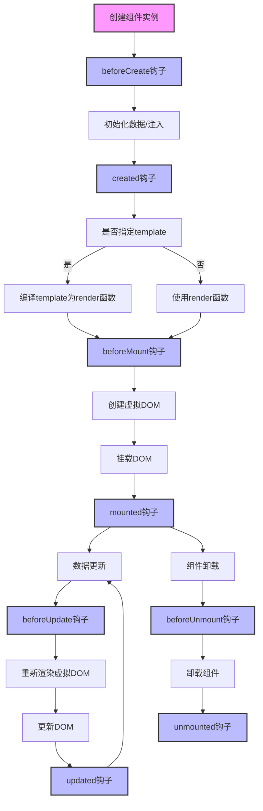

```
**描述说明**：
- 节点 `A` 表示用户请求访问受保护的应用程序。
- 节点 `B` 表示应用程序准备好 SAML 请求并将用户重定向到 Azure AD 进行身份验证。
- 节点 `C` 是 Azure AD，它显示登录页面并生成 SAML 响应。
- 节点 `F` 表示应用程序接收 SAML 响应并进行验证。
- 最后，节点 `H` 表示用户成功登录应用程序。

你可以直接将这个 Mermaid 代码粘贴到支持 Mermaid 的工具中（例如 Markdown 编辑器、一些 Wiki 平台等）来生成流程图。如果有任何部分需要调整或者进一步详细说明，随时告诉我！

```